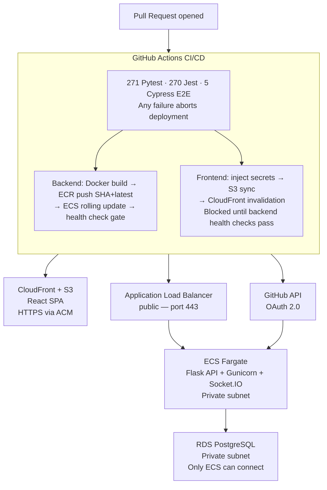
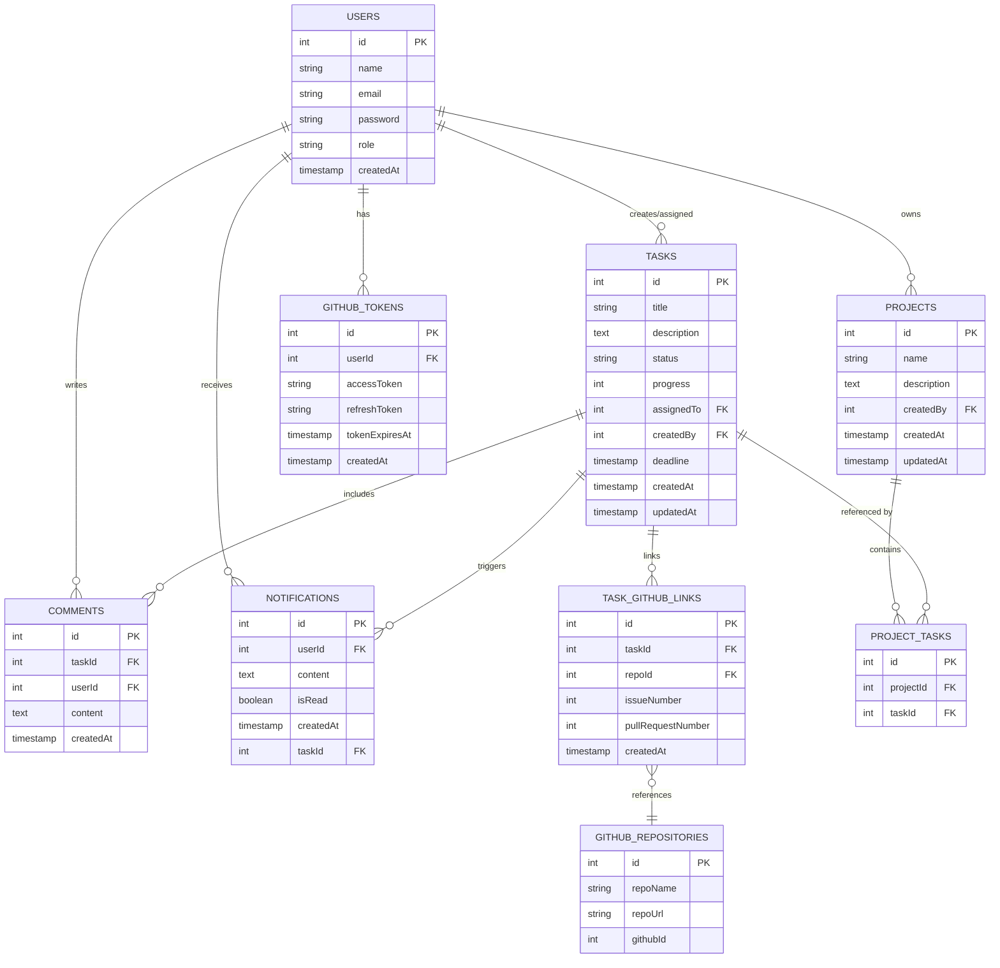

# DevSync - Project Tracker with GitHub Integration

> Production-grade full-stack project management platform with real-time WebSocket collaboration, GitHub OAuth 2.0, and bidirectional Issue/PR linking. ECS Fargate in a custom VPC, RDS in a private subnet, CloudFront frontend - 541 automated tests gate every PR via GitHub Actions with OIDC federation. Deployment aborts on any failure.

<p align="center">
  
  
  
  
  
  
</p>

<p align="center">
  <a href="https://github.com/AhmedIkram05/devsync/actions/workflows/ci.yml">
    
  </a>
</p>

---

## Screenshots

### Project dashboard - real-time task state, GitHub Issue links, and live collaborator presence


### GitHub integration - bidirectional task ↔ Issue/PR linking with live status sync


### WebSocket collaboration - task updates broadcast instantly to all project members


### GitHub Actions pipeline - 541 tests across Pytest, Jest, and Cypress gating every PR


### AWS architecture - ECS Fargate in custom VPC, RDS in private subnet, CloudFront frontend


---

## Architecture
 

 
> **Network isolation:** Security groups enforce strict ingress — only the ALB can reach ECS, only ECS can reach RDS. Zero public database exposure. HTTPS everywhere via ACM.
 
---

## Design Decisions

**OIDC federation — no static AWS credentials**
GitHub Actions authenticates to AWS via OpenID Connect rather than long-lived access keys. The pipeline assumes an IAM role scoped to this repository's `main` branch only - no credentials are stored as GitHub Secrets. If the role assumption fails, the entire pipeline fails rather than falling back to a less secure method.

**Frontend deployment blocked on backend health checks**
The CD pipeline explicitly waits for ECS health checks to pass before deploying the frontend. This prevents an API/UI version mismatch reaching production - a common failure mode where the new frontend ships before the new backend is stable, causing breaking API calls for users during the rollout window.

**541 tests as a hard deployment gate**
The 541-test suite (271 Pytest backend, 270 Jest frontend, 5 Cypress E2E) is not advisory - any single failure aborts deployment entirely. Coverage thresholds (80% backend, 90% frontend) are enforced as hard pipeline failure conditions, not warnings. This treats test coverage as a non-negotiable system property rather than a metric to report.

**Rolling ECS updates with SHA + latest dual tagging**
Every Docker image is tagged with both the Git commit SHA and `latest`. Rolling updates replace tasks incrementally, keeping the service live during deployment. The SHA tag provides a pinned, immutable reference for rollback - `docker pull devsync-backend:latest` always gets the most recent, but the exact deployed version is always recoverable by SHA.

**WebSocket rooms scoped to projects**
Socket.IO connections are authenticated with JWT on handshake — unauthenticated connections are rejected before joining any room. Clients join project-specific rooms so broadcasts are scoped: a task update in Project A is never sent to a client viewing Project B. This avoids broadcasting all events to all connected clients, which would not scale.

**Highly indexed PostgreSQL schema**
The schema is designed for the query patterns Power BI and the API actually execute - indexes on foreign keys, frequently filtered columns, and join columns. `ON CONFLICT DO NOTHING` is used throughout auto-migration scripts making them idempotent — safe to run on every deployment boot without manual intervention.

**GitHub OAuth 2.0 — no token storage in frontend**
The OAuth flow completes server-side. The GitHub access token is stored in the backend database, not in browser localStorage or a cookie visible to client-side JavaScript. The frontend receives only a platform JWT - the GitHub token is never exposed to the browser.

**Least-privilege security groups at the network layer**
Security group rules enforce a strict ingress hierarchy: only the ALB can reach ECS on port 8000, only ECS can reach RDS on port 5432. No other traffic is permitted at the network layer - not just unauthenticated traffic, but any traffic from outside the expected source. This is enforced by AWS rather than application code, making it tamper-resistant.

---

## Features

**Project & Task Management**
- Create and manage projects with team members
- Full task lifecycle — create, assign, update status, comment, close
- Real-time task state broadcast to all project members via WebSockets
- Notification system for task assignments and updates

**GitHub Integration**
- GitHub OAuth 2.0 — connect your GitHub account securely
- Link repository to a project
- Bidirectional task ↔ GitHub Issue linking — create Issues from tasks, or link existing Issues
- Pull Request linking — associate tasks with open PRs
- Live status sync — Issue/PR state reflected in platform tasks

**Real-time Collaboration**
- WebSocket layer (Socket.io) with JWT-authenticated connections
- Project-scoped rooms - updates only broadcast to relevant project members
- Live presence indicators

**Security**
- JWT authentication on all API routes and WebSocket connections
- GitHub tokens stored server-side only - never exposed to the browser
- RBAC for project-level access control
- HTTPS enforced end-to-end via ACM

---

## Testing

| Layer | Framework | Count | Coverage |
|---|---|---|---|
| Backend unit + integration | Pytest | 271 | 80% line coverage (hard gate) |
| Frontend unit + component | Jest | 270 | 90% line coverage (hard gate) |
| End-to-end | Cypress | 5 suites | Critical user journeys |
| **Total** | | **541** | |

Tests run on every PR. Any failure - including a coverage threshold drop - aborts the CD pipeline before any deployment step runs.

---

## Getting Started

### Prerequisites

- Python 3.8+
- Node.js 14.x+, npm 6.x+
- Docker + Docker Compose

### 1. Clone

```bash
git clone https://github.com/AhmedIkram05/DevSync
cd DevSync
```

### 2. Environment setup

```bash
cp .env.example .env
# Fill in: DATABASE_URL, JWT_SECRET_KEY, GITHUB_CLIENT_ID, GITHUB_CLIENT_SECRET
```

### 3. Backend

```bash
python -m venv .venv
source .venv/bin/activate  # Windows: .venv\Scripts\activate
pip install -r requirements.txt
```

### 4. Frontend

```bash
cd frontend
npm install
```

### 5. Start local database

```bash
make db-up
make db-setup
```

### 6. Run

```bash
# Backend (from repo root)
source .venv/bin/activate
cd backend/src && python app.py
# API runs at http://localhost:8000

# Frontend (separate terminal)
cd frontend && npm start
# App runs at http://localhost:5173
```

### Dockerised backend (production-like)

```bash
make backend-build
make backend-up
make backend-logs
make backend-down
```

---

## AWS Deployment

The full deployment is automated via GitHub Actions. Manual setup is required once per environment:

| Component | Service | Notes |
|---|---|---|
| Backend container registry | ECR | Private repo: `devsync-backend` |
| Backend runtime | ECS Fargate | Behind ALB, port 8000, custom VPC |
| Database | RDS PostgreSQL | Private subnet, only ECS can connect |
| Frontend hosting | S3 + CloudFront | OAC, HTTPS via ACM |
| CI/CD auth | IAM OIDC | No static credentials — role assumed per run |

### Required GitHub Secrets

```
IAM_ROLE_ARN
AWS_REGION
ECR_REPOSITORY          # devsync-backend
ECS_CLUSTER
ECS_SERVICE
ECS_TASK_DEFINITION_ARN
ECS_CONTAINER_NAME
S3_BUCKET_NAME          # devsync-frontend-prod
CLOUDFRONT_DIST_ID
PRODUCTION_API_URL
```

See the [AWS Deployment section](#aws-deployment) in the original docs for full IAM policy and security group configuration.

---

## Database Schema



---

## Role-Based Access Control (RBAC)

Three roles with increasing permission levels - enforced via JWT role claims and custom permission decorators on every protected route.

| Role | Description |
|---|---|
| **Developer** | View and update assigned tasks, add comments, link GitHub account |
| **Team Lead** | All Developer permissions + create tasks, assign to team members, view team stats |
| **Admin** | All Team Lead permissions + delete tasks, manage users, system settings, audit logs |

### Endpoint permission mapping

| Endpoint | Method | Minimum Role |
|---|---|---|
| `/api/auth/register` | POST | Public |
| `/api/auth/login` | POST | Public |
| `/api/auth/me` | GET | Any |
| `/api/tasks` | GET | Developer |
| `/api/tasks` | POST | Team Lead |
| `/api/tasks/:id` | PUT | Developer (own tasks) |
| `/api/tasks/:id` | DELETE | Admin |
| `/api/tasks/:id/comments` | GET / POST | Developer |
| `/api/admin/users` | GET / PUT / DELETE | Admin |
| `/api/admin/system/settings` | GET / PUT | Admin |

---

## API Reference

### Authentication — `/api/auth`

| Method | Endpoint | Description |
|---|---|---|
| POST | `/register` | Create new user account |
| POST | `/login` | Authenticate and issue JWT |
| POST | `/refresh` | Refresh access token using refresh token |
| POST | `/logout` | Invalidate tokens |
| GET | `/me` | Get current user profile |

**JWT implementation:** HTTP-only cookies with CSRF protection. Access token expires after **24 hours**, refresh token after **30 days**.

### Tasks — `/api/tasks`

| Method | Endpoint | Description |
|---|---|---|
| GET | `/api/tasks` | Fetch all tasks |
| POST | `/api/tasks` | Create task (Team Lead+) |
| PUT | `/api/tasks/:id` | Update task |
| DELETE | `/api/tasks/:id` | Delete task (Admin only) |
| PATCH | `/api/tasks/:id/progress` | Update progress percentage |
| GET/POST | `/api/tasks/:id/comments` | View or add comments |

### GitHub Integration — `/api/github`

| Method | Endpoint | Description |
|---|---|---|
| GET | `/api/github/repos` | Fetch user repositories |
| GET | `/api/github/issues` | Fetch linked GitHub issues |
| POST | `/api/github/link-task` | Link task to Issue or PR |

All GitHub API calls are proxied through the Flask backend - the GitHub OAuth token is never exposed to the frontend.

---

## Security

| Concern | Implementation |
|---|---|
| Authentication | JWT in HTTP-only cookies - not accessible to JavaScript |
| Token expiry | 24hr access token, 30 day refresh token |
| OAuth flow | PKCE - prevents authorisation code interception |
| OAuth token storage | Encrypted server-side - never sent to browser |
| Rate limiting | 100 requests per 15 minutes per IP |
| Input validation | Flask-Validator server-side checks, parameterised queries throughout |
| XSS prevention | CSP headers, HTML sanitisation on all comment content |
| Network isolation | Security groups enforce strict ingress: only ALB → ECS → RDS |
| CI/CD credentials | OIDC federation - no static AWS credentials stored anywhere |

---

## Technology Choices

| Component | Chosen | Alternative | Rationale |
|---|---|---|---|
| Backend | Flask | Django | Lightweight, fewer constraints, faster API development without monolithic overhead |
| Frontend | React | Angular | Smaller bundle, component-based architecture, larger ecosystem - Angular's complexity suits enterprise apps, not a focused SPA |
| Database | PostgreSQL | Firebase | Relational integrity required for task/user/project relationships - Firebase's NoSQL model would lose referential constraints |
| Real-time | Socket.IO | AJAX Polling | WebSockets maintain persistent connections with minimal latency - polling multiplies server load with no benefit |
| Auth | GitHub OAuth | Custom email/password | Removes password storage entirely, simplifies onboarding for developers, PKCE eliminates token interception risk |
| CI/CD | GitHub Actions + OIDC | Static IAM keys | No credentials stored - role assumed per run, scoped to this repository only |

---

## Tech Stack

| Layer | Technology |
|---|---|
| Frontend | React, Vite, Tailwind CSS, Socket.io client |
| Backend | Flask, SQLAlchemy, Flask-SocketIO, Gunicorn |
| Database | PostgreSQL on AWS RDS |
| Real-time | Socket.IO (WebSockets) |
| Auth | JWT (HTTP-only cookies), GitHub OAuth 2.0 with PKCE |
| Cloud | AWS ECS Fargate, ECR, RDS, S3, CloudFront, ACM |
| CI/CD | GitHub Actions, OIDC federation, Docker |
| Testing | Pytest, Jest, Cypress |
| Local dev | Docker Compose, Make |

---

## Related Projects From Me

- [ATM Log Aggregation & Diagnostics Platform](https://github.com/AhmedIkram05/laad) - production data engineering with RAG diagnostic assistant
- [StockLens FinTech App](https://github.com/AhmedIkram05/StockLens) - full-stack mobile app with OCR pipeline and ML forecasting
- [W3C Web Logs ETL Pipeline](https://github.com/AhmedIkram05/W3C-ETL-Pipeline) - parallel Airflow ETL with Power BI analytics
