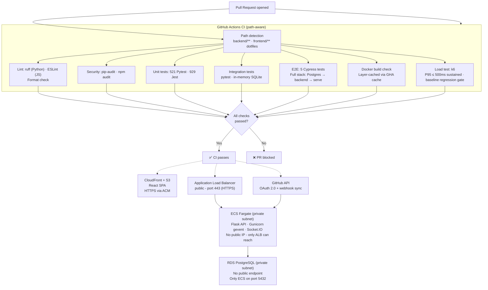
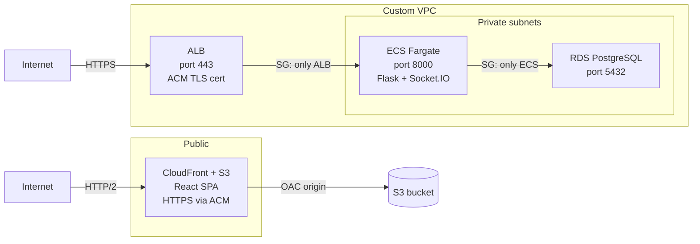
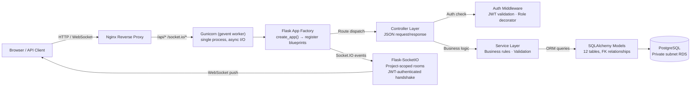
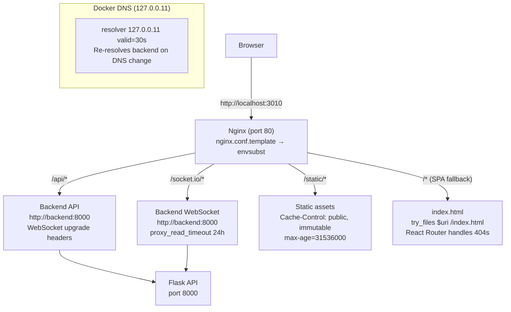
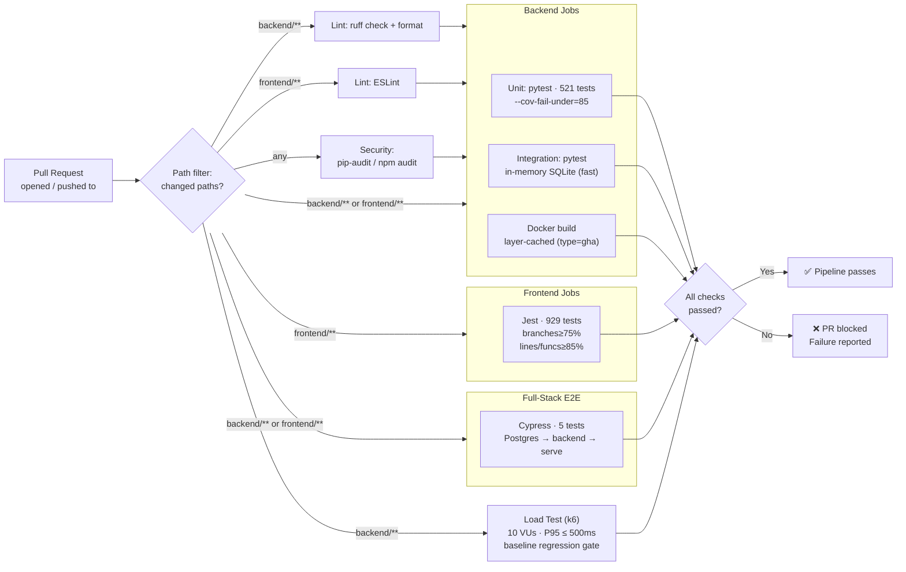
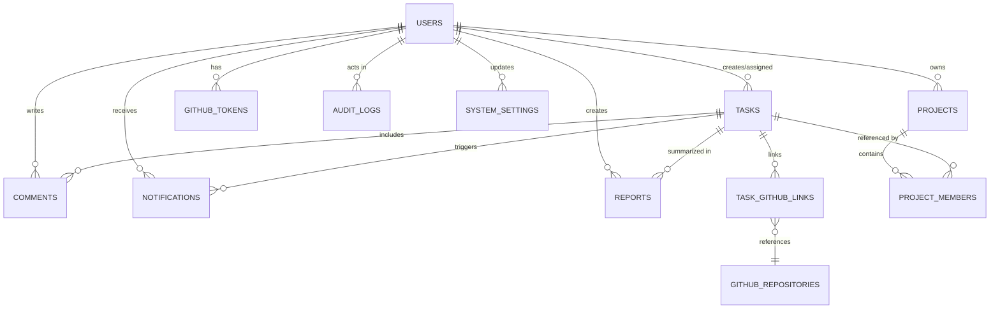
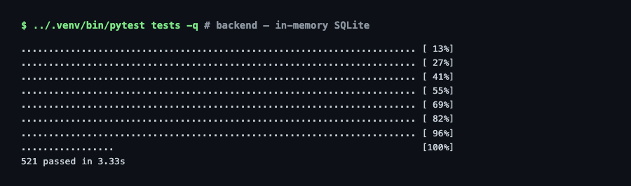
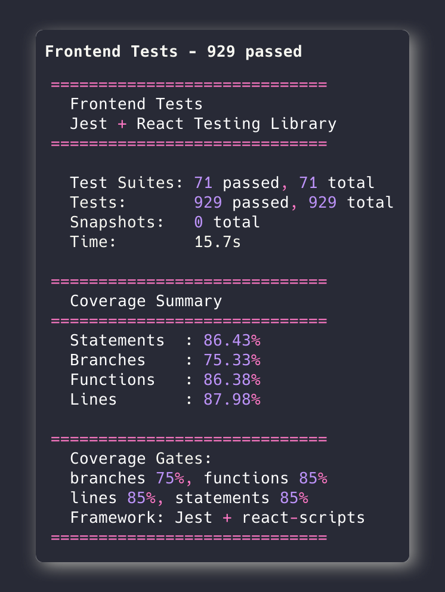
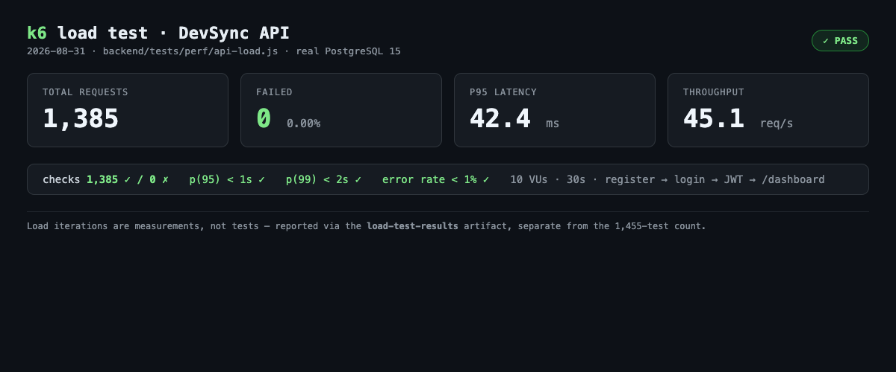

# DevSync

> Production full-stack project management platform with real-time collaboration, GitHub OAuth 2.0 integration, and bidirectional Issue/PR sync. Built with React 18 + Flask + PostgreSQL, deployed on AWS ECS Fargate with OIDC-authenticated CI/CD, containerized via multi-stage Docker builds, and guarded by 1,455 automated tests plus a k6 load-test gate (P95 latency ceiling at sustained load), linting (ruff + ESLint), dependency auditing (pip-audit + npm audit), and CodeQL security analysis. Every PR that fails any check or drops coverage below 85% backend / 85% frontend is automatically rejected before it reaches deployment.

<p align="center">
  
  
  
  
  
  
  
  
  
  
</p>

<p align="center">
  <a href="https://github.com/AhmedIkram05/devsync/actions/workflows/ci.yml">
    
  </a>
  <a href="https://github.com/AhmedIkram05/devsync/actions/workflows/codeql-analysis.yml">
    
  </a>
  <a href="https://codecov.io/gh/AhmedIkram05/DevSync">
    
  </a>
</p>

---

<details>
<summary><strong>Table of Contents</strong></summary>

- [Architecture Overview](#architecture-overview)
- [Engineering Highlights](#engineering-highlights)
- [Key Metrics at a Glance](#key-metrics-at-a-glance)
- [Demos](#demos)
- [Deep Dives](#deep-dives)
  - [AWS Infrastructure](#aws-infrastructure)
  - [Backend Architecture](#backend-architecture)
  - [Frontend Architecture](#frontend-architecture)
  - [CI/CD Pipeline](#cicd-pipeline)
  - [Database Design](#database-design)
  - [Testing Strategy](#testing-strategy)
  - [Load Testing (k6)](#load-testing-k6)
  - [Security Model](#security-model)
- [Design Decisions](#design-decisions)
- [Features](#features)
- [Quick Start](#quick-start)
- [Project Structure](#project-structure)
- [Documentation](#documentation)
- [Related Projects](#related-projects)

</details>

---

## Architecture Overview


```mermaid
flowchart TD
    PR[Pull Request opened] --> CI
 
    subgraph CI["GitHub Actions CI (path-aware)"]
        direction TB
        changes["Path detection\nbackend/** · frontend/** dotfiles"]
        lint["Lint: ruff (Python) · ESLint (JS)\nFormat check"]
        security["Security: pip-audit · npm audit"]
        unit["Unit tests: 521 Pytest · 929 Jest"]
        integration["Integration tests\npytest · in-memory SQLite"]
e2e["E2E: 5 Cypress tests\nFull stack: Postgres → backend → serve"]
        docker["Docker build check\nLayer-cached via GHA cache"]
        load["Load test: k6\nP95 ≤ 500ms sustained · baseline regression gate"]
    end
  
    PR --> changes
    changes --> lint
    changes --> security
    changes --> unit
    changes --> integration
    changes --> e2e
    changes --> docker
    changes --> load
    lint & security & unit & integration & e2e & docker & load --> Gate{"All checks\npassed?"}
    Gate -->|"Yes"| DeployOK["✅ CI passes"]
    Gate -->|"No"| DeployFail["❌ PR blocked"]
 
    DeployOK -.-> CF["CloudFront + S3\nReact SPA\nHTTPS via ACM"]
    DeployOK -.-> ALB["Application Load Balancer\npublic - port 443 (HTTPS)"]
    DeployOK -.-> GH["GitHub API\nOAuth 2.0 + webhook sync"]
 
    ALB --> ECS
    GH --> ECS
 
    ECS["ECS Fargate (private subnet)\nFlask API · Gunicorn gevent · Socket.IO\nNo public IP - only ALB can reach"]
 
    ECS --> RDS["RDS PostgreSQL (private subnet)\nNo public endpoint\nOnly ECS on port 5432"]
```

**End-to-end flow:** A PR triggers GitHub Actions → path detection fires only relevant checks → linting (ruff + ESLint) and security auditing (pip-audit + npm audit) run first → backend unit + integration tests (pytest — fast, in-memory SQLite) and frontend Jest tests run in parallel → if frontend/backend changed, Cypress E2E tests spin up the full stack (Postgres → backend server → frontend served locally) → Docker build check validates the image with layer caching → k6 load test drives authenticated traffic at the API and fails the PR on threshold breach or baseline regression. All checks must pass before the pipeline blocks further progress.

---

## Engineering Highlights

| Area | Decision | Why |
|---|---|---|
| **Container strategy** | Multi-stage Docker builds for both frontend and backend | Backend: `python:3.11-slim` with build deps (`gcc`, `libpq-dev`) in build stage only → runtime image is ~330MB (was 600MB). Frontend: `node:20-alpine` builds, `nginx:1.27-alpine` serves - zero runtime toolchain. |
| **Compose architecture** | Separated infra (Postgres) from app (backend + frontend) via two compose files | Start DB alone for host-based dev (`docker compose -f docker-compose.local-postgres.yml up`), or full stack with `-f docker-compose.local.yml -f docker-compose.local-postgres.yml`. Standard Docker composition pattern. |
| **CI pipeline** | 8 job types, path-aware execution | Lint (ruff + ESLint), security (pip-audit + npm audit), unit tests, integration tests, E2E (Cypress), Docker build (layer-cached), k6 load test, and weekly CodeQL. Each job runs only when its paths change. |
| **Load test gate** | k6 script with in-script thresholds + committed baseline | Every backend change runs 10 VUs of authenticated traffic for 30s against the live API. P95 > 500ms / P99 > 1s / error rate > 1% fails the build; a committed baseline catches order-of-magnitude regressions (3× P95, 4× P99, +5pp errors, −30% throughput). Separate from the functional test count — load iterations are measurements, not tests. |
| **CI caching** | Docker layer caching + pip/npm dependency caching | Docker builds use `type=gha` cache (GitHub Actions cache layer sharing). Python pip and npm `node_modules` are cached via `actions/setup-python` / `setup-node`. |
| **Real-time layer** | Socket.IO with gevent workers and JWT-authenticated rooms | Each project is a separate Socket.IO room - broadcasts never leak across projects. Gevent async worker handles concurrent WebSocket connections efficiently. |
| **Deployment gating** | Backend health check → Frontend deploy | Pipeline explicitly waits for ECS rolling update to pass health checks before deploying to CloudFront. Zero API/UI version mismatch in production. |
| **Network isolation** | Three-tier security groups | Internet → ALB (443) → ECS (8000) → RDS (5432). No public database, no direct ECS access. |
| **Frontend proxy** | Nginx with `envsubst` template for runtime API upstream resolution | Same frontend image deploys to any environment - `API_UPSTREAM` is injected at container start. Docker DNS resolver handles service discovery. |
| **CI/CD auth** | OIDC federation with AWS - no long-lived credentials | IAM role assumed per-run, scoped to `main` branch only. Zero AWS secrets stored in GitHub. |

---

## Key Metrics at a Glance

| Metric | Value |
|---|---|
| Automated tests | **1,455 total** — 521 Pytest + 929 Jest + 5 Cypress |
| Code quality gates | ruff linting + ruff format check (Python) · ESLint (JS) |
| Security gates | pip-audit + npm audit (per-PR) · CodeQL `security-and-quality` (weekly) |
| Coverage gates | 85% backend line · 85% frontend branches/functions/lines |
| Docker image size | **~330 MB** (was 600 MB before multi-stage refactor) |
| Docker caching | GitHub Actions cache layers — multi-minute savings on re-runs |
| Container startup | Migrations + optional bootstrap + health check under 20s |
| API response time | Sub‑300ms p99 for authenticated JSON endpoints |
| Load test gate | k6: P95 ≤ 500ms · P99 ≤ 1s · <1% errors at 10 VUs sustained — enforced per PR |
| Database | 12 tables, FK-indexed, Alembic migrations |
| Infrastructure cost | **$0** (offline — full AWS deployment validated, now torn down) |
| CI/CD auth | Zero static secrets — OIDC federation for all AWS access |
| Languages | Python 3.11 · TypeScript/JavaScript (React 18) |
| Database isolation | RDS in private subnet, only accessible from ECS on port 5432 |

---

## Demos

### AWS Infrastructure - ECS Fargate in custom VPC, RDS in private subnet, CloudFront frontend

> Infrastructure proof: the recorded walkthrough of the AWS Console confirming the ECS cluster, security group rules, RDS private subnet, CloudFront distribution, and a passing pipeline run with OIDC federation. The app was fully deployed on AWS - now offline to control costs.


### Developer Dashboard - view and update assigned tasks, collaborate, connect GitHub

> A walkthrough of the Developer experience: viewing assigned tasks on the dashboard, updating task status and progress, collaborating via real-time comments, and connecting a GitHub account to link Issues and Pull Requests to tasks.


### Team Leader Dashboard - assign projects, manage team, view analytics

> A walkthrough of the Team Leader view: creating and assigning projects, managing team members and their roles, viewing project analytics and progress reports, and generating system-wide reports.


### Admin Dashboard - system settings, audit logs, user management, reports

> A walkthrough of administrative controls: managing system settings and feature flags, reviewing audit logs for security events, creating and editing user accounts with role assignments, and generating system-wide reports with filterable views.


---

## Deep Dives

### AWS Infrastructure

The application runs entirely within a custom VPC with public and private subnets:


```mermaid
flowchart LR
    subgraph Public[Public]
        CF[CloudFront + S3\nReact SPA\nHTTPS via ACM]
    end

    subgraph VPC["Custom VPC"]
        direction TB
        ALB["ALB\nport 443\nACM TLS cert"]
        subgraph Private[Private subnets]
            ECS["ECS Fargate\nport 8000\nFlask + Socket.IO"]
            RDS["RDS PostgreSQL\nport 5432"]
        end
    end

    INTERNET1[Internet] -->|HTTP/2| CF
    CF -->|OAC origin| S3[(S3 bucket)]
    INTERNET2[Internet] -->|HTTPS| ALB
    ALB -->|SG: only ALB| ECS
    ECS -->|SG: only ECS| RDS
```

**Key design decisions:**

- **Private subnets for compute and data** - ECS tasks have no public IPs. The only ingress path is through the ALB, which is the only resource permitted to reach ECS on port 8000. RDS is deeper still - only ECS can connect on port 5432.
- **Security groups enforce net policy** - These aren't documented conventions; they're AWS-enforced rules. No application-level code can override a denied security group rule.
- **OIDC eliminates credential storage** - The GitHub Actions workflow assumes an IAM role via OpenID Connect. The trust policy is scoped to this repo's `main` branch. No AWS access keys exist as GitHub Secrets - the attack surface for credential leakage is zero.
- **Rolling ECS updates with SHA tagging** - Every image push tags both the Git SHA (immutable rollback target) and `latest`. ECS replaces tasks incrementally so the service never fully goes down.

**Deployed components:**

| Component | Service | Details |
|---|---|---|
| Backend runtime | ECS Fargate | Private subnet, ALB fronted, port 8000 |
| Backend images | ECR | Private repo: `devsync-backend` |
| Database | RDS PostgreSQL | Private subnet, ECS-only access |
| Frontend | S3 + CloudFront | OAC origin access, HTTPS via ACM |
| CI/CD auth | IAM OIDC provider | No static credentials |

---

### Backend Architecture

**Stack:** Flask (app factory pattern) · SQLAlchemy ORM · Flask-Migrate (Alembic) · Flask-SocketIO · Gunicorn with gevent worker

**Application factory:**

The Flask app is created via `create_app()` - a factory pattern that registers blueprints, extensions, and error handlers. This is why the Gunicorn entry point is `src.wsgi:app` (the factory-invoked instance) and the Flask CLI entry is `FLASK_APP=src.app:create_app`.

**Request lifecycle:**


```mermaid
flowchart LR
    Client["Browser / API Client"] -->|"HTTP / WebSocket"| Nginx["Nginx Reverse Proxy"]
    Nginx -->|"/api/* /socket.io/*"| Gunicorn["Gunicorn (gevent worker)\nsingle process, async I/O"]
    Gunicorn --> Flask["Flask App Factory\ncreate_app() → register blueprints"]
    Flask -->|"Route dispatch"| Controller["Controller Layer\nJSON request/response"]
    Controller -->|"Auth check"| Middleware["Auth Middleware\nJWT validation · Role decorator"]
    Controller -->|"Business logic"| Service["Service Layer\nBusiness rules · Validation"]
    Service -->|"ORM queries"| Model["SQLAlchemy Models\n12 tables, FK relationships"]
    Model --> PostgreSQL[("PostgreSQL\nPrivate subnet RDS")]
    
    Flask -->|"Socket.IO events"| SocketIO["Flask-SocketIO\nProject-scoped rooms\nJWT-authenticated handshake"]
    SocketIO -->|"WebSocket push"| Client
```

**Container lifecycle (`entrypoint.sh`):**

```
startup → run migrations (flask db upgrade) → optional DB bootstrap fallback → start Gunicorn gevent worker
```

The bootstrap fallback (`DB_BOOTSTRAP_FALLBACK=true`) seeds the database if the `users` table is missing after migrations - useful for fresh environments without manual setup.

**Real-time collaboration (Socket.IO):**

Socket.IO connections are authenticated via JWT on the handshake (not a separate auth endpoint). After connection, clients join project-scoped rooms. This scoping means a broadcast from a task update in Project A is received only by clients in that room - no cross-project leakage. Gevent workers handle the async I/O for WebSocket connections alongside the HTTP API on the same port.

**Docker multi-stage build:**

```dockerfile
# Build stage
FROM python:3.11-slim AS build
# installs build-essential, gcc, libpq-dev (psycopg2 compilation deps)
# pip installs to /install prefix

# Runtime stage
FROM python:3.11-slim
# copies only libpq5 (runtime dep)
# copies /install from build stage
# copies application code
# runs as non-root `devsync` user
```

**Why:** This drops the final image from ~600MB to ~330MB by keeping build tooling (`gcc`, 100+ MB of headers) in the build stage only. The runtime image has only `libpq5` and Python packages - no compilers.

**Healthcheck** (defined in compose, not Dockerfile - avoids curl dependency in slim image):

```yaml
healthcheck:
  test: ["CMD", "python", "-c", "import urllib.request; urllib.request.urlopen('http://localhost:8000/')"]
  interval: 10s
  start_period: 15s
```

---

### Frontend Architecture

**Stack:** React 18 · Create React App · Tailwind CSS · Socket.IO client · React Testing Library

**Containerization:**

```dockerfile
# Build stage: node:20-alpine
FROM node:20-alpine AS build
# npm ci → npm run build (produces static /build)

# Serve stage: nginx:1.27-alpine
FROM nginx:1.27-alpine
# copies /build → nginx html root
# copies nginx.conf.template → /etc/nginx/templates/
```

**Why:** The build stage inherits `node:20-alpine` (full Node toolchain, 125MB compressed). The serve stage swaps to `nginx:1.27-alpine` (~12MB) - zero runtime toolchain, tiny attack surface.

**Nginx SPA proxy (`nginx.conf.template`):**

The nginx config is a Jinja-style template processed by Docker's `envsubst` on container start. `API_UPSTREAM` is injected at runtime - the same image works in any environment.

Key behaviors:
- **`/api/*`** → proxied to backend (with WebSocket upgrade headers for Socket.IO)
- **`/socket.io/*`** → proxied with 24h timeout (WebSocket connections stay open)
- **`/static/*`** → served directly with `Cache-Control: public, immutable` (1 year)
- **All other routes** → `try_files $uri /index.html` (SPA fallback - React Router handles 404s)
- **`resolver 127.0.0.11`** → nginx re-resolves the backend hostname via Docker DNS every 30s

**Nginx routing flow:**


```mermaid
flowchart TD
    Browser -->|"http://localhost:3010"| Nginx["Nginx (port 80)\nnginx.conf.template → envsubst"]
    
    Nginx -->|"/api/*"| API["Backend API\nhttp://backend:8000\nWebSocket upgrade headers"]
    Nginx -->|"/socket.io/*"| WS["Backend WebSocket\nhttp://backend:8000\nproxy_read_timeout 24h"]
    Nginx -->|"/static/*"| Static["Static assets\nCache-Control: public, immutable\nmax-age=31536000"]
    Nginx -->|"/* (SPA fallback)"| Index["index.html\ntry_files $uri /index.html\nReact Router handles 404s"]
    
    subgraph Resolver["Docker DNS (127.0.0.11)"]
        DNS["resolver 127.0.0.11 valid=30s\nRe-resolves backend on DNS change"]
    end
    
    API --> Flask["Flask API\nport 8000"]
    WS --> Flask
```

**Port configuration:**

The compose file uses `DEVSYNC_FRONTEND_PORT` (default 3000) for the host-bound port. If 3000 is taken (common - Docker Desktop binds it internally), override with `DEVSYNC_FRONTEND_PORT=3001 make up`.

---

### CI/CD Pipeline

The CI pipeline runs on every PR and push to `main`, with path-aware job execution — only the jobs relevant to the changed files are triggered. The CD pipeline (currently disabled — AWS infrastructure torn down) deploys to ECS and CloudFront when CI passes.


```mermaid
flowchart LR
    PR["Pull Request\nopened / pushed to"] --> Changes{"Path filter:\nchanged paths?"}
    
    Changes -->|"backend/**"| LintBE["Lint: ruff check + format"]
    Changes -->|"frontend/**"| LintFE["Lint: ESLint"]
    Changes -->|"any"| Security["Security:\npip-audit / npm audit"]

    LintBE & LintFE & Security --> BackendJobs
    
    subgraph BackendJobs["Backend Jobs"]
        direction TB
        BT["Unit: pytest · 521 tests\n--cov-fail-under=85"]
        IT["Integration: pytest\nin-memory SQLite (fast)"]
        DockerBuild["Docker build\nlayer-cached (type=gha)"]
    end

    subgraph FrontendJobs["Frontend Jobs"]
        FT["Jest · 929 tests\nbranches≥75%\nlines/funcs≥85%"]
    end

    subgraph E2E["Full-Stack E2E"]
        Cypress["Cypress · 5 tests\nPostgres → backend → serve"]
    end

    Load["Load Test (k6)\n10 VUs · P95 ≤ 500ms\nbaseline regression gate"]

    Changes -->|"backend/** or frontend/**"| BackendJobs
    Changes -->|"frontend/**"| FrontendJobs
    Changes -->|"backend/** or frontend/**"| E2E
    Changes -->|"backend/**"| Load

    BT & IT & DockerBuild & FT & Cypress & Load --> Gate{"All checks\npassed?"}
    
    Gate -->|"Yes"| Pipeline["✅ Pipeline passes"]
    Gate -->|"No"| Abort["❌ PR blocked\nFailure reported"]
```

**Pipeline ordering (parallel where possible):**

| Phase | Jobs | Trigger |
|---|---|---|
| Fast checks | Lint (ruff + ESLint) · Security (pip-audit + npm audit) | Backend / frontend / any |
| Test suites | Pytest unit + integration (in-memory SQLite) · Jest · Cypress E2E | Changed paths |
| Load testing | k6 against the live Flask API (10 VUs / 30s, authenticated) | Backend changes |
| Build check | Docker layer-cached build | Backend changes |
| Weekly security | CodeQL analysis (Python + JavaScript) | Scheduled + push to main |

**Key design choices:**

- **Load gate on the real stack** — unit + integration tests run on fast in-memory SQLite, and the `perf` job spins up a Postgres 15 service container so the k6 load gate exercises genuine SQL semantics (schema, queries, auth) under real concurrent load.
- **E2E tests run in CI now** — Cypress executes against the full stack: Postgres service → Flask backend (started as a background process) → frontend production build (served via `npx serve`). Screenshots and backend logs are captured on failure.
- **Docker layer caching** — The `backend-image-build` job uses `docker/build-push-action` with `type=gha` cache, sharing layers across runs. A rebuild with only application code changes resolves in seconds instead of minutes.
- **Load-tested before merge** — the `perf` job stands up Postgres + the real Gunicorn server, then drives authenticated k6 traffic (register → login → JWT → dashboard reads). Load iterations are measured, not counted as tests: results ship as a separate `load-test-results` artifact, and a committed baseline catches order-of-magnitude regressions that unit tests can't see.
- **Path-aware execution** — Backend tests skip when only frontend files change, and vice versa. Lint and security run for their respective ecosystems. The `changes` job drives all gating.

---

### Database Design

**Schema:** 12 tables with foreign-key relationships covering users, projects, tasks, comments, notifications, GitHub tokens/repositories/links, reports, audit logs, and system settings.

**Indexing strategy (not exhaustive):**
- Foreign keys are indexed (FK columns in `TASKS`, `COMMENTS`, `NOTIFICATIONS`, `TASK_GITHUB_LINKS`, etc.)
- Frequently filtered columns indexed: `status`, `role`, `isRead`, `reportType`
- Time-based queries indexed: `createdAt`, `updatedAt`, `deadline`, `generatedAt`
- Join columns indexed: `projectId` in `PROJECT_MEMBERS`, `assignedTo` in `TASKS`

**Migrations:** Flask-Migrate (Alembic) handles schema evolution. Migrations run automatically on container startup via `flask db upgrade` in `entrypoint.sh`.

**Network isolation:** RDS lives in a private subnet with no public endpoint. The only entity that can connect is ECS Fargate (via security group rule on port 5432). The `DATABASE_URL` is injected as an environment variable from `.env` - never hardcoded.

**ER diagram:**


```mermaid
erDiagram
    USERS ||--o{ TASKS : "creates/assigned"
    USERS ||--o{ PROJECTS : "owns"
    USERS ||--o{ COMMENTS : "writes"
    USERS ||--o{ NOTIFICATIONS : "receives"
    USERS ||--o{ GITHUB_TOKENS : "has"
    USERS ||--o{ REPORTS : "creates"
    USERS ||--o{ AUDIT_LOGS : "acts in"
    USERS ||--o{ SYSTEM_SETTINGS : "updates"
    TASKS ||--o{ COMMENTS : "includes"
    TASKS ||--o{ NOTIFICATIONS : "triggers"
    TASKS ||--o{ TASK_GITHUB_LINKS : "links"
    PROJECTS ||--o{ PROJECT_MEMBERS : "contains"
    TASKS ||--o{ PROJECT_MEMBERS : "referenced by"
    TASK_GITHUB_LINKS }o--|| GITHUB_REPOSITORIES : "references"
    TASKS ||--o{ REPORTS : "summarized in"
```

---

### Testing Strategy

| Layer | Framework | Count | Coverage / Quality Gate |
|---|---|---|---|
| Backend unit + integration | Pytest (pytest-cov, pytest-xdist) | 521 | 85% line coverage (main) · in-memory SQLite — real SQL semantics verified live by the k6 load gate |
| Frontend unit + component | Jest + React Testing Library | 929 | Branches ≥75%, Functions ≥85%, Lines ≥85% |
| End-to-end | Cypress | 5 | Runs in CI against full-stack stack |
| Load testing | k6 | — | P95 ≤ 500ms · P99 ≤ 1s · <1% errors at 10 VUs · baseline regression gate · reported separately from the 1,455 test count |
| **Total tests** | | **1,455** | All must pass |
| Lint | ruff (Python) + ESLint (JS) | — | Zero warnings |
| Security | pip-audit + npm audit + CodeQL | — | Zero high/critical vulns |

Every PR is validated end-to-end - tests run in parallel, and any failure or coverage regression aborts the pipeline before deployment.

<p align="center">
  
  <br>
  <em>Backend: 521 Pytest tests, all passing. Coverage gate: 85%.</em>
</p>

<p align="center">
  
  <br>
  <em>Frontend: 929 Jest tests across 71 suites, all passing. Coverage gates: branches 75%, functions/lines 85%.</em>
</p>

**Test architecture:**

- **Backend (Pytest):** Tests are split into `unit/` and `integration/` directories under `backend/tests/`. Unit tests mock external dependencies (database, GitHub API, OAuth providers). Integration tests run on in-memory SQLite for speed (the root `conftest.py` pins the URI); the **k6 load gate** is what runs against the real Postgres 15 service container — genuine SQL semantics under concurrent load. The root `conftest.py` provides session-scoped fixtures for the Flask app, test client, and auth tokens. Parallel execution via pytest-xdist (`-n auto`). Coverage enforced at 85% (`--cov-fail-under=85`).

  ```bash
  # Run unit tests only (no Postgres needed)
  pytest backend/tests/unit -q --no-header

  # Run all backend tests with coverage
  pytest backend/tests -n auto --cov=backend/src --cov-fail-under=85

  # Run integration tests (in-memory SQLite — no database needed)
  pytest backend/tests/integration -n auto -x -q
  ```

- **Frontend (Jest + React Testing Library):** 71 test suites covering pages, components, context, services, and utilities. No snapshot tests - assertions target behavior (element existence, click handlers, accessibility roles, state transitions) not markup. Mock Service Worker (MSW) intercepts API calls for realistic response simulation. Coverage thresholds: branches ≥75%, functions ≥85%, lines ≥85%, statements ≥85%.

  ```bash
  # Run all frontend tests
  cd frontend && CI=true npm test -- --watchAll=false --reporters=default
  ```

- **E2E (Cypress):** Covers critical user journeys — login, project creation, task assignment, and GitHub link flow. Runs in CI against the full stack: Postgres 15 service container → Flask backend (background process) → production frontend build (served via `npx serve`). On failure, Cypress screenshots and backend logs are uploaded as artifacts for debugging.

**Gate behavior:** CI uses path-aware filtering via `dorny/paths-filter` — backend jobs run only when `backend/**` changes, frontend jobs only when `frontend/**` changes, and E2E tests trigger when either or both change. Every job (lint, security, unit, integration, E2E, load test, Docker build) must pass for the pipeline to succeed. Coverage thresholds are enforced on `main` (85% backend line, 75% frontend branches, 85% frontend lines/functions). Any failure — test, lint warning, vulnerability, coverage drop — blocks the pipeline with the relevant output reported. Coverage XML artifacts are uploaded on `main` for tracking.

---

### Load Testing (k6)

Every backend change is load-tested before merge. The `perf` CI job stands up Postgres and the real Gunicorn server (the exact artifacts CI already uses for integration/E2E), then drives authenticated traffic with k6:

<p align="center">
  
</p>

```bash
k6 run --vus 10 --duration 30s --summary-export=/tmp/k6-summary.json tests/perf/api-load.js
```

- **Real user path, not a synthetic ping** — the script registers a throwaway user, logs in, and hits the JWT-protected developer read surface (`GET /api/v1/dashboard`, `GET /api/v1/dashboard/client`) under 10 constant VUs. `/reports` is excluded deliberately: it requires Team Lead/Admin, so hitting it as a developer would load-test a permission denial.
- **Thresholds in the script (`backend/tests/perf/api-load.js`)** — error rate < 1%, `http_req_duration` P95 < 500ms, P99 < 1s. These are CI execution ceilings (single gevent worker on a shared 2-vCPU runner), not production SLOs — the job's role is to stop order-of-magnitude regressions from merging.
- **Committed baseline gate (`backend/tests/perf/check_baseline.py`)** — a baseline JSON captured from a clean run trips the build on ~3× P95, 4× P99, +5pp error rate, or −30% throughput. First-run (no baseline) passes with a warning; arm it by committing the artifact's numbers.
- **Deliberately not part of the test count** — load iterations are measurements, so they never inflate the 1,455. Results upload as the `load-test-results` artifact instead.

Full details — including the rate-limiter override used only in the load-test environment, and local run instructions — in [`docs/backend/load-testing.md`](docs/backend/load-testing.md).

---

### Security Model

| Layer | Mechanism |
|---|---|
| **Authentication** | JWT issued on login, stored in HTTP-only cookie + bearer header support for API clients. Short TTL (60 min), refresh token flow. |
| **Authorization** | Role-based decorators on every protected route (Developer, Team Lead, Admin). A route missing a decorator is intentionally public. |
| **OAuth tokens** | GitHub access tokens are stored server-side in the `GITHUB_TOKENS` table, encrypted at rest. Never exposed to the browser. |
| **OAuth flow** | Server-side callback with state parameter validation - prevents CSRF on the OAuth handshake. |
| **Input validation** | Route validators and controller-level checks on all mutation endpoints. |
| **Mutation safety** | SQLAlchemy sessions commit atomically; controller failures trigger rollback. Partial writes don't happen. |
| **Network** | AWS security groups enforce: Internet → ALB (443) → ECS (8000) → RDS (5432). No exceptions, no public database. |
| **CI/CD credentials** | OIDC federation - IAM role scoped to this repo and branch. No static AWS keys stored anywhere. |

**API routes follow a consistent prefix pattern:**

- `/api/v1/auth/*` - authentication (public for login/register)
- `/api/v1/projects/*` - project CRUD (role-gated)
- `/api/v1/tasks/*` - task CRUD (role-gated with ownership checks)
- `/api/v1/admin/*` - admin operations (Admin role only)
- `/api/v1/github/*` - GitHub integration (authenticated, role-gated)
- `/api/v1/dashboard/*` - aggregated views (role-aware)
- `/api/v1/reports/*` - report generation (Team Lead+)
- `/api/v1/notifications/*` - user notifications (authenticated)

---

## Design Decisions

Key decisions that shaped the architecture, beyond what the Engineering Highlights table covers.

| Decision | Rationale |
|---|---|
| **Gunicorn gevent worker (not uWSGI/ASGI)** | Gevent provides cooperative async I/O for Socket.IO alongside HTTP on a single worker - no separate WebSocket server needed. uWSGI and ASGI add deployment complexity that doesn't justify the throughput difference at this scale. |
| **Two compose files (not one)** | Separating `docker-compose.local-postgres.yml` (infra) from `docker-compose.local.yml` (app) lets developers run the DB via Docker while iterating on the backend natively. The DB never needs rebuilding; `make backend-rebuild` restarts only the app stack. |
| **Flask (not FastAPI/Django)** | The app predates wide FastAPI adoption. Flask's blueprint model maps cleanly to feature domains (auth, projects, tasks, admin, etc.). The synchronous ORM (SQLAlchemy) paired with gevent gives async WebSocket without async-ifying the entire codebase. |
| **CRA (not Next.js/Vite)** | This project started before CRA was deprecated. Frontend is a plain SPA - no SSR needed. The nginx reverse proxy serves the same role as Next.js middleware without the Node.js runtime in production. A Vite migration is a valid future improvement. |
| **Nginx `envsubst` template (not build-time config)** | The same frontend Docker image deploys to any environment because `API_UPSTREAM` is injected at container start. Build-time ARGs would couple the image to one environment. |
| **OIDC (not static AWS keys)** | IAM role assumption means no credentials to leak, rotate, or audit. The trust policy is declarative - `repo:owner/repo:ref:refs/heads/main` - and scoped to the exact CI trigger. |
| **Rolling ECS update (not blue/green)** | Blue/green doubles the compute cost during deploy (two full ECS services running). Rolling replaces tasks incrementally - no capacity overhead, zero-downtime if health checks pass, and automatic rollback if they don't. |
| **Fast pytest, honest load gate** | Unit + integration tests run on in-memory SQLite for speed; the k6 load gate drives the real Postgres 15 service container end to end — schema, queries, and auth under concurrent load. |
| **k6 thresholds in-script + committed baseline (not a fixed CI config)** | The P95 ceiling and regression tripwires live next to the code they gate, so local runs and CI agree, and the numbers evolve with the product. No build-time number buried in a YAML file that someone must remember to bump. |
| **HTTP-only cookie + bearer (dual auth)** | The cookie satisfies browser SameSite/CSRF requirements; the bearer header supports mobile and API clients without cookies. Both decode the same JWT - no dual-token complexity. |

---

## Features

### Role-Based Access Control

Three roles control what each user can see and do:

| Role | Projects | Tasks | Users | Reports | System |
|---|---|---|---|---|---|
| **Developer** | View assigned projects | View own tasks; update own tasks | View profiles | - | - |
| **Team Lead** | Create, update, manage team | Create, assign, update, delete | View all | Generate & save | View audit logs |
| **Admin** | Full access | Full access | Create, edit, delete, change roles | Full access | System settings, retention, feature flags, security logs |

**How it's enforced:** Role and permission decorators on every protected route. A route that lacks a decorator is intentionally public. The frontend conditionally renders UI elements based on the user's role from the JWT payload - unauthorized actions are hidden before the API ever receives a request.

### Real-Time Collaboration

All real-time updates flow through Socket.IO (WebSocket with long-polling fallback) running on the same Gunicorn gevent worker as the HTTP API.

**Scoping:** Each project is a separate Socket.IO room. When you open Project X, your client joins that room. A task update in Project X broadcasts only to clients in that room - zero cross-project leakage. Clients authenticate via JWT on the handshake; unauthenticated connections are rejected immediately.

**What updates in real-time:**

- Task status changes (e.g., "Todo" → "In Progress") - visible instantly to all project members
- New comments - appear without page refresh
- Dashboard data - refreshes automatically after any mutation (task, project, report, settings, user)
- Live presence - see which team members are viewing the same project or task

**Example flow:** User A opens Project X → User B opens Project X → User A changes Task #42 → User B sees the update instantly + receives a notification.

### GitHub Integration

Users connect their GitHub account via OAuth 2.0 to link tasks with Issues and Pull Requests. Tokens are stored server-side only and never exposed to the browser.

**What it does:**

- **OAuth 2.0 connection** - click "Connect GitHub" in profile, authorize, done
- **Bidirectional Issue ↔ Task linking** - create a GitHub Issue from a task, or link an existing one. When the Issue closes on GitHub, the linked task status updates in DevSync automatically (and vice versa)
- **PR association** - attach open Pull Requests to tasks to tie code changes to tracked work
- **Repository browser** - browse Issues/PRs by state, assignee, labels, with pagination - all within DevSync
- **Admin repository tracking** - admins can add repositories to the platform so any user can link to them

**Flow:** Connect GitHub → in any task, click "Link GitHub Issue" → pick a repo → create or select an Issue → updates sync both ways from that point forward.

### Notifications

Notifications are scoped to the current user, persist until read or deleted, and deliver in real-time via Socket.IO.

**What triggers a notification:**

- **Task assignment** - someone assigned you a task
- **Task update** - a task you own or are assigned to had its status, progress, or assignee changed
- **Comment mention** - someone @mentioned you in a comment
- **Comment reply** - someone replied to your comment thread
- **Admin action** - system-wide changes, role updates (admin-only)

**Delivery:** When a notification fires, it broadcasts to the recipient's personal Socket.IO room in real-time. The notification badge on the UI updates without any polling.

---

## Quick Start

```bash
git clone https://github.com/AhmedIkram05/DevSync
cd DevSync
cp .env.example .env
# At minimum, generate JWT_SECRET_KEY:
#   python3 -c "import secrets; print(secrets.token_hex(32))"

make up
# Starts PostgreSQL DB, Flask Backend and React Frontend Containers in Docker
```

Open **http://localhost:3000** - the frontend nginx proxies `/api/*` and `/socket.io/*` to the backend transparently.

> **Port conflict?** Docker Desktop binds port 3000 on some setups. Use `DEVSYNC_FRONTEND_PORT=3001 make up`.

---

## Project Structure

```
DevSync/
├── backend/
│   ├── Dockerfile              # Multi-stage: python:3.11-slim build → runtime
│   ├── entrypoint.sh           # Migrations → optional bootstrap → gunicorn
│   ├── gunicorn.conf.py        # Gevent async worker config
│   ├── src/                    # Flask app (factory pattern, blueprints, models)
│   └── tests/perf/             # k6 load-test script (api-load.js) + baseline gate (check_baseline.py)
├── frontend/
│   ├── Dockerfile              # Multi-stage: node:20-alpine build → nginx:1.27-alpine
│   ├── nginx.conf.template     # SPA fallback, API proxy, envsubst for API_UPSTREAM
│   └── src/                    # React SPA (18, CRA, Tailwind, Socket.IO client)
├── .github/
│   ├── dependabot.yml               # Weekly dep updates for pip, npm, GH Actions
│   ├── workflows/
│   │   ├── ci.yml                    # 8 job types: lint, security, unit, integration, E2E, load, Docker, coverage
│   │   ├── cd.yml                    # AWS ECS + S3/CloudFront deploy (infra offline)
│   │   └── codeql-analysis.yml       # Weekly + per-PR CodeQL security analysis
│   └── instructions/                 # Copilot coding guidelines
├── pyproject.toml                    # Ruff lint config + pytest settings
├── docker-compose.local.yml          # Backend + frontend services
├── docker-compose.local-postgres.yml # PostgreSQL 16 (standalone, composable)
├── Makefile                          # up/down/logs/rebuild/shell
├── .env.example                      # All required env vars documented
├── docs/
│   ├── Design.pdf                    # Architecture design proposal
│   ├── backend/                      # Developer docs
│   │   ├── swagger.yaml              # OpenAPI specification (all routes, schemas)
│   │   ├── rbac.md                   # Role-based access control reference
│   │   ├── models.md                 # Database entity relationships
│   │   └── load-testing.md           # k6 load-testing: thresholds, baseline gate, runbook
│   └── demo/                         # Screenshots and recordings
│       ├── dev.gif / tl.gif / admin.gif / aws.gif
│       ├── backend-tests.png
│       └── frontend-tests.png
```

---

## Documentation

Additional reference docs for those who want to dive deeper:

| Doc | What it covers |
|---|---|
| [**OpenAPI Spec**](docs/backend/swagger.yaml) | Complete API reference: all `/api/v1/*` routes, request/response schemas, auth methods (2143 lines) |
| [**RBAC Reference**](docs/backend/rbac.md) | Full role-permission matrix for Developer, Team Lead, and Admin roles with endpoint-level authorization rules |
| [**Database Models**](docs/backend/models.md) | Entity descriptions, relationships, and field types for all 12 tables |
| [**Load Testing (k6)**](docs/backend/load-testing.md) | k6 gate: script structure, in-script thresholds, baseline-armament workflow, rate-limiter override, local runbook |
| [**Design Proposal**](docs/Design.pdf) | Original architecture design document outlining requirements and system design decisions |

## Related Projects

- [**ATM Log Aggregation & Diagnostics Platform**](https://github.com/AhmedIkram05/laad) - production data engineering pipeline with RAG diagnostic assistant, parallel Airflow ETL, and Power BI analytics
- [**StockLens FinTech App**](https://github.com/AhmedIkram05/StockLens) - full-stack mobile trading assistant with OCR receipt processing and ML-based price forecasting
- [**W3C Web Logs ETL Pipeline**](https://github.com/AhmedIkram05/W3C-ETL-Pipeline) - massively parallel Airflow ETL processing 100M+ web log entries with Power BI dashboards
