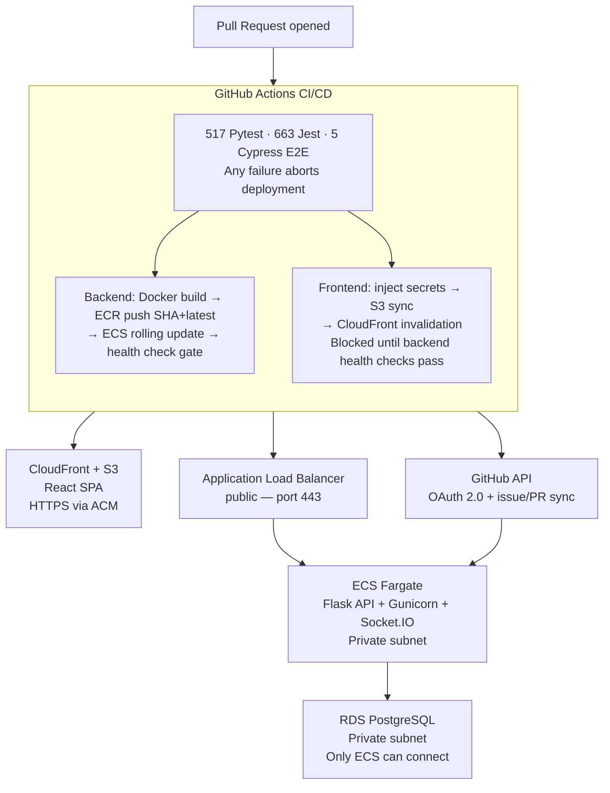
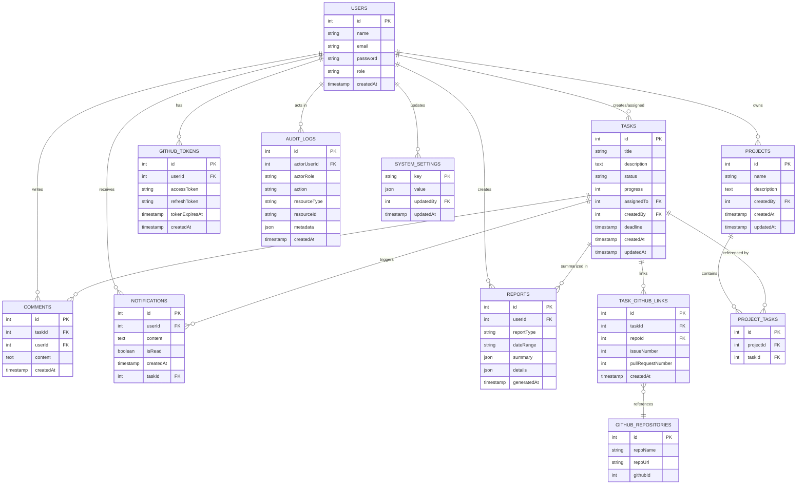

# DevSync - Project Tracker with GitHub Integration

> Production-grade full-stack project management platform with real-time Socket.IO collaboration, GitHub OAuth 2.0, task/project/comment management, reports, audit logs, and bidirectional Issue/PR linking. ECS Fargate in a custom VPC, RDS in a private subnet, CloudFront frontend, and 1,446 automated tests gate every PR via GitHub Actions with OIDC federation. Deployment aborts on any failure.

<p align="center">
  
  
  
  
  
  
</p>

<p align="center">
  <a href="https://github.com/AhmedIkram05/devsync/actions/workflows/ci.yml">
    
  </a>
</p>

[→ Design Proposal](https://github.com/AhmedIkram05/DevSync/blob/6ea5839058e95aa539d89a766f3f05bbaad55ae1/docs/Design.pdf)

---

## Demonstrations

### AWS architecture - ECS Fargate in custom VPC, RDS in private subnet, CloudFront frontend


### Developer Dashboard - view and update assigned tasks, collaborate via comments, connect GitHub account


### Team Leader Dashboard - Assign projects, tasks and manage team members


### Admin Dashboard - Manage system settings, view audit logs, and generate reports


---

## AWS Architecture & CI/CD


```mermaid
flowchart TD
    PR[Pull Request opened] --> CI
 
    subgraph CI["GitHub Actions CI/CD"]
        direction TB
        tests["517 Pytest · 663 Jest · 5 Cypress E2E\nAny failure aborts deployment"]
        tests --> be_deploy["Backend: Docker build → ECR push SHA+latest\n→ ECS rolling update → health check gate"]
        tests --> fe_deploy["Frontend: inject secrets → S3 sync\n→ CloudFront invalidation\nBlocked until backend health checks pass"]
    end
 
    CI --> CF
    CI --> ALB
    CI --> GH
 
    CF["CloudFront + S3\nReact SPA\nHTTPS via ACM"]
    ALB["Application Load Balancer\npublic — port 443"]
    GH["GitHub API\nOAuth 2.0 + issue/PR sync"]
 
    ALB --> ECS
    GH --> ECS
 
    ECS["ECS Fargate\nFlask API + Gunicorn + Socket.IO\nPrivate subnet"]
 
    ECS --> RDS["RDS PostgreSQL\nPrivate subnet\nOnly ECS can connect"]
```

**Network isolation:** Security groups enforce strict ingress — only the ALB can reach ECS on port 8000, only ECS can reach RDS on port 5432. Zero public database exposure. HTTPS everywhere via ACM.

**OIDC federation:** GitHub Actions authenticates to AWS via OpenID Connect rather than long-lived access keys. The pipeline assumes an IAM role scoped to this repository's `main` branch only—no credentials are stored as GitHub Secrets.

**Frontend blocked on backend health checks:** The CD pipeline explicitly waits for ECS health checks to pass before deploying the frontend. This prevents API/UI version mismatch from reaching production.

**1,446 tests as a hard gate:** Any test failure or coverage drop (hard gates: 80% backend, 90% frontend) aborts the entire deployment pipeline before any AWS step.

---

## Developer Account

Developers can view and update work assigned to them, collaborate via comments, connect their GitHub account, and manage personal notifications.

### Developer Permissions

- **Projects** — view all projects you're a member of
- **Tasks** — view tasks in your projects; create tasks within assigned projects; update status/progress on your own tasks; delete only your own tasks
- **Comments** — add and view comments on tasks in your projects
- **GitHub** — connect GitHub account; link tasks to Issues/PRs
- **Notifications** — receive task-related notifications; mark read; manage preferences
- **Dashboard** — personal dashboard with assigned tasks, activity, and project overview

### Example Developer Actions

- View assigned tasks on a project dashboard
- Update a task status (e.g., "Todo" → "In Progress") — triggers real-time broadcast to team members
- Add a comment to a task — visible immediately to all project members
- Connect GitHub and link a task to an existing Issue
- Receive a notification when assigned a task

---

## Team Lead Account

Team Leads inherit all Developer permissions and can additionally create projects, manage team members, create/assign tasks to others, generate reports, and view team dashboards.

### Team Lead Permissions

- **All Developer permissions** plus:
- **Projects** — create new projects; add/remove team members; update project details
- **Tasks** — create tasks; assign to any team member; update any task in your projects; delete tasks
- **Reports** — generate on-demand reports (task summaries, developer performance, GitHub activity); save for future reference
- **Dashboards** — team-wide dashboard showing all project status, workload, deadlines
- **Users** — view all user profiles
- **Audit** — view audit logs for your projects (read-only)

### Example Team Lead Actions

- Create a new project "Q2 Roadmap" and invite developers
- Create a task and assign it to Alex
- Generate a report showing developer velocity for the past month
- View the team dashboard to identify bottlenecks and redistribute work

---

## Admin Account

Admins have full platform access: user management, system settings, audit logs, retention policies, and all reporting across all projects.

### Admin Permissions

- **All Team Lead permissions** plus:
- **Users** — create, edit, delete users; change roles; reset passwords; view all user activity
- **System Settings** — configure retention policies, system-wide limits, feature flags, GitHub integration settings
- **Audit Logs** — full audit trail of all platform actions; filter by user/action/resource/date; export and cleanup old logs
- **Repositories** — track GitHub repositories across the platform; manage GitHub organization connections
- **Retention** — run cleanup jobs to archive or delete old data
- **Reports** — access all saved reports across all users and projects
- **Security** — view authentication logs, failed login attempts, suspicious activity

### Example Admin Actions

- Create a new user account and assign a role
- Change a user's role from Developer to Team Lead
- Configure data retention policy (delete audit logs older than 90 days)
- View system statistics (total projects, users, tasks, last week's activity)
- Run retention cleanup to archive old data

---

## GitHub Integration

Connect your GitHub account via OAuth 2.0 to link tasks with GitHub Issues and Pull Requests. The platform maintains a bidirectional connection—when an Issue closes or PR merges on GitHub, the linked task updates automatically. GitHub access tokens are stored server-side only and never exposed to the browser.

### GitHub Features

- **OAuth 2.0 Connection** — securely connect your GitHub account; disconnect anytime
- **Repository Tracking** — track GitHub repositories and view their Issues/PRs within DevSync
- **Bidirectional Task ↔ Issue Linking** — create new GitHub Issues from tasks or link existing ones
- **Pull Request Association** — attach open PRs to tasks to tie code changes to work
- **Live Status Sync** — Issue closes on GitHub → linked task status updates in DevSync (and vice versa)
- **Repository Browser** — filter Issues and PRs by state, assignee, labels, and page through results

### How It Works

1. Click "Connect GitHub" in your profile (Developer+)
2. Authorize the application to access your repositories
3. In any task, click "Link GitHub Issue" or "Attach PR"
4. Select a repository, create a new Issue, or link an existing one
5. Updates sync bidirectionally: close the Issue → task status updates in DevSync
6. Admins track additional repositories via `POST /api/github/repositories`

---

## Notifications

The notification system keeps team members informed about work affecting them. Notifications are scoped to the current user, persist until read/deleted, and broadcast in real-time via Socket.IO.

### Notification Types

- **Task Assignment** — you've been assigned a new task
- **Task Update** — a task you own or are assigned to was updated (status, progress, assignee)
- **Comment Mention** — someone @mentioned you in a comment
- **Comment Reply** — someone replied to your comment thread
- **Admin Action** — system-wide changes, user role updates (admin notifications only)

### Real-time Delivery

Notifications broadcast via Socket.IO. When a task updates, all users in that project room receive a live notification without page refresh.

---

## Real-time Collaboration

Real-time updates keep teams in sync. When a task, project, or setting changes, all connected clients viewing that context receive a live broadcast via WebSocket (Socket.IO).

### Real-time Features

- **WebSocket Layer** — JWT-authenticated Socket.IO connections; unauthenticated connections rejected
- **Project-Scoped Rooms** — each project is a room; updates broadcast only to members viewing that project
- **Live Presence** — see which team members are currently viewing the same project/task
- **Live Task Updates** — change task status and see it update instantly for others (no refresh needed)
- **Dashboard Refresh** — after any mutation (task, project, report, settings), dashboards refresh automatically

### Example Real-time Flow

1. User A opens Project X (joins project room)
2. User B opens Project X (joins same room)
3. User A changes Task #42 from "Todo" to "In Progress"
4. User B sees Task #42 status change instantly
5. Notification broadcast: "Task #42 updated by User A"

---

## Design Decisions

**WebSocket rooms scoped to projects** — Socket.IO connections are JWT-authenticated on handshake. Clients join project-specific rooms so broadcasts are scoped: a task update in Project A never reaches a client viewing Project B. Dashboard refresh events emit after task, project, report, user, and settings mutations.

**Highly indexed PostgreSQL schema** — The schema is designed for actual API query patterns: indexes on foreign keys, frequently filtered columns, and join columns. Reports, audit logs, system settings, GitHub repositories, and task links each map to dedicated tables matching the backend surface.

**Rolling ECS updates with SHA + latest tagging** — Every Docker image gets both the Git commit SHA and `latest` tag. Rolling updates replace tasks incrementally, keeping the service live. The SHA tag provides a pinned, immutable reference for rollback.

**Least-privilege security groups** — Only the ALB reaches ECS on port 8000; only ECS reaches RDS on port 5432. No other traffic is permitted at the network layer—enforced by AWS, not application code.

---

## Testing

| Layer | Framework | Count | Coverage |
| --- | --- | --- | --- |
| Backend unit + integration | Pytest | 517 | 85% line coverage (hard gate) |
| Frontend unit + component | Jest + React Testing Library | 929 | 85% line coverage (hard gate) |
| **Total** | | **1,446** | |

Tests run on every PR. Any failure—including a coverage threshold drop—aborts the CD pipeline before any deployment step runs.

---

## Getting Started

### Prerequisites

- Python 3.8+
- Node.js 14.x+, npm 6.x+
- Docker + Docker Compose

### 1. Clone

```bash
git clone https://github.com/AhmedIkram05/DevSync
cd DevSync
```

### 2. Environment setup

```bash
cp .env.example .env
# Fill in: DATABASE_URL, JWT_SECRET_KEY, GITHUB_CLIENT_ID, GITHUB_CLIENT_SECRET
```

### 3. Backend

```bash
python -m venv .venv
source .venv/bin/activate  # Windows: .venv\Scripts\activate
pip install -r backend/requirements.txt
```

### 4. Frontend

```bash
cd frontend
npm install
```

### 5. Start local database

```bash
make db-up
make db-setup
```

### 6. Run

```bash
# Backend (from repo root)
source .venv/bin/activate
cd backend/src && python app.py
# API runs at http://localhost:8000

# Frontend (separate terminal)
cd frontend && npm start
# App runs at http://localhost:3000
```

### Docker & Makefile (recommended for local, production-like runs)

There is a Makefile that wraps two Docker Compose files for a production-like local environment:

- `docker-compose.local-postgres.yml` — local Postgres instance
- `docker-compose.backend-local.yml` — backend service using the Dockerfile

Makefile targets:

- `make db-up` — start the local Postgres service and wait for it to be healthy
- `make db-down` — stop the local Postgres service
- `make db-reset` — remove volumes and recreate the DB

- `make backend-build` — build the backend image
- `make backend-up` — start the backend container (and DB) in detached mode
- `make backend-logs` — stream backend logs
- `make backend-rebuild` — full rebuild (down, build, up)

- `make up` — start DB and backend together in detached mode
- `make down` — stop all services
- `make reset` — full reset (down, remove DB volumes, up)

**Example: Production-like backend and DB**

```bash
make backend-build
make backend-up
make backend-logs
```

**Example: DB only (for venv backend development)**

```bash
make db-up
# Then run backend locally with venv
```

> **Note:** The `backend-up` target composes both DB and backend using the two Compose files. This mirrors production: private DB + backend service. Use `make db-reset` cautiously—it removes volumes and deletes data.

---

## AWS Deployment

The full deployment is automated via GitHub Actions. Manual setup is required once per environment:

| Component | Service | Notes |
| --- | --- | --- |
| Backend container registry | ECR | Private repo: `devsync-backend` |
| Backend runtime | ECS Fargate | Behind ALB, port 8000, custom VPC, private subnet |
| Database | RDS PostgreSQL | Private subnet, only ECS can connect |
| Frontend hosting | S3 + CloudFront | OAC, HTTPS via ACM |
| CI/CD auth | IAM OIDC | No static credentials—role assumed per run |

The canonical OpenAPI document lives in `docs/backend/swagger.yaml`.

---

## Database Schema


```mermaid
erDiagram
    USERS ||--o{ TASKS : "creates/assigned"
    USERS ||--o{ PROJECTS : "owns"
    USERS ||--o{ COMMENTS : "writes"
    USERS ||--o{ NOTIFICATIONS : "receives"
    USERS ||--o{ GITHUB_TOKENS : "has"
    USERS ||--o{ REPORTS : "creates"
    USERS ||--o{ AUDIT_LOGS : "acts in"
    USERS ||--o{ SYSTEM_SETTINGS : "updates"
    TASKS ||--o{ COMMENTS : "includes"
    TASKS ||--o{ NOTIFICATIONS : "triggers"
    TASKS ||--o{ TASK_GITHUB_LINKS : "links"
    PROJECTS ||--o{ PROJECT_TASKS : "contains"
    TASKS ||--o{ PROJECT_TASKS : "referenced by"
    TASK_GITHUB_LINKS }o--|| GITHUB_REPOSITORIES : "references"
    TASKS ||--o{ REPORTS : "summarized in"

    USERS {
        int id PK
        string name
        string email
        string password
        string role
        timestamp createdAt
    }
    TASKS {
        int id PK
        string title
        text description
        string status
        int progress
        int assignedTo FK
        int createdBy FK
        timestamp deadline
        timestamp createdAt
        timestamp updatedAt
    }
    PROJECTS {
        int id PK
        string name
        text description
        int createdBy FK
        timestamp createdAt
        timestamp updatedAt
    }
    PROJECT_TASKS {
        int id PK
        int projectId FK
        int taskId FK
    }
    COMMENTS {
        int id PK
        int taskId FK
        int userId FK
        text content
        timestamp createdAt
    }
    NOTIFICATIONS {
        int id PK
        int userId FK
        text content
        boolean isRead
        timestamp createdAt
        int taskId FK
    }
    GITHUB_TOKENS {
        int id PK
        int userId FK
        string accessToken
        string refreshToken
        timestamp tokenExpiresAt
        timestamp createdAt
    }
    GITHUB_REPOSITORIES {
        int id PK
        string repoName
        string repoUrl
        int githubId
    }
    REPORTS {
        int id PK
        int userId FK
        string reportType
        string dateRange
        json summary
        json details
        timestamp generatedAt
    }
    AUDIT_LOGS {
        int id PK
        int actorUserId FK
        string actorRole
        string action
        string resourceType
        string resourceId
        json metadata
        timestamp createdAt
    }
    SYSTEM_SETTINGS {
        string key PK
        json value
        int updatedBy FK
        timestamp updatedAt
    }
    TASK_GITHUB_LINKS {
        int id PK
        int taskId FK
        int repoId FK
        int issueNumber
        int pullRequestNumber
        timestamp createdAt
    }
```

---

## API Reference

### Authentication — `/api/auth`

| Method | Endpoint | Description |
| --- | --- | --- |
| POST | `/register` | Create new user account |
| POST | `/login` | Authenticate and issue JWT |
| POST | `/refresh` | Refresh access token |
| POST | `/logout` | Invalidate tokens |
| GET | `/me` | Get current user profile |
| GET | `/permissions` | Return role and permission list |

### Projects — `/api/projects`

| Method | Endpoint | Description |
| --- | --- | --- |
| GET | `/api/projects` | Fetch visible projects |
| POST | `/api/projects` | Create project (Team Lead+) |
| GET | `/api/projects/:id` | Fetch single project and team |
| PUT | `/api/projects/:id` | Update project (Team Lead+) |
| DELETE | `/api/projects/:id` | Delete project (Team Lead+) |
| GET | `/api/projects/:id/tasks` | Fetch project tasks |

### Tasks — `/api/tasks`

| Method | Endpoint | Description |
| --- | --- | --- |
| GET | `/api/tasks` | Fetch tasks with role-aware filters |
| POST | `/api/tasks` | Create task (Team Lead+) |
| GET | `/api/tasks/:id` | Fetch single task |
| PUT | `/api/tasks/:id` | Update task |
| DELETE | `/api/tasks/:id` | Delete task (Admin+) |
| GET/POST | `/api/tasks/:id/comments` | View or add comments |
| GET/POST | `/api/tasks/:id/github` | View or create GitHub links |
| DELETE | `/api/tasks/:id/github/:link_id` | Remove GitHub link |

### Notifications — `/api/notifications`

| Method | Endpoint | Description |
| --- | --- | --- |
| GET | `/api/notifications` | List your notifications |
| PUT | `/api/notifications/:id/read` | Mark as read |
| PUT | `/api/notifications/read-all` | Mark all as read |
| DELETE | `/api/notifications/:id` | Delete a notification |

### Dashboards — `/api/dashboard`

| Method | Endpoint | Description |
| --- | --- | --- |
| GET | `/api/dashboard` | Personal dashboard |
| GET | `/api/dashboard/client` | Team Lead+ dashboard |
| GET | `/api/dashboard/admin` | Admin dashboard |
| GET | `/api/dashboard/projects/:id` | Project-specific dashboard |

### Admin — `/api/admin`

| Method | Endpoint | Description |
| --- | --- | --- |
| GET | `/api/admin/users` | List users |
| POST | `/api/admin/users` | Create user (Admin) |
| PUT | `/api/admin/users/:id/role` | Change user role (Admin) |
| GET/PUT | `/api/admin/settings` | Read or update system settings (Admin) |
| GET | `/api/admin/audit-logs` | Paginated audit logs (Admin) |
| POST | `/api/admin/audit-logs/cleanup` | Cleanup old logs (Admin) |
| GET | `/api/admin/stats` | System statistics (Team Lead+) |

### Reports — `/api/reports`

| Method | Endpoint | Description |
| --- | --- | --- |
| GET | `/api/reports` | List saved reports (Team Lead+) |
| POST | `/api/reports` | Save a report (Team Lead+) |
| GET | `/api/reports/:id` | Fetch one report |
| DELETE | `/api/reports/:id` | Delete a report |

### GitHub Integration — `/api/github`

| Method | Endpoint | Description |
| --- | --- | --- |
| GET | `/api/github/status` | Check connection status |
| GET | `/api/github/auth` | Start OAuth flow |
| GET | `/api/github/callback` | Handle OAuth callback |
| POST | `/api/github/disconnect` | Disconnect GitHub account |
| GET | `/api/github/repositories` | Fetch tracked repositories |
| POST | `/api/github/repositories` | Add repository (Admin) |
| GET | `/api/github/repositories/:repo_id/issues` | Fetch Issues |
| GET | `/api/github/repositories/:repo_id/pulls` | Fetch Pull Requests |

---

## Role-Based Access Control Summary

| Role | Can Create Projects | Can Create Tasks | Can Manage Users | Can View Reports | Can Manage System |
| --- | --- | --- | --- | --- | --- |
| **Developer** | No | No (own project only) | No | No | No |
| **Team Lead** | Yes | Yes (in own projects) | View only | Yes | No |
| **Admin** | Yes | Yes | Yes | Yes | Yes |

---

## Security

| Concern | Implementation |
| --- | --- |
| Authentication | JWT in HTTP-only cookies with bearer support for API clients |
| Token storage | GitHub tokens stay in backend database, never exposed to browser |
| OAuth flow | Server-side callback with state validation |
| Input validation | Route validators and controller-level checks throughout |
| Mutation safety | DB transactions with rollback on controller failure |
| Network isolation | Security groups: only ALB → ECS → RDS |
| CI/CD credentials | OIDC federation—no static AWS credentials stored |
| Route protection | Role and permission decorators on all protected routes |

---

## Technology Stack

| Layer | Technology |
| --- | --- |
| Frontend | React 18, Vite, Tailwind CSS, Socket.io client, React Testing Library |
| Backend | Flask, SQLAlchemy, Flask-SocketIO, Gunicorn |
| Database | PostgreSQL on AWS RDS |
| Real-time | Socket.IO (WebSockets) |
| Auth | JWT (HTTP-only cookies), GitHub OAuth 2.0 |
| Cloud | AWS ECS Fargate, ECR, RDS, S3, CloudFront, ACM |
| CI/CD | GitHub Actions, OIDC federation, Docker |
| Testing | Pytest, Jest, React Testing Library, Cypress |
| Local dev | Docker Compose, Make |

---

## Related Projects From Me

- [ATM Log Aggregation & Diagnostics Platform](https://github.com/AhmedIkram05/laad) - production data engineering with RAG diagnostic assistant
- [StockLens FinTech App](https://github.com/AhmedIkram05/StockLens) - full-stack mobile app with OCR pipeline and ML forecasting
- [W3C Web Logs ETL Pipeline](https://github.com/AhmedIkram05/W3C-ETL-Pipeline) - parallel Airflow ETL with Power BI analytics
