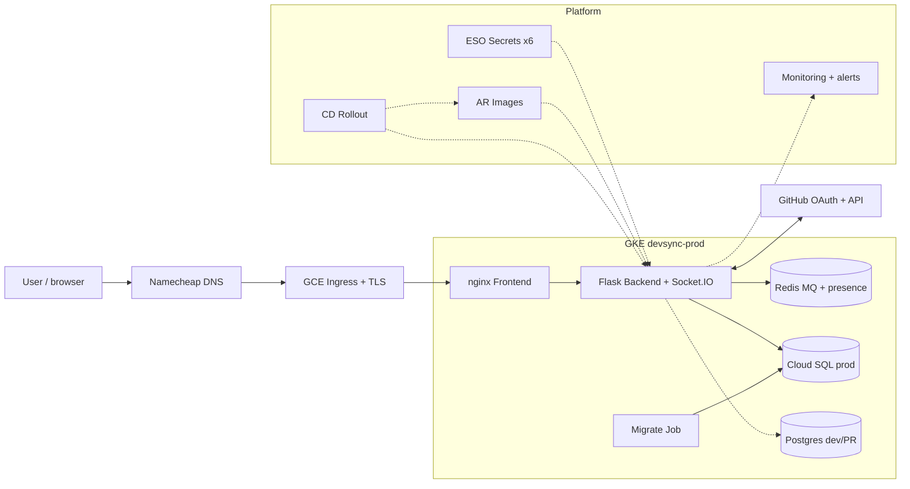

# DevSync

> Team task tracker for dev teams with GitHub-synced issues/PRs, realtime rooms with comments and presence, and **3** dev/TL/admin workflows - live on GKE.

DevSync covers the sprint in one place - boards with Assigned and In Progress states, assignments, deadlines, progress bars, realtime comments, GitHub OAuth with issue and PR linking, presence rooms, Reports with per-developer completion, and admin User Mgmt plus self-registration and retention settings.

The architecture is the point - the same board runs live on GKE at https://gcp.devsyncapp.me with Flask-SocketIO rooms, Redis presence, and managed Postgres behind it.

<p align="center">
<a href="https://react.dev/"></a>
<a href="https://tailwindcss.com/"></a>
<a href="https://www.python.org/"></a>
<a href="https://flask.palletsprojects.com/"></a>
<a href="https://www.sqlalchemy.org/"></a>
<a href="https://gunicorn.org/"></a>
<a href="https://swagger.io/"></a>
<a href="https://www.postgresql.org/"></a>
<a href="https://redis.io/"></a>
<a href="https://www.docker.com/"></a>
<a href="https://nginx.org/"></a>
<a href="https://kubernetes.io/"></a>
<a href="https://cloud.google.com/"></a>
<a href="https://www.terraform.io/"></a>
<a href="https://github.com/features/actions"></a>
<a href="https://socket.io/"></a>
<a href="https://k6.io/"></a>
<a href="https://docs.pytest.org/"></a>
<a href="https://www.cypress.io/"></a>
<a href="https://jestjs.io/"></a>
</p>

<p align="center">
  <a href="https://github.com/AhmedIkram05/devsync/actions/workflows/ci.yml">
    
  </a>
  <a href="https://github.com/AhmedIkram05/devsync/actions/workflows/k8s-cd.yml">
    
  </a>
  <a href="https://github.com/AhmedIkram05/devsync/actions/workflows/k8s-pr.yml">
    
  </a>
  <a href="https://github.com/AhmedIkram05/devsync/actions/workflows/codeql-analysis.yml">
    
  </a>
  <a href="https://codecov.io/gh/AhmedIkram05/DevSync">
    
  </a>
</p>

<p align="center">
  
  <br/><em>Cluster list 100% healthy, Standard autoscale 2-6 (3 at capture 2026-09-12, ~4 after Phase 2) in us-central1-a, backend 2/2 and frontend 2/2 live.</em>
</p>

<p align="center">
  
  <br/><em>e2-small pool autoscale 2-6 (3 at capture 2026-09-12, ~4 after Phase 2), managed Postgres with CPU chart, 6 synced secrets - the prod estate in one pass.</em>
</p>

## How It Fits Together


```mermaid
flowchart LR
    USER["User / browser"]
    DNS["Namecheap DNS"]
    ING["GCE Ingress + TLS"]

    subgraph GKE["GKE devsync-prod"]
        FE["nginx Frontend"]
        BE["Flask Backend + Socket.IO"]
        REDIS[("Redis MQ + presence")]
        SQL[("Cloud SQL prod")]
        PGDEV[("Postgres dev/PR")]
        JOB["Migrate Job"]
    end

    GH["GitHub OAuth + API"]

    subgraph PLAT["Platform"]
        SM["ESO Secrets x6"]
        AR["AR Images"]
        CD["CD Rollout"]
        MON["Monitoring + alerts"]
    end

    USER --> DNS
    DNS --> ING
    ING --> FE
    FE --> BE

    BE --> REDIS
    BE --> SQL
    JOB --> SQL
    BE <--> GH
    BE -.-> PGDEV

    SM -.-> BE
    CD -.-> AR
    AR -.-> BE
    CD -.-> BE
    BE -.-> MON
```

End-to-end: Browser hits the GCE Ingress over managed TLS → nginx serves the SPA and proxies `/api/*` and `/socket.io/*` to Flask on Gunicorn gevent → JWT auth plus role checks gate each route → Socket.IO verifies project membership before joining `project_<id>` rooms → broadcasts fan out cluster-wide via the Redis message queue → state persists to Cloud SQL over private IP with presence and rate-limit counters in Redis. Full receipts in [docs/planning/k8s-prod-platform.md](docs/planning/k8s-prod-platform.md) and [docs/planning/k8s-phase2-scaling.md](docs/planning/k8s-phase2-scaling.md).

## Every Piece in One Line

| Piece | What it does |
| --- | --- |
| **GKE Standard `devsync-prod`** | Zonal us-central1-a, REGULAR channel, e2-small pool autoscale 2-6 (3 at capture 2026-09-12, ~4 after Phase 2), endpoint computed via TF outputs |
| **Terraform modules `gke` + `iam`; root `dashboard` + `services`** | Cluster, WIF OIDC for repo AhmedIkram05/devsync, Artifact Registry `devsync-repo` in us-central1, dashboard and alerts |
| **GCE Ingress + `devsync-prod-cert`** | Catch-all → `frontend:80`, covers devsyncapp.me, www.devsyncapp.me, gcp.devsyncapp.me |
| **Frontend 2/2** | nginx image, req 100m/128Mi lim 500m/512Mi, proxies to backend FQDN with node-local DNS 169.254.20.10 |
| **Backend 2/2 + Migrate Job** | Flask-SocketIO on gunicorn, req 250m/256Mi lim 1000m/1Gi, startup/liveness/readiness on `/health:8000`, preStop sleep 15, SA `devsync-ksa`; migrate Job runs first, backoffLimit 3 |
| **Redis + realtime** | `REDIS_URL=redis://devsync-redis:6379/0`; `message_queue=REDIS_URL` in prod else None with CORS locked to FRONTEND_URL; `presence:user:<id>` SETEX 30s with 10s heartbeat and POD_ID from HOSTNAME; `_membership_denied` re-check on every emit with `_safe_emit` degrading instead of 500ing; Redis INCR/EXPIRE 300/60s fail-open with bypass via env (CI perf sets 0; live verify keeps 300/60s) |
| **ESO → `devsync-app-secrets`** | Syncs 6 secrets (DATABASE_URL, JWT_SECRET_KEY, GITHUB_CLIENT_ID, GITHUB_CLIENT_SECRET, FERNET_KEY, POSTGRES_PASSWORD) |
| **`managed-db` overlay (applied)** | Deletes PG StatefulSet, Cloud SQL annotation, DATABASE_URL via secretKeyRef, private IP with no proxy |
| **NetworkPolicy default-deny** | Only DNS 169.254.20.10:53, frontend→backend :8000, backend/migrate→PG :5432 and Redis :6379, Cloud SQL egress 10.60.0.0/24:5432, LB ranges 130.211.0.0/22 + 35.191.0.0/16, and :443 egress stay open |
| **PDBs + HPA** | minAvailable 1 on both backends and frontends; frontend HPA 2-6 at CPU 60 |
| **CI/CD + `pr` previews** | ci.yml: kustomize plus kubeconform strict, socket smoke with broadcast_smoke 7 and cross-pod receipt; k8s-cd.yml: workflow_run on main plus dispatch with build, Trivy HIGH,CRITICAL, cosign v3.1.3 stored-key sign, Syft SBOM, SLSA, fail-closed tf-plan, tf-apply, managed-db rollout with digest tripwire and migrate wait, verify (TLS, OAuth, port-forward, Cypress, k6 `--vus 3 --duration 30s` vs live), then collect; pr overlay gives ephemeral `pr-<n>` namespace at replicas 1 with sticky comment and GC on close |
| **Observability** | 4-tile dashboard (backend/frontend CPU, container restarts, BackendDown log evidence, error logs) plus 3 alerts (BackendDown on k8s_pod BackOff, RedisDegraded, CloudSQL over 9GB) |

## Why It's Interesting

| What | Why a reviewer should care |
| --- | --- |
| **One line unlocks scale** | `message_queue` on `REDIS_URL` turns split-brain rooms into cluster-wide rooms; the standing cross-pod receipt test proves it on every run. [Deep dive](docs/deep-dives.md#5-realtime-at-scale) |
| **Rooms that cannot leak** | Every emit path re-checks `_membership_denied`; two live clients proved broadcast delivery over polling, websocket, and port-forward on 2026-09-12. [Deep dive](docs/deep-dives.md#5-realtime-at-scale) |
| **Limits that hold across pods** | Redis INCR/EXPIRE shares one 300/60s budget across both replicas and fails open; bypass via env (CI perf sets 0; live verify keeps 300/60s). [Deep dive](docs/deep-dives.md#5-realtime-at-scale) |
| **Supply chain you can verify** | Digest-pinned rollout with a deploy-time tripwire, stored-key cosign signatures, and SLSA provenance on every image. [Deep dive](docs/deep-dives.md#6-cicd) |
| **Infra alerts decoupled from app SLOs** | BackendDown watches k8s_pod BackOff events, fired on a real CrashLoop canary with email proof; PDB drain-denied proven with zero live impact. [Deep dive](docs/deep-dives.md#7-observability) |

## Key Metrics

| Metric | Value |
| --- | --- |
| Tests | **1,520 total** - 579 backend expanded (449 unit + 113 integration + 2 cross-pod, base 564) + 929 Jest across 71 suites + 12 Cypress across 5 specs |
| Coverage gates | 80% backend line, 85%/75% frontend (lines/functions/statements/branches) |
| Live k6 vs prod | 3 VU / 30s, **250/250 checks**, p95 232ms, p99 447ms, thresholds p95<500ms, p99<1000ms, <1% fail |
| CI k6 baseline | p95 9.65ms, 46.58 rps at 10 VU ([baseline.json](backend/tests/perf/baseline.json)) |
| Realtime proof | Broadcast 2026-09-12 over polling, websocket, and port-forward, all OK |
| Resilience proofs | BackendDown CrashLoop email fired; PDB drain-denied |
| Cluster | Standard zonal us-central1-a, e2-small 2-6 (3 at capture 2026-09-12, ~4 after Phase 2), REGULAR, endpoint via TF outputs |
| Deployments | Backend 2/2 (250m/256Mi → 1000m/1Gi), frontend 2/2 (100m/128Mi → 500m/512Mi), PDBs minAvailable 1, HPA 2-6 CPU 60 |
| Data | Managed Postgres devsync-db PG16.15 Enterprise 1vCPU 628MB 10GB SSD single zone (console/GIF capture); retention control proven 30d→1d |
| Cost | **~$4-5/day** (Standard $0.10/hr control plane) until credits out; billing budget $50/mo at 50/80/100% |

> **Metrics provenance:** 1,520 = 579 backend expanded (564 base) (449 unit + 113 integration + 2 cross-pod) + 929 Jest + 12 Cypress; k6 live numbers are the 2026-09-12 3VU/30s run against <https://gcp.devsyncapp.me> (250/250, p95 232ms, p99 447ms) and sit outside the test count; CI baseline p95 9.65ms at 46.58 rps is the committed localhost gate; broadcast, BackendDown email, and PDB drain-denied receipts live in docs/planning/k8s-prod-platform.md and docs/planning/k8s-phase2-scaling.md.

## Demos

### Monitoring and alerting

<p align="center">
  
  <br/><em>Dashboard CPU, restarts, BackendDown Back-off rows, and error logs; 1 firing alert with RedisDegraded, CloudSQL over 9GB, and BackendDown policies; BackendDown CrashLoop email.</em>
</p>

### Test suites

<p align="center">
  
  <br/><em>pytest 449 unit plus 113 integration plus 2 cross-pod, 579 expanded, Jest 71 suites with 929 tests, Cypress 5 specs with 12 tests all passing.</em>
</p>

### Pipelines

<p align="center">
  
  <br/><em>CI 166 Success in 3m10s; K8s CD 32 Success in 12m40s from gate to collect; K8s PR 30 Success in 8m10s with sticky comment.</em>
</p>

### Developer workspace

<p align="center">
  
  <br/><em>Dashboard with Assigned 4 and In Progress 1, GitHub issues and PRs linked to tasks, realtime comments.</em>
</p>

### Team lead workspace

<p align="center">
  
  <br/><em>Task at 99%, Reports Developer Performance across 4 members at 17% completion, Team Lead Workspace with 12 assigned.</em>
</p>

### Admin workspace

<p align="center">
  
  <br/><em>User Management across 4 users and roles, System Settings with self-registration plus retention 30d to 1d plus auto-delete.</em>
</p>

### Load test evidence

<p align="center">
  
  <br/><em>Live k6 thresholds p95 under 500ms, p99 under 1000ms, under 1% fail - measurements, separate from the 1,520 test count.</em>
</p>

## Trade-offs That Mattered

| Decision | Alternative | Why |
| --- | --- | --- |
| **GKE Standard zonal over regional** | Regional cluster | Regional pools hit stockouts; zonal us-central1-a had proven capacity and keeps PDB drain semantics |
| **In-cluster Redis, single replica** | Managed memory store | Pub/sub transit plus TTLs rebuild on restart; standing managed cost for zero users was indefensible |
| **Cloud SQL private IP, no proxy** | Public IP or proxy sidecar | Private IP with sslmode require is simplest; proxy only if private IP or IAM auth ever needs it |
| **Fail-open limiter on Redis outage** | Fail-closed | A cache outage must not become a self-outage; throttle-disabled CI already proves the open shape |
| **Stored-key cosign over keyless** | Keyless OIDC | Keyless hung with no local token and the SPDX bundle path failed; stored key with custom attest is green |
| **Catch-all Ingress, no per-host rules** | Per-host routing | One backend serves devsyncapp.me, www, and gcp hosts; fewer rules, same TLS coverage |

All numbered ADRs plus the full reasoning live in [docs/planning](docs/planning/) with component depth in [docs/deep-dives.md](docs/deep-dives.md).

## Deep Dives

Architecture, realtime design, database, testing, k6 methodology, security, Terraform, and CI/CD detail live in **[docs/deep-dives.md](docs/deep-dives.md)** - this README keeps one-liners with proof and links out for depth.

## Quick Start

### Prerequisites

- Docker + Docker Compose
- Python 3.11+, Node 20+
- `gcloud` + Terraform ~1.15 for prod deploys

### Run It

```bash
git clone https://github.com/AhmedIkram05/DevSync
cd DevSync
cp .env.example .env
# At minimum, generate JWT_SECRET_KEY:
#   python3 -c "import secrets; print(secrets.token_hex(32))"

make up
# Starts Postgres, Flask backend, and React frontend in Docker
```

Open **<http://localhost:3000>** - the frontend nginx proxies `/api/*` and `/socket.io/*` to the backend transparently.

> **Port conflict?** Docker Desktop binds port 3000 on some setups. Use `DEVSYNC_FRONTEND_PORT=3001 make up`.

### Configuration

| Variable | Purpose | Default |
| --- | --- | --- |
| `DATABASE_URL` | Postgres connection string (ESO-synced in prod) | local compose DSN |
| `JWT_SECRET_KEY` | JWT signing key | - (generate it) |
| `FRONTEND_URL` | Allowed socket CORS origin in production | `https://gcp.devsyncapp.me` in prod |
| `REDIS_URL` | Socket queue, presence, and limiter backend | `redis://devsync-redis:6379/0` in prod |
| `GITHUB_CLIENT_ID` / `GITHUB_CLIENT_SECRET` | OAuth login plus issue/PR sync | - |
| `FERNET_KEY` | OAuth token encryption | - |
| `RATE_LIMIT_REQUESTS_PER_WINDOW` | Global throttle budget, `0` disables | `300` per 60s |

### Tests

```bash
# Backend: 579 expanded (449 unit + 113 integration + 2 cross-pod, base 564)
pytest backend/tests/unit -q
pytest backend/tests/integration -q

# Frontend: 929 Jest across 71 suites
npm test --prefix frontend

# E2E: 12 Cypress across 5 specs
npx cypress run --project frontend
```

### Deploy

```bash
# Prod deploys are push-to-main via k8s-cd.yml:
# build to Artifact Registry → sign → tf-apply → managed-db rollout → verify → collect
# Live URL: https://gcp.devsyncapp.me
# PR previews: ephemeral pr-<n> namespace with sticky comment and GC on close
```

## Documentation

| Doc | What it covers |
| --- | --- |
| [docs/deep-dives.md](docs/deep-dives.md) | Architecture, realtime, database, testing, k6, security, Terraform, CI/CD |
| [docs/planning/k8s-prod-platform.md](docs/planning/k8s-prod-platform.md) | Prod platform plan with A11/A12/A13 live receipts |
| [docs/planning/k8s-phase2-scaling.md](docs/planning/k8s-phase2-scaling.md) | Permanent hardening: MQ line, presence, limiter, managed DB |
| [docs/backend/swagger.yaml](docs/backend/swagger.yaml) | Complete API reference for all `/api/v1/*` routes |
| [docs/backend/rbac.md](docs/backend/rbac.md) | Role-permission matrix for Developer, Team Lead, and Admin |
| [docs/backend/models.md](docs/backend/models.md) | Entity descriptions for all 12 tables |
| [docs/backend/load-testing.md](docs/backend/load-testing.md) | k6 gate, thresholds, baseline, and local runbook |
| [docs/Design.pdf](docs/Design.pdf) | Original architecture design document |

## About Ahmed Ikram

A personal project by **Ahmed Ikram**, designed and built end-to-end - from the Flask API, JWT auth, and cross-pod Socket.IO rooms, through the k6 quality gates and per-PR preview envs, to the standing GKE prod platform with managed Postgres, Redis-backed limits, and Terraform ownership.

## Related Projects

- [**WikiStream**](https://github.com/AhmedIkram05/WikiStream) - realtime Wikipedia streaming analytics: async SSE consumer, ClickHouse, BigQuery warehouse, Terraform on Google Cloud
- [**SWE-Qwen**](https://github.com/AhmedIkram05/SWE-Qwen) - SWE-bench to QLoRA fine-tuning to execution-based evaluation LLMOps platform
- [**LAAD**](https://github.com/AhmedIkram05/laad) - ATM log aggregation and diagnostics: Kafka streaming, 3-layer ML anomaly detection, agentic RAG assistant
- [**StockLens**](https://github.com/AhmedIkram05/StockLens) - FinTech mobile app: OCR receipt scanning, portfolio analytics, LSTM forecasting, self-built MCP server
- [**W3C ETL Pipeline**](https://github.com/AhmedIkram05/W3C-ETL-Pipeline) - serverless Azure ETL: W3C web logs through Databricks DLT to dbt to Power BI

---

<p align="center">
  <b>DevSync</b> - realtime project tracking on GKE: Ingress → nginx → Flask-SocketIO → managed Postgres + Redis.<br/>
  Built with Python · Flask · React · Postgres · Redis · Kubernetes · Terraform · Google Cloud · GitHub Actions.<br/>
  MIT © Ahmed Ikram
</p>
