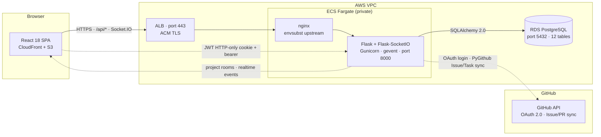

# DevSync

> Full-stack project management platform with real-time collaboration, GitHub OAuth 2.0 integration, and bidirectional Issue/PR sync - guarded by 1,462 automated tests, a k6 load-test gate (P95 latency ceiling at sustained load), path-aware CI, ruff + ESLint, pip-audit + npm audit, and CodeQL. Every PR that fails a check or drops coverage below 85% is rejected automatically.

<p align="center">
<a href="https://react.dev/"></a>
<a href="https://tailwindcss.com/"></a>
<a href="https://www.python.org/"></a>
<a href="https://flask.palletsprojects.com/"></a>
<a href="https://www.sqlalchemy.org/"></a>
<a href="https://gunicorn.org/"></a>
<a href="https://swagger.io/"></a>
<a href="https://www.postgresql.org/"></a>
<a href="https://www.docker.com/"></a>
<a href="https://nginx.org/"></a>
<a href="https://aws.amazon.com/"></a>
<a href="https://github.com/features/actions"></a>
<a href="https://socket.io/"></a>
<a href="https://k6.io/"></a>
<a href="https://docs.pytest.org/"></a>
<a href="https://www.cypress.io/"></a>
</p>

<p align="center">
  <a href="https://github.com/AhmedIkram05/devsync/actions/workflows/ci.yml">
    
  </a>
  <a href="https://github.com/AhmedIkram05/devsync/actions/workflows/codeql-analysis.yml">
    
  </a>
  <a href="https://codecov.io/gh/AhmedIkram05/DevSync">
    
  </a>
</p>

<br/>

DevSync goes past the project board: three-role access control, sockets that push updates the instant a teammate edits a task, and GitHub Issues/PRs wired to tasks in both directions. The interesting part is under the hood - every PR is measured, not just tested.

- **RBAC** - Developer, Team Lead, and Admin roles with endpoint-level permission enforcement
- **Real-time collaboration** - Socket.IO rooms scoped per project; JWT handshake; broadcasts never leak across projects
- **GitHub integration** - OAuth 2.0 account linking with bidirectional Issue/PR ↔ Task sync
- **Admin controls** - audit logs, user management, system-wide reports with filters

## How It Fits Together

The React SPA and the Flask API talk over load-balanced HTTPS; every stateful and realtime layer sits inside a custom VPC:


```mermaid
flowchart LR
    subgraph Client["Browser"]
        SPA["React 18 SPA<br/>CloudFront + S3"]
    end

    subgraph GitHub["GitHub"]
        GH["GitHub API<br/>OAuth 2.0 · Issue/PR sync"]
    end

    subgraph AWS_VPC["AWS VPC"]
        ALB["ALB · port 443<br/>ACM TLS"]
        subgraph ECS["ECS Fargate (private)"]
            NX["nginx<br/>envsubst upstream"]
            APP["Flask + Flask-SocketIO<br/>Gunicorn · gevent · port 8000"]
        end
        RDS[("RDS PostgreSQL<br/>port 5432 · 12 tables")]
    end

    SPA -->|"HTTPS · /api/* · Socket.IO"| ALB
    ALB --> NX
    NX --> APP
    APP -->|"SQLAlchemy 2.0"| RDS
    SPA -.->|"JWT HTTP-only cookie + bearer"| APP
    APP -.->|"OAuth login · PyGithub Issue/Task sync"| GH
    APP -.->|"project rooms · realtime events"| SPA
```

**End-to-end flow:** a user signs in (credentials or GitHub OAuth) → the backend issues a JWT delivered as an HTTP-only cookie plus bearer header → the React SPA, served from CloudFront/S3, calls `/api/*` → nginx proxies to Flask on Gunicorn gevent → role decorators authorize the route → Socket.IO joins that user to their project rooms → task updates, comments, and GitHub sync events broadcast in real time.

## Every Piece, in One Line

| Area | Decision | Why |
|---|---|---|
| **Container strategy** | Multi-stage Docker builds for both frontend and backend | Backend: `python:3.11-slim` with build deps (`gcc`, `libpq-dev`) in build stage only → runtime image is ~330MB (was 600MB). Frontend: `node:20-alpine` builds, `nginx:1.27-alpine` serves - zero runtime toolchain. |
| **Compose architecture** | Separated infra (Postgres) from app (backend + frontend) via two compose files | Start DB alone for host-based dev (`docker compose -f docker-compose.local-postgres.yml up`), or full stack with `-f docker-compose.local.yml -f docker-compose.local-postgres.yml`. Standard Docker composition pattern. |
| **CI pipeline** | 8 job types, path-aware execution | Lint (ruff + ESLint), security (pip-audit + npm audit), unit tests, integration tests, E2E (Cypress), Docker build (layer-cached), k6 load test, and weekly CodeQL. Each job runs only when its paths change. |
| **Load test gate** | k6 script with in-script thresholds + committed baseline | Every backend change runs 10 VUs of authenticated traffic for 30s against the live API. P95 > 500ms / P99 > 1s / error rate > 1% fails the build; a committed baseline catches order-of-magnitude regressions (3× P95, 4× P99, +5pp errors, −30% throughput). Separate from the functional test count - load iterations are measurements, not tests. |
| **CI caching** | Docker layer caching + pip/npm dependency caching | Docker builds use `type=gha` cache (GitHub Actions cache layer sharing). Python pip and npm `node_modules` are cached via `actions/setup-python` / `setup-node`. |
| **Real-time layer** | Socket.IO with gevent workers and JWT-authenticated rooms | Each project is a separate Socket.IO room - broadcasts never leak across projects. Gevent async worker handles concurrent WebSocket connections efficiently. |
| **Deployment gating** | Backend health check → Frontend deploy | Pipeline explicitly waits for ECS rolling update to pass health checks before deploying to CloudFront. Zero API/UI version mismatch on deploy. |
| **Network isolation** | Three-tier security groups | Internet → ALB (443) → ECS (8000) → RDS (5432). No public database, no direct ECS access. |
| **Frontend proxy** | Nginx with `envsubst` template for runtime API upstream resolution | Same frontend image deploys to any environment - `API_UPSTREAM` is injected at container start. Docker DNS resolver handles service discovery. |
| **CI/CD auth** | OIDC federation with AWS - no long-lived credentials | IAM role assumed per-run, scoped to `main` branch only. Zero AWS secrets stored in GitHub. |

## Why It's Interesting

| What | Why a reviewer should care |
|---|---|
| **A load gate, not just a test gate** | Every PR runs 10 VUs of authenticated k6 traffic for 30s against the real Postgres 15 service container. In-script thresholds (P95 ≤ 500ms, P99 ≤ 1s, <1% errors) plus a committed baseline that trips on 3× P95, 4× P99, +5pp errors, or −30% throughput. Load numbers are enforced by CI, not collected in a dashboard. |
| **Rooms that cannot leak** | Socket.IO rooms are per project with a JWT-authenticated handshake - there is no code path for a broadcast to cross projects. Real-time done with gevent on a single worker, no separate WebSocket server. |
| **Zero credentials, zero bill** | OIDC federation: IAM roles assumed per CI run, scoped to `main`, with zero static AWS secrets in GitHub. And the AWS deployment was fully built, validated, and recorded - then torn down, so running cost is $0. |
| **One image, every environment** | Frontend nginx config is an `envsubst` template: `API_UPSTREAM` is injected at container start, so the same image serves local, staging, and production. No per-environment builds. |

## Key Metrics

| Metric | Value |
|---|---|
| Automated tests | **1,462 total** - 521 Pytest + 929 Jest + 12 Cypress (across 5 specs) |
| Test spread | 61 backend test files · 71 frontend test suites |
| Coverage gates | 85% backend line · 85% frontend (branches/functions/lines) |
| Code quality gates | ruff linting + format check (Python) · ESLint (JS) |
| Security gates | pip-audit + npm audit (per-PR) · CodeQL `security-and-quality` (weekly) |
| Docker image size | **~330MB** (was 600MB before multi-stage refactor) |
| Container startup | Migrations + optional bootstrap + health check under 20s |
| API response time | Sub-300ms p99 for authenticated JSON endpoints |
| Load test gate | k6: P95 ≤ 500ms · P99 ≤ 1s · <1% errors at 10 VUs sustained - enforced per PR |
| Database | 12 tables, FK-indexed, Alembic migrations, RDS in private subnet |
| Infrastructure cost | **$0** (offline - full AWS deployment validated, now torn down) |
| CI/CD auth | Zero static secrets - OIDC federation for all AWS access |
| Stack | Python 3.11 · flask + gevent · React 18 · PostgreSQL 15 |

## Demos

### AWS Infrastructure - ECS Fargate in custom VPC, RDS in private subnet, CloudFront frontend

> Infrastructure proof: the recorded walkthrough of the AWS Console confirming the ECS cluster, security group rules, RDS private subnet, CloudFront distribution, and a passing pipeline run with OIDC federation. The app was fully deployed on AWS - now offline to control costs.


### Developer Dashboard - view and update assigned tasks, collaborate, connect GitHub

> A walkthrough of the Developer experience: viewing assigned tasks on the dashboard, updating task status and progress, collaborating via real-time comments, and connecting a GitHub account to link Issues and Pull Requests to tasks.


### Team Leader Dashboard - assign projects, manage team, view analytics

> A walkthrough of the Team Leader view: creating and assigning projects, managing team members and their roles, viewing project analytics and progress reports, and generating system-wide reports.


### Admin Dashboard - system settings, audit logs, user management, reports

> A walkthrough of administrative controls: managing system settings and feature flags, reviewing audit logs for security events, creating and editing user accounts with role assignments, and generating system-wide reports with filterable views.


## Trade-offs That Mattered

The decisions that shaped the architecture, beyond the every-piece table above:

| Decision | Rationale |
|---|---|
| **Gunicorn gevent worker (not uWSGI/ASGI)** | Gevent provides cooperative async I/O for Socket.IO alongside HTTP on a single worker - no separate WebSocket server needed. uWSGI and ASGI add deployment complexity that doesn't justify the throughput difference at this scale. |
| **Two compose files (not one)** | Separating `docker-compose.local-postgres.yml` (infra) from `docker-compose.local.yml` (app) lets developers run the DB via Docker while iterating on the backend natively. The DB never needs rebuilding; `make backend-rebuild` restarts only the app stack. |
| **Flask (not FastAPI/Django)** | The app predates wide FastAPI adoption. Flask's blueprint model maps cleanly to feature domains (auth, projects, tasks, admin, etc.). The synchronous ORM (SQLAlchemy) paired with gevent gives async WebSocket without async-ifying the entire codebase. |
| **CRA (not Next.js/Vite)** | This project started before CRA was deprecated. Frontend is a plain SPA - no SSR needed. The nginx reverse proxy serves the same role as Next.js middleware without the Node.js runtime in production. A Vite migration is a valid future improvement. |
| **Nginx `envsubst` template (not build-time config)** | The same frontend Docker image deploys to any environment because `API_UPSTREAM` is injected at container start. Build-time ARGs would couple the image to one environment. |
| **OIDC (not static AWS keys)** | IAM role assumption means no credentials to leak, rotate, or audit. The trust policy is declarative - `repo:owner/repo:ref:refs/heads/main` - and scoped to the exact CI trigger. |
| **Rolling ECS update (not blue/green)** | Blue/green doubles the compute cost during deploy (two full ECS services running). Rolling replaces tasks incrementally - no capacity overhead, zero-downtime if health checks pass, and automatic rollback if they don't. |
| **Fast pytest, honest load gate** | Unit + integration tests run on in-memory SQLite for speed; the k6 load gate drives the real Postgres 15 service container end to end - schema, queries, and auth under concurrent load. |
| **k6 thresholds in-script + committed baseline (not a fixed CI config)** | The P95 ceiling and regression tripwires live next to the code they gate, so local runs and CI agree, and the numbers evolve with the product. No build-time number buried in a YAML file that someone must remember to bump. |
| **HTTP-only cookie + bearer (dual auth)** | The cookie satisfies browser SameSite/CSRF requirements; the bearer header supports mobile and API clients without cookies. Both decode the same JWT - no dual-token complexity. |

## Deep Dives

The full technical detail - AWS infrastructure, backend architecture, frontend architecture, CI/CD pipeline, database design, testing strategy, k6 load testing, security model, and project structure - lives in **[docs/deep-dives.md](docs/deep-dives.md)**.

## Quick Start

```bash
git clone https://github.com/AhmedIkram05/DevSync
cd DevSync
cp .env.example .env
# At minimum, generate JWT_SECRET_KEY:
#   python3 -c "import secrets; print(secrets.token_hex(32))"

make up
# Starts PostgreSQL DB, Flask Backend and React Frontend Containers in Docker
```

Open **http://localhost:3000** - the frontend nginx proxies `/api/*` and `/socket.io/*` to the backend transparently.

> **Port conflict?** Docker Desktop binds port 3000 on some setups. Use `DEVSYNC_FRONTEND_PORT=3001 make up`.

## Documentation

Additional reference docs for those who want to dive deeper:

| Doc | What it covers |
|---|---|
| [**OpenAPI Spec**](docs/backend/swagger.yaml) | Complete API reference: all `/api/v1/*` routes, request/response schemas, auth methods (2143 lines) |
| [**RBAC Reference**](docs/backend/rbac.md) | Full role-permission matrix for Developer, Team Lead, and Admin roles with endpoint-level authorization rules |
| [**Database Models**](docs/backend/models.md) | Entity descriptions, relationships, and field types for all 12 tables |
| [**Load Testing (k6)**](docs/backend/load-testing.md) | k6 gate: script structure, in-script thresholds, baseline-armament workflow, rate-limiter override, local runbook |
| [**Design Proposal**](docs/Design.pdf) | Original architecture design document outlining requirements and system design decisions |

## About This Project

A personal project by **Ahmed Ikram**, designed and built end-to-end, from the Flask API, JWT auth, and Socket.IO rooms, through the CI and k6 quality gates, to the AWS estate.

## Related Projects

- [**LAAD**](https://github.com/AhmedIkram05/laad) - ATM log aggregation & diagnostics: Kafka streaming, 3-layer ML anomaly detection, agentic RAG assistant on AWS ECS Fargate
- [**StockLens**](https://github.com/AhmedIkram05/StockLens) - FinTech mobile app: OCR receipt scanning, portfolio analytics, LSTM forecasting, self-built MCP server
- [**W3C ETL Pipeline**](https://github.com/AhmedIkram05/W3C-ETL-Pipeline) - serverless Azure ETL: W3C web logs through Databricks DLT → dbt → Power BI