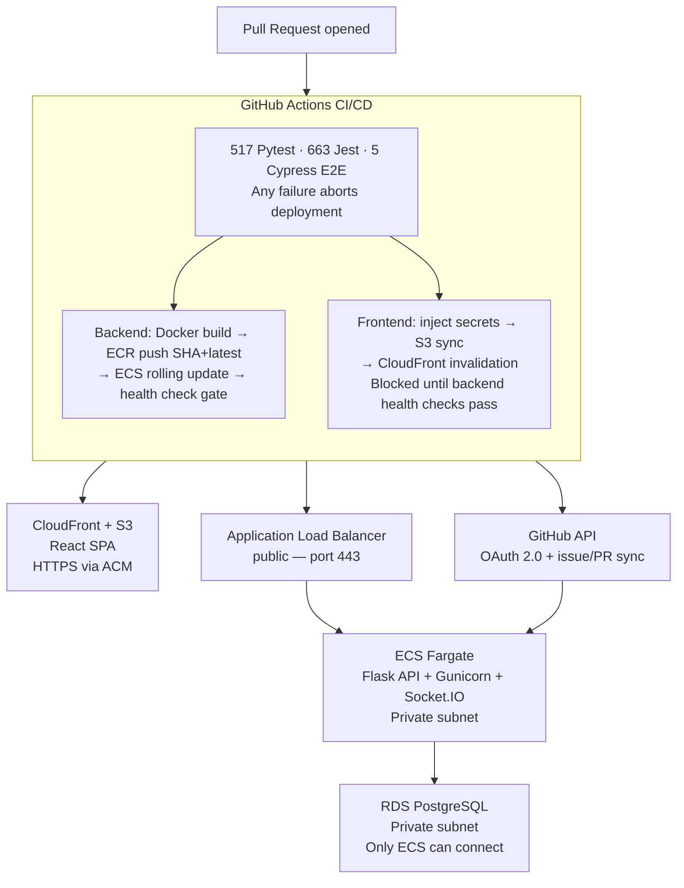

# DevSync - Project Tracker with GitHub Integration

> Production-grade full-stack project management platform with real-time Socket.IO collaboration, GitHub OAuth 2.0, task/project/comment management, reports, audit logs, and bidirectional Issue/PR linking. ECS Fargate in a custom VPC, RDS in a private subnet, CloudFront frontend, and 541 automated tests gate every PR via GitHub Actions with OIDC federation. Deployment aborts on any failure.

<p align="center">
  
  
  
  
  
  
</p>

<p align="center">
  <a href="https://github.com/AhmedIkram05/devsync/actions/workflows/ci.yml">
    
  </a>
</p>

[→ Design Proposal](https://github.com/AhmedIkram05/DevSync/blob/6ea5839058e95aa539d89a766f3f05bbaad55ae1/docs/Design.pdf)

---

## Demo

### Project dashboard - real-time task state, GitHub Issue links, and live collaborator presence


### GitHub integration - bidirectional task ↔ Issue/PR linking with live status sync


### WebSocket collaboration - task, project, and dashboard updates broadcast to scoped rooms


### GitHub Actions pipeline - 1,185 tests across Pytest, React Testing Library, Jest, and Cypress gating every PR


### AWS architecture - ECS Fargate in custom VPC, RDS in private subnet, CloudFront frontend


---

## Architecture


```mermaid
flowchart TD
    PR[Pull Request opened] --> CI
 
    subgraph CI["GitHub Actions CI/CD"]
        direction TB
        tests["517 Pytest · 663 Jest · 5 Cypress E2E\nAny failure aborts deployment"]
        tests --> be_deploy["Backend: Docker build → ECR push SHA+latest\n→ ECS rolling update → health check gate"]
        tests --> fe_deploy["Frontend: inject secrets → S3 sync\n→ CloudFront invalidation\nBlocked until backend health checks pass"]
    end
 
    CI --> CF
    CI --> ALB
    CI --> GH
 
    CF["CloudFront + S3\nReact SPA\nHTTPS via ACM"]
    ALB["Application Load Balancer\npublic — port 443"]
    GH["GitHub API\nOAuth 2.0 + issue/PR sync"]
 
    ALB --> ECS
    GH --> ECS
 
    ECS["ECS Fargate\nFlask API + Gunicorn + Socket.IO\nPrivate subnet"]
 
    ECS --> RDS["RDS PostgreSQL\nPrivate subnet\nOnly ECS can connect"]

```

> **Network isolation:** Security groups enforce strict ingress — only the ALB can reach ECS, only ECS can reach RDS. Zero public database exposure. HTTPS everywhere via ACM.

---

## Design Decisions

**OIDC federation — no static AWS credentials**
GitHub Actions authenticates to AWS via OpenID Connect rather than long-lived access keys. The pipeline assumes an IAM role scoped to this repository's `main` branch only - no credentials are stored as GitHub Secrets. If the role assumption fails, the entire pipeline fails rather than falling back to a less secure method.

**Frontend deployment blocked on backend health checks**
The CD pipeline explicitly waits for ECS health checks to pass before deploying the frontend. This prevents an API/UI version mismatch reaching production - a common failure mode where the new frontend ships before the new backend is stable, causing breaking API calls for users during the rollout window.

**1,427 tests as a hard deployment gate**
The 1,427-test suite (517 Pytest backend, 924 Jest frontend, 5 Cypress E2E) is not advisory - any single failure aborts deployment entirely. Coverage thresholds (80% backend, 90% frontend) are enforced as hard pipeline failure conditions, not warnings. This treats test coverage as a non-negotiable system property rather than a metric to report.

**Rolling ECS updates with SHA + latest dual tagging**
Every Docker image is tagged with both the Git commit SHA and `latest`. Rolling updates replace tasks incrementally, keeping the service live during deployment. The SHA tag provides a pinned, immutable reference for rollback - `docker pull devsync-backend:latest` always gets the most recent, but the exact deployed version is always recoverable by SHA.

**WebSocket rooms scoped to projects**
Socket.IO connections are authenticated with JWT on handshake — unauthenticated connections are rejected before joining any room. Clients join project-specific rooms so broadcasts are scoped: a task update in Project A is never sent to a client viewing Project B. Dashboard refresh events are emitted after task, project, report, user, and settings mutations so the UI stays current without polling.

**Highly indexed PostgreSQL schema**
The schema is designed for the query patterns the API actually executes - indexes on foreign keys, frequently filtered columns, and join columns. Reports, audit logs, system settings, GitHub repositories, and task links all map to dedicated tables so the data model matches the current backend surface.

**GitHub OAuth 2.0 — no token storage in frontend**
The OAuth flow completes server-side. The GitHub access token is stored in the backend database, not in browser localStorage or a cookie visible to client-side JavaScript. The frontend receives only a platform JWT - the GitHub token is never exposed to the browser.

**Least-privilege security groups at the network layer**
Security group rules enforce a strict ingress hierarchy: only the ALB can reach ECS on port 8000, only ECS can reach RDS on port 5432. No other traffic is permitted at the network layer - not just unauthenticated traffic, but any traffic from outside the expected source. This is enforced by AWS rather than application code, making it tamper-resistant.

---

## Features

### Project & Task Management

- Create and manage projects with team members and project-level task scopes
- Full task lifecycle — create, assign, update status, comment, and delete
- Real-time task, project, user, and report refresh events via Socket.IO
- Notification system for task assignments, comments, mentions, and admin actions
- Dashboard endpoints for user, client, admin, and project-specific views

### GitHub Integration

- GitHub OAuth 2.0 — connect your GitHub account securely and disconnect it later
- Track GitHub repositories in the platform database
- Bidirectional task ↔ GitHub Issue linking — create Issues from tasks or link existing Issues
- Pull Request linking — associate tasks with open PRs
- Repository issue/PR browser with filters for state, page, and per-page
- Live status sync — Issue/PR state reflected in platform tasks and dashboards

### Administration & Reporting

- Admin user creation, editing, deletion, and role updates
- System stats, system settings, and retention cleanup controls
- Audit log browsing, detail lookup, and cleanup
- Saved reports for tasks, developers, and GitHub activity with pagination

### Real-time Collaboration

- WebSocket layer (Socket.io) with JWT-authenticated connections
- Project-scoped rooms - updates only broadcast to relevant project members
- Live dashboard refresh events after mutations

### Platform Security

- JWT authentication on all API routes and WebSocket connections
- GitHub tokens stored server-side only - never exposed to the browser
- RBAC for user, project, admin, report, and notification access control
- HTTPS enforced end-to-end via ACM

---

## Testing

| Layer | Framework | Count | Coverage |
| --- | --- | --- | --- |
| Backend unit + integration | Pytest | 517 | 85% line coverage (hard gate) |
| Frontend unit + component | Jest + React Testing Library | 929 | 85% line coverage (hard gate) |
| **Total** | | **1,441** | |

Tests run on every PR. Any failure - including a coverage threshold drop - aborts the CD pipeline before any deployment step runs.

---

## Getting Started

### Prerequisites

- Python 3.8+
- Node.js 14.x+, npm 6.x+
- Docker + Docker Compose

### 1. Clone

```bash
git clone https://github.com/AhmedIkram05/DevSync
cd DevSync
```

### 2. Environment setup

```bash
cp .env.example .env
# Fill in: DATABASE_URL, JWT_SECRET_KEY, GITHUB_CLIENT_ID, GITHUB_CLIENT_SECRET
```

### 3. Backend

```bash
python -m venv .venv
source .venv/bin/activate  # Windows: .venv\Scripts\activate
pip install -r requirements.txt
```

### 4. Frontend

```bash
cd frontend
npm install
```

### 5. Start local database

```bash
make db-up
make db-setup
```

### 6. Run

```bash
# Backend (from repo root)
source .venv/bin/activate
cd backend/src && python app.py
# API runs at http://localhost:8000

# Frontend (separate terminal)
cd frontend && npm start
# App runs at http://localhost:3000
```

### Docker & Makefile (recommended for local, production-like runs)

There is a Makefile that wraps two Docker Compose files for a production-like local environment:

- `docker-compose.local-postgres.yml` — local Postgres instance used for development and testing
- `docker-compose.backend-local.yml` — backend service definition that uses the backend Dockerfile

Common Makefile targets:

- `make db-up` — start the local Postgres service in detached mode and wait for it to be healthy
- `make db-down` — stop the local Postgres service
- `make db-reset` — remove volumes and recreate the DB (useful when schema changes)

- `make backend-build` — build the backend service image (uses the Dockerfile in `backend/`)
- `make backend-up` — start the backend container (and the DB) in detached mode
- `make backend-logs` — stream backend logs
- `make backend-down` — stop the backend container
- `make backend-rebuild` — full backend rebuild (down, build, up)

- `make up` — start both DB and backend together (`db + backend`) in detached mode
- `make down` — stop all Compose services
- `make reset` — full reset (down, remove DB volumes, up)

Examples:

Start a production-like backend and DB locally (recommended):

```bash
# from the repo root
make backend-build
make backend-up

# view logs
make backend-logs

# stop
make backend-down
```

If you only need a local Postgres for running tests or the backend in dev mode:

```bash
make db-up
# run your backend locally (venv) or via docker
```

Notes:

- The `backend-up` target composes both the DB and backend using the two Compose files declared in the Makefile. This mirrors a minimal production topology: private DB + backend service.
- Use `make db-reset` cautiously — it removes volumes and will delete local data.
- The Docker-based flow is useful for reviewer demos or reproducing production-like behaviour without installing system-level dependencies.

### Dockerised backend (production-like)

```bash
make backend-build
make backend-up
make backend-logs
make backend-down
```

---

## AWS Deployment

The full deployment is automated via GitHub Actions. Manual setup is required once per environment:

| Component | Service | Notes |
| --- | --- | --- |
| Backend container registry | ECR | Private repo: `devsync-backend` |
| Backend runtime | ECS Fargate | Behind ALB, port 8000, custom VPC |
| Database | RDS PostgreSQL | Private subnet, only ECS can connect |
| Frontend hosting | S3 + CloudFront | OAC, HTTPS via ACM |
| CI/CD auth | IAM OIDC | No static credentials — role assumed per run |

The canonical OpenAPI document lives in `docs/backend/swagger.yaml`.

---

## Database Schema


```mermaid
erDiagram
    USERS ||--o{ TASKS : "creates/assigned"
    USERS ||--o{ PROJECTS : "owns"
    USERS ||--o{ COMMENTS : "writes"
    USERS ||--o{ NOTIFICATIONS : "receives"
    USERS ||--o{ GITHUB_TOKENS : "has"
    USERS ||--o{ REPORTS : "creates"
    USERS ||--o{ AUDIT_LOGS : "acts in"
    USERS ||--o{ SYSTEM_SETTINGS : "updates"
    TASKS ||--o{ COMMENTS : "includes"
    TASKS ||--o{ NOTIFICATIONS : "triggers"
    TASKS ||--o{ TASK_GITHUB_LINKS : "links"
    PROJECTS ||--o{ PROJECT_TASKS : "contains"
    TASKS ||--o{ PROJECT_TASKS : "referenced by"
    TASK_GITHUB_LINKS }o--|| GITHUB_REPOSITORIES : "references"
    TASKS ||--o{ REPORTS : "summarized in"

    USERS {
        int id PK
        string name
        string email
        string password
        string role
        timestamp createdAt
    }
    TASKS {
        int id PK
        string title
        text description
        string status
        int progress
        int assignedTo FK
        int createdBy FK
        timestamp deadline
        timestamp createdAt
        timestamp updatedAt
    }
    PROJECTS {
        int id PK
        string name
        text description
        int createdBy FK
        timestamp createdAt
        timestamp updatedAt
    }
    PROJECT_TASKS {
        int id PK
        int projectId FK
        int taskId FK
    }
    COMMENTS {
        int id PK
        int taskId FK
        int userId FK
        text content
        timestamp createdAt
    }
    NOTIFICATIONS {
        int id PK
        int userId FK
        text content
        boolean isRead
        timestamp createdAt
        int taskId FK
    }
    GITHUB_TOKENS {
        int id PK
        int userId FK
        string accessToken
        string refreshToken
        timestamp tokenExpiresAt
        timestamp createdAt
    }
    GITHUB_REPOSITORIES {
        int id PK
        string repoName
        string repoUrl
        int githubId
    }
    REPORTS {
        int id PK
        int userId FK
        string reportType
        string dateRange
        json summary
        json details
        timestamp generatedAt
    }
    AUDIT_LOGS {
        int id PK
        int actorUserId FK
        string actorRole
        string action
        string resourceType
        string resourceId
        json metadata
        timestamp createdAt
    }
    SYSTEM_SETTINGS {
        string key PK
        json value
        int updatedBy FK
        timestamp updatedAt
    }
    TASK_GITHUB_LINKS {
        int id PK
        int taskId FK
        int repoId FK
        int issueNumber
        int pullRequestNumber
        timestamp createdAt
    }
```

---

## Role-Based Access Control (RBAC)

Three roles with increasing permission levels - enforced via JWT role claims and custom permission decorators on every protected route.

| Role | Description |
| --- | --- |
| **Developer** | View and update assigned tasks, add comments, manage personal notifications, connect GitHub |
| **Team Lead** | All Developer permissions + create tasks, manage projects, view client/admin dashboards, generate and view reports |
| **Admin** | All Team Lead permissions + manage users, system settings, audit logs, retention cleanup, and repository tracking |

### Endpoint permission mapping

| Endpoint | Method | Minimum Role |
| --- | --- | --- |
| `/api/auth/register` | POST | Public |
| `/api/auth/login` | POST | Public |
| `/api/auth/refresh` | POST | Authenticated |
| `/api/auth/logout` | POST | Authenticated |
| `/api/auth/me` | GET | Any |
| `/api/auth/permissions` | GET | Authenticated |
| `/api/tasks` | GET | Developer |
| `/api/tasks` | POST | Team Lead |
| `/api/tasks/:id` | PUT | Developer (own tasks) |
| `/api/tasks/:id` | DELETE | Admin |
| `/api/tasks/:id/comments` | GET / POST | Developer |
| `/api/users` | GET | Developer |
| `/api/users/:id` | GET | Self or Team Lead+ |
| `/api/projects` | GET | Developer |
| `/api/projects` | POST / PUT / DELETE | Team Lead |
| `/api/admin/users` | GET / PUT / DELETE | Team Lead for list, Admin for mutations |
| `/api/admin/users/:id/role` | PUT | Admin |
| `/api/admin/stats` | GET | Team Lead |
| `/api/admin/settings` | GET / PUT | Admin |
| `/api/admin/audit-logs` | GET | Admin |
| `/api/admin/audit-logs/:id` | GET | Admin |
| `/api/admin/audit-logs/cleanup` | POST | Admin |
| `/api/admin/settings/retention/run` | POST | Admin |
| `/api/reports` | GET / POST | Team Lead |
| `/api/reports/:id` | GET / DELETE | Team Lead |
| `/api/notifications/:id` | DELETE | Personal notification permission |
| `/api/dashboard/client` | GET | Developer / Team Lead |
| `/api/dashboard/admin` | GET | Admin / Team Lead |
| `/api/github/repositories` | GET | Authenticated |
| `/api/github/repositories` | POST | Admin |
| `/api/tasks/:id/github` | GET / POST | Authenticated |
| `/api/tasks/:id/github/:link_id` | DELETE | Authenticated |

---

## API Reference

### Authentication — `/api/auth`

| Method | Endpoint | Description |
| --- | --- | --- |
| POST | `/register` | Create new user account |
| POST | `/login` | Authenticate and issue JWT |
| POST | `/refresh` | Refresh access token using refresh token |
| POST | `/logout` | Invalidate tokens |
| GET | `/me` | Get current user profile |
| POST | `/token` | Issue token directly from login credentials |
| GET | `/permissions` | Return role and permission list |

**JWT implementation:** HTTP-only cookies with JWT bearer support for API clients. Access and refresh token handling is server-side; the GitHub OAuth token is stored in the backend database and never exposed to the browser.

### Users & Profile — `/api/users`, `/api/profile`

| Method | Endpoint | Description |
| --- | --- | --- |
| GET | `/api/users` | List users visible to the caller |
| GET | `/api/users/:id` | View a user profile with self/elevated access checks |
| PUT | `/api/users/:id` | Admin update for a user |
| DELETE | `/api/users/:id` | Admin delete for a user |
| GET | `/api/profile` | Get current profile |
| PUT | `/api/profile` | Update current profile |

### Projects — `/api/projects`

| Method | Endpoint | Description |
| --- | --- | --- |
| GET | `/api/projects` | Fetch visible projects |
| POST | `/api/projects` | Create project with optional team members |
| GET | `/api/projects/:id` | Fetch a single project and its team members |
| PUT | `/api/projects/:id` | Update project, including status and team membership |
| DELETE | `/api/projects/:id` | Delete a project |
| GET | `/api/projects/:id/tasks` | Fetch tasks for a project |

### Tasks — `/api/tasks`

| Method | Endpoint | Description |
| --- | --- | --- |
| GET | `/api/tasks` | Fetch tasks with role-aware filters |
| POST | `/api/tasks` | Create task |
| GET | `/api/tasks/:id` | Fetch a single task |
| PUT | `/api/tasks/:id` | Update task |
| DELETE | `/api/tasks/:id` | Delete task |
| GET/POST | `/api/tasks/:id/comments` | View or add comments |
| GET/POST | `/api/tasks/:id/github` | View or create GitHub links for a task |
| DELETE | `/api/tasks/:id/github/:link_id` | Remove a GitHub link |

### Notifications — `/api/notifications`

| Method | Endpoint | Description |
| --- | --- | --- |
| GET | `/api/notifications` | List current user notifications |
| POST | `/api/notifications` | Create a notification |
| PUT | `/api/notifications/:id/read` | Mark a notification as read |
| PUT | `/api/notifications/read-all` | Mark all notifications as read |
| DELETE | `/api/notifications/:id` | Delete a personal notification |

### Dashboards — `/api/dashboard`

| Method | Endpoint | Description |
| --- | --- | --- |
| GET | `/api/dashboard` | Current user dashboard |
| GET | `/api/dashboard/client` | Developer/team lead dashboard |
| GET | `/api/dashboard/admin` | Admin dashboard |
| GET | `/api/dashboard/projects/:id` | Project-specific dashboard |

### Admin — `/api/admin`

| Method | Endpoint | Description |
| --- | --- | --- |
| GET | `/api/admin/users` | List users for admins/team leads |
| POST | `/api/admin/users` | Create a user as admin |
| PUT | `/api/admin/users/:id` | Update a user as admin |
| DELETE | `/api/admin/users/:id` | Delete a user as admin |
| PUT | `/api/admin/users/:id/role` | Update a user's role |
| GET | `/api/admin/stats` | Get system statistics |
| GET/PUT | `/api/admin/settings` | Read or update system settings |
| GET | `/api/admin/audit-logs` | Paginated audit logs with filters |
| GET | `/api/admin/audit-logs/:id` | Single audit log details |
| POST | `/api/admin/audit-logs/cleanup` | Purge expired audit logs |
| POST | `/api/admin/settings/retention/run` | Run retention cleanup immediately |

### Reports — `/api/reports`

| Method | Endpoint | Description |
| --- | --- | --- |
| GET | `/api/reports` | List saved reports with filters and pagination |
| POST | `/api/reports` | Save a generated report |
| GET | `/api/reports/:id` | Fetch one saved report |
| DELETE | `/api/reports/:id` | Delete a saved report |

### GitHub Integration — `/api/github`

| Method | Endpoint | Description |
| --- | --- | --- |
| GET | `/api/github/config-check` | Verify GitHub OAuth configuration |
| GET | `/api/github/auth` | Start OAuth flow |
| GET/POST | `/api/github/callback` | Handle OAuth callback |
| GET | `/api/github/exchange` | Exchange code for token |
| GET | `/api/github/status` | Check connection status |
| POST | `/api/github/disconnect` | Disconnect GitHub account |
| GET | `/api/github/repositories` | Fetch tracked repositories |
| POST | `/api/github/repositories` | Add a repository to track |
| GET | `/api/github/repositories/:repo_id/issues` | Fetch repository issues |
| GET | `/api/github/repositories/:repo_id/pulls` | Fetch repository pull requests |

All GitHub API calls are proxied through the Flask backend - the GitHub OAuth token is never exposed to the frontend.

---

## Security

| Concern | Implementation |
| --- | --- |
| Authentication | JWT in HTTP-only cookies with bearer support for API clients |
| Token storage | GitHub access tokens stay in the backend database |
| OAuth flow | Server-side OAuth callback with state validation |
| Input validation | Route validators and controller-level checks throughout |
| Mutation safety | DB transactions with rollback on controller failure |
| Network isolation | Security groups enforce strict ingress: only ALB → ECS → RDS |
| CI/CD credentials | OIDC federation - no static AWS credentials stored anywhere |
| Route protection | Role and permission decorators for users, projects, tasks, admin, reports, and notifications |

---

## Technology Choices

| Component | Chosen | Alternative | Rationale |
| --- | --- | --- | --- |
| Backend | Flask | Django | Lightweight, fewer constraints, fast API development with clear route-level control |
| Frontend | React | Angular | Component-based SPA with current test tooling and Socket.IO client support |
| Database | PostgreSQL | Firebase | Relational integrity fits users, projects, tasks, reports, audit logs, and GitHub links |
| Real-time | Socket.IO | AJAX Polling | Event-driven updates keep dashboards and rooms in sync without polling |
| Auth | GitHub OAuth + JWT cookies | Custom email/password | Server-side OAuth keeps GitHub tokens off the frontend and avoids password storage |
| CI/CD | GitHub Actions + OIDC | Static IAM keys | No credentials stored - role assumed per run, scoped to this repository only |

---

## Tech Stack

| Layer | Technology |
| --- | --- |
| Frontend | React 18, Vite, Tailwind CSS, Socket.io client, React Testing Library |
| Backend | Flask, SQLAlchemy, Flask-SocketIO, Gunicorn |
| Database | PostgreSQL on AWS RDS |
| Real-time | Socket.IO (WebSockets) |
| Auth | JWT (HTTP-only cookies), GitHub OAuth 2.0 |
| Cloud | AWS ECS Fargate, ECR, RDS, S3, CloudFront, ACM |
| CI/CD | GitHub Actions, OIDC federation, Docker |
| Testing | Pytest, Jest, React Testing Library, Cypress |
| Local dev | Docker Compose, Make |

---

## Related Projects From Me

- [ATM Log Aggregation & Diagnostics Platform](https://github.com/AhmedIkram05/laad) - production data engineering with RAG diagnostic assistant
- [StockLens FinTech App](https://github.com/AhmedIkram05/StockLens) - full-stack mobile app with OCR pipeline and ML forecasting
- [W3C Web Logs ETL Pipeline](https://github.com/AhmedIkram05/W3C-ETL-Pipeline) - parallel Airflow ETL with Power BI analytics
