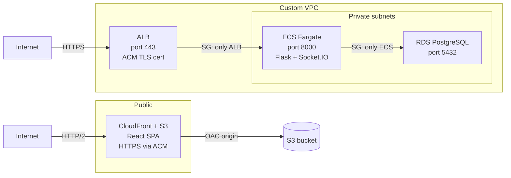
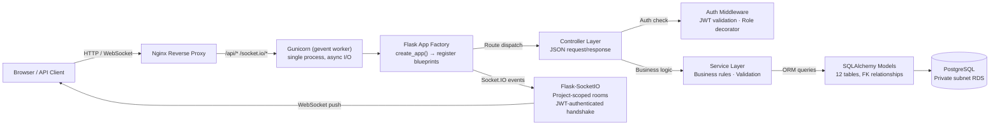
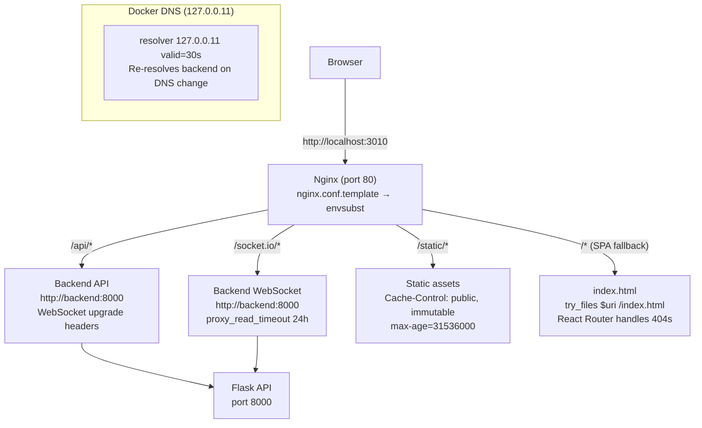
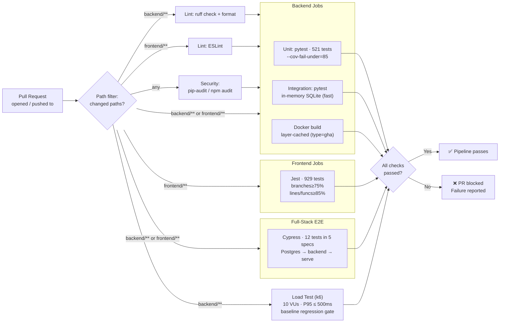
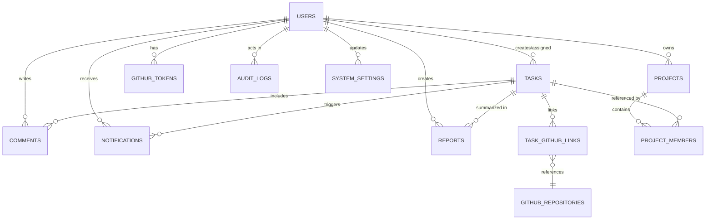

# Deep Dives

_Full technical detail moved out of the main README - architecture, CI/CD, database design, testing strategy, load testing, security model, and project structure._

## Deep Dives

### AWS Infrastructure

The application runs entirely within a custom VPC with public and private subnets:



**Key design decisions:**

- **Private subnets for compute and data** - ECS tasks have no public IPs. The only ingress path is through the ALB, which is the only resource permitted to reach ECS on port 8000. RDS is deeper still - only ECS can connect on port 5432.
- **Security groups enforce net policy** - These aren't documented conventions; they're AWS-enforced rules. No application-level code can override a denied security group rule.
- **OIDC eliminates credential storage** - The GitHub Actions workflow assumes an IAM role via OpenID Connect. The trust policy is scoped to this repo's `main` branch. No AWS access keys exist as GitHub Secrets - the attack surface for credential leakage is zero.
- **Rolling ECS updates with SHA tagging** - Every image push tags both the Git SHA (immutable rollback target) and `latest`. ECS replaces tasks incrementally so the service never fully goes down.

**Deployed components:**

| Component | Service | Details |
|---|---|---|
| Backend runtime | ECS Fargate | Private subnet, ALB fronted, port 8000 |
| Backend images | ECR | Private repo: `devsync-backend` |
| Database | RDS PostgreSQL | Private subnet, ECS-only access |
| Frontend | S3 + CloudFront | OAC origin access, HTTPS via ACM |
| CI/CD auth | IAM OIDC provider | No static credentials |

---

### Backend Architecture

**Stack:** Flask (app factory pattern) · SQLAlchemy ORM · Flask-Migrate (Alembic) · Flask-SocketIO · Gunicorn with gevent worker

**Application factory:**

The Flask app is created via `create_app()` - a factory pattern that registers blueprints, extensions, and error handlers. This is why the Gunicorn entry point is `src.wsgi:app` (the factory-invoked instance) and the Flask CLI entry is `FLASK_APP=src.app:create_app`.

**Request lifecycle:**



**Container lifecycle (`entrypoint.sh`):**

```
startup → run migrations (flask db upgrade) → optional DB bootstrap fallback → start Gunicorn gevent worker
```

The bootstrap fallback (`DB_BOOTSTRAP_FALLBACK=true`) seeds the database if the `users` table is missing after migrations - useful for fresh environments without manual setup.

**Real-time collaboration (Socket.IO):**

Socket.IO connections are authenticated via JWT on the handshake (not a separate auth endpoint). After connection, clients join project-scoped rooms. This scoping means a broadcast from a task update in Project A is received only by clients in that room - no cross-project leakage. Gevent workers handle the async I/O for WebSocket connections alongside the HTTP API on the same port.

**Docker multi-stage build:**

```dockerfile
# Build stage
FROM python:3.11-slim AS build
# installs build-essential, gcc, libpq-dev (psycopg2 compilation deps)
# pip installs to /install prefix

# Runtime stage
FROM python:3.11-slim
# copies only libpq5 (runtime dep)
# copies /install from build stage
# copies application code
# runs as non-root `devsync` user
```

**Why:** This drops the final image from ~600MB to ~330MB by keeping build tooling (`gcc`, 100+ MB of headers) in the build stage only. The runtime image has only `libpq5` and Python packages - no compilers.

**Healthcheck** (defined in compose, not Dockerfile - avoids curl dependency in slim image):

```yaml
healthcheck:
  test: ["CMD", "python", "-c", "import urllib.request; urllib.request.urlopen('http://localhost:8000/')"]
  interval: 10s
  start_period: 15s
```

---

### Frontend Architecture

**Stack:** React 18 · Create React App · Tailwind CSS · Socket.IO client · React Testing Library

**Containerization:**

```dockerfile
# Build stage: node:20-alpine
FROM node:20-alpine AS build
# npm ci → npm run build (produces static /build)

# Serve stage: nginx:1.27-alpine
FROM nginx:1.27-alpine
# copies /build → nginx html root
# copies nginx.conf.template → /etc/nginx/templates/
```

**Why:** The build stage inherits `node:20-alpine` (full Node toolchain, 125MB compressed). The serve stage swaps to `nginx:1.27-alpine` (~12MB) - zero runtime toolchain, tiny attack surface.

**Nginx SPA proxy (`nginx.conf.template`):**

The nginx config is a Jinja-style template processed by Docker's `envsubst` on container start. `API_UPSTREAM` is injected at runtime - the same image works in any environment.

Key behaviors:
- **`/api/*`** → proxied to backend (with WebSocket upgrade headers for Socket.IO)
- **`/socket.io/*`** → proxied with 24h timeout (WebSocket connections stay open)
- **`/static/*`** → served directly with `Cache-Control: public, immutable` (1 year)
- **All other routes** → `try_files $uri /index.html` (SPA fallback - React Router handles 404s)
- **`resolver 127.0.0.11`** → nginx re-resolves the backend hostname via Docker DNS every 30s

**Nginx routing flow:**



**Port configuration:**

The compose file uses `DEVSYNC_FRONTEND_PORT` (default 3000) for the host-bound port. If 3000 is taken (common - Docker Desktop binds it internally), override with `DEVSYNC_FRONTEND_PORT=3001 make up`.

---

### CI/CD Pipeline

The CI pipeline runs on every PR and push to `main`, with path-aware job execution - only the jobs relevant to the changed files are triggered. The CD pipeline (currently disabled - AWS infrastructure torn down) deploys to ECS and CloudFront when CI passes.



**Pipeline ordering (parallel where possible):**

| Phase | Jobs | Trigger |
|---|---|---|
| Fast checks | Lint (ruff + ESLint) · Security (pip-audit + npm audit) | Backend / frontend / any |
| Test suites | Pytest unit + integration (in-memory SQLite) · Jest · Cypress E2E | Changed paths |
| Load testing | k6 against the live Flask API (10 VUs / 30s, authenticated) | Backend changes |
| Build check | Docker layer-cached build | Backend changes |
| Weekly security | CodeQL analysis (Python + JavaScript) | Scheduled + push to main |

**Key design choices:**

- **Load gate on the real stack** - unit + integration tests run on fast in-memory SQLite, and the `perf` job spins up a Postgres 15 service container so the k6 load gate exercises genuine SQL semantics (schema, queries, auth) under real concurrent load.
- **E2E tests run in CI now** - Cypress executes against the full stack: Postgres service → Flask backend (started as a background process) → frontend production build (served via `npx serve`). Screenshots and backend logs are captured on failure.
- **Docker layer caching** - The `backend-image-build` job uses `docker/build-push-action` with `type=gha` cache, sharing layers across runs. A rebuild with only application code changes resolves in seconds instead of minutes.
- **Load-tested before merge** - the `perf` job stands up Postgres + the real Gunicorn server, then drives authenticated k6 traffic (register → login → JWT → dashboard reads). Load iterations are measured, not counted as tests: results ship as a separate `load-test-results` artifact, and a committed baseline catches order-of-magnitude regressions that unit tests can't see.
- **Path-aware execution** - Backend tests skip when only frontend files change, and vice versa. Lint and security run for their respective ecosystems. The `changes` job drives all gating.

---

### Database Design

**Schema:** 12 tables with foreign-key relationships covering users, projects, tasks, comments, notifications, GitHub tokens/repositories/links, reports, audit logs, and system settings.

**Indexing strategy (not exhaustive):**
- Foreign keys are indexed (FK columns in `TASKS`, `COMMENTS`, `NOTIFICATIONS`, `TASK_GITHUB_LINKS`, etc.)
- Frequently filtered columns indexed: `status`, `role`, `isRead`, `reportType`
- Time-based queries indexed: `createdAt`, `updatedAt`, `deadline`, `generatedAt`
- Join columns indexed: `projectId` in `PROJECT_MEMBERS`, `assignedTo` in `TASKS`

**Migrations:** Flask-Migrate (Alembic) handles schema evolution. Migrations run automatically on container startup via `flask db upgrade` in `entrypoint.sh`.

**Network isolation:** RDS lives in a private subnet with no public endpoint. The only entity that can connect is ECS Fargate (via security group rule on port 5432). The `DATABASE_URL` is injected as an environment variable from `.env` - never hardcoded.

**ER diagram:**



---

### Testing Strategy

| Layer | Framework | Count | Coverage / Quality Gate |
|---|---|---|---|
| Backend unit + integration | Pytest (pytest-cov, pytest-xdist) | 521 | 85% line coverage (main) · in-memory SQLite - real SQL semantics verified live by the k6 load gate |
| Frontend unit + component | Jest + React Testing Library | 929 | Branches ≥75%, Functions ≥85%, Lines ≥85% |
| End-to-end | Cypress | 12 (5 specs) | Runs in CI against full-stack stack |
| Load testing | k6 | - | P95 ≤ 500ms · P99 ≤ 1s · <1% errors at 10 VUs · baseline regression gate · reported separately from the 1,462 test count |
| **Total tests** | | **1,462** | All must pass |
| Lint | ruff (Python) + ESLint (JS) | - | Zero warnings |
| Security | pip-audit + npm audit + CodeQL | - | Zero high/critical vulns |

Every PR is validated end-to-end - tests run in parallel, and any failure or coverage regression aborts the pipeline before deployment.

<p align="center">
  
  <br>
  <em>Backend: 521 Pytest tests, all passing. Coverage gate: 85%.</em>
</p>

<p align="center">
  
  <br>
  <em>Frontend: 929 Jest tests across 71 suites, all passing. Coverage gates: branches 75%, functions/lines 85%.</em>
</p>

**Test architecture:**

- **Backend (Pytest):** Tests are split into `unit/` and `integration/` directories under `backend/tests/`. Unit tests mock external dependencies (database, GitHub API, OAuth providers). Integration tests run on in-memory SQLite for speed (the root `conftest.py` pins the URI); the **k6 load gate** is what runs against the real Postgres 15 service container - genuine SQL semantics under concurrent load. The root `conftest.py` provides session-scoped fixtures for the Flask app, test client, and auth tokens. Parallel execution via pytest-xdist (`-n auto`). Coverage enforced at 85% (`--cov-fail-under=85`).

  ```bash
  # Run unit tests only (no Postgres needed)
  pytest backend/tests/unit -q --no-header

  # Run all backend tests with coverage
  pytest backend/tests -n auto --cov=backend/src --cov-fail-under=85

  # Run integration tests (in-memory SQLite - no database needed)
  pytest backend/tests/integration -n auto -x -q
  ```

- **Frontend (Jest + React Testing Library):** 71 test suites covering pages, components, context, services, and utilities. No snapshot tests - assertions target behavior (element existence, click handlers, accessibility roles, state transitions) not markup. Mock Service Worker (MSW) intercepts API calls for realistic response simulation. Coverage thresholds: branches ≥75%, functions ≥85%, lines ≥85%, statements ≥85%.

  ```bash
  # Run all frontend tests
  cd frontend && CI=true npm test -- --watchAll=false --reporters=default
  ```

- **E2E (Cypress):** Covers critical user journeys - login, project creation, task assignment, and GitHub link flow. Runs in CI against the full stack: Postgres 15 service container → Flask backend (background process) → production frontend build (served via `npx serve`). On failure, Cypress screenshots and backend logs are uploaded as artifacts for debugging.

**Gate behavior:** CI uses path-aware filtering via `dorny/paths-filter` - backend jobs run only when `backend/**` changes, frontend jobs only when `frontend/**` changes, and E2E tests trigger when either or both change. Every job (lint, security, unit, integration, E2E, load test, Docker build) must pass for the pipeline to succeed. Coverage thresholds are enforced on `main` (85% backend line, 75% frontend branches, 85% frontend lines/functions). Any failure - test, lint warning, vulnerability, coverage drop - blocks the pipeline with the relevant output reported. Coverage XML artifacts are uploaded on `main` for tracking.

---

### Load Testing (k6)

Every backend change is load-tested before merge. The `perf` CI job stands up Postgres and the real Gunicorn server (the exact artifacts CI already uses for integration/E2E), then drives authenticated traffic with k6:

<p align="center">
  
</p>

```bash
k6 run --vus 10 --duration 30s --summary-export=/tmp/k6-summary.json tests/perf/api-load.js
```

- **Real user path, not a synthetic ping** - the script registers a throwaway user, logs in, and hits the JWT-protected developer read surface (`GET /api/v1/dashboard`, `GET /api/v1/dashboard/client`) under 10 constant VUs. `/reports` is excluded deliberately: it requires Team Lead/Admin, so hitting it as a developer would load-test a permission denial.
- **Thresholds in the script (`backend/tests/perf/api-load.js`)** - error rate < 1%, `http_req_duration` P95 < 500ms, P99 < 1s. These are CI execution ceilings (single gevent worker on a shared 2-vCPU runner), not production SLOs - the job's role is to stop order-of-magnitude regressions from merging.
- **Committed baseline gate (`backend/tests/perf/check_baseline.py`)** - a baseline JSON captured from a clean run trips the build on ~3× P95, 4× P99, +5pp error rate, or −30% throughput. First-run (no baseline) passes with a warning; arm it by committing the artifact's numbers.
- **Deliberately not part of the test count** - load iterations are measurements, so they never inflate the 1,462. Results upload as the `load-test-results` artifact instead.

Full details - including the rate-limiter override used only in the load-test environment, and local run instructions - in [`docs/backend/load-testing.md`](docs/backend/load-testing.md).

---

### Security Model

| Layer | Mechanism |
|---|---|
| **Authentication** | JWT issued on login, stored in HTTP-only cookie + bearer header support for API clients. Short TTL (60 min), refresh token flow. |
| **Authorization** | Role-based decorators on every protected route (Developer, Team Lead, Admin). A route missing a decorator is intentionally public. |
| **OAuth tokens** | GitHub access tokens are stored server-side in the `GITHUB_TOKENS` table, encrypted at rest. Never exposed to the browser. |
| **OAuth flow** | Server-side callback with state parameter validation - prevents CSRF on the OAuth handshake. |
| **Input validation** | Route validators and controller-level checks on all mutation endpoints. |
| **Mutation safety** | SQLAlchemy sessions commit atomically; controller failures trigger rollback. Partial writes don't happen. |
| **Network** | AWS security groups enforce: Internet → ALB (443) → ECS (8000) → RDS (5432). No exceptions, no public database. |
| **CI/CD credentials** | OIDC federation - IAM role scoped to this repo and branch. No static AWS keys stored anywhere. |

**API routes follow a consistent prefix pattern:**

- `/api/v1/auth/*` - authentication (public for login/register)
- `/api/v1/projects/*` - project CRUD (role-gated)
- `/api/v1/tasks/*` - task CRUD (role-gated with ownership checks)
- `/api/v1/admin/*` - admin operations (Admin role only)
- `/api/v1/github/*` - GitHub integration (authenticated, role-gated)
- `/api/v1/dashboard/*` - aggregated views (role-aware)
- `/api/v1/reports/*` - report generation (Team Lead+)
- `/api/v1/notifications/*` - user notifications (authenticated)

---
## Project Structure

```
DevSync/
├── backend/
│   ├── Dockerfile              # Multi-stage: python:3.11-slim build → runtime
│   ├── entrypoint.sh           # Migrations → optional bootstrap → gunicorn
│   ├── gunicorn.conf.py        # Gevent async worker config
│   ├── src/                    # Flask app (factory pattern, blueprints, models)
│   └── tests/perf/             # k6 load-test script (api-load.js) + baseline gate (check_baseline.py)
├── frontend/
│   ├── Dockerfile              # Multi-stage: node:20-alpine build → nginx:1.27-alpine
│   ├── nginx.conf.template     # SPA fallback, API proxy, envsubst for API_UPSTREAM
│   └── src/                    # React SPA (18, CRA, Tailwind, Socket.IO client)
├── .github/
│   ├── dependabot.yml               # Weekly dep updates for pip, npm, GH Actions
│   ├── workflows/
│   │   ├── ci.yml                    # 8 job types: lint, security, unit, integration, E2E, load, Docker, coverage
│   │   ├── cd.yml                    # AWS ECS + S3/CloudFront deploy (infra offline)
│   │   └── codeql-analysis.yml       # Weekly + per-PR CodeQL security analysis
│   └── instructions/                 # Copilot coding guidelines
├── pyproject.toml                    # Ruff lint config + pytest settings
├── docker-compose.local.yml          # Backend + frontend services
├── docker-compose.local-postgres.yml # PostgreSQL 16 (standalone, composable)
├── Makefile                          # up/down/logs/rebuild/shell
├── .env.example                      # All required env vars documented
├── docs/
│   ├── Design.pdf                    # Architecture design proposal
│   ├── backend/                      # Developer docs
│   │   ├── swagger.yaml              # OpenAPI specification (all routes, schemas)
│   │   ├── rbac.md                   # Role-based access control reference
│   │   ├── models.md                 # Database entity relationships
│   │   └── load-testing.md           # k6 load-testing: thresholds, baseline gate, runbook
│   └── demo/                         # Screenshots and recordings
│       ├── dev.gif / tl.gif / admin.gif / aws.gif
│       ├── backend-tests.png
│       └── frontend-tests.png
```

---
