# Deep Dives

_Full technical detail for every part of DevSync: GKE production platform, backend, frontend, CI/CD, database design, testing strategy, load testing, security model, observability, project structure, costs, and the trade-offs behind each decision. For the one-page overview and demo gallery, see [../README.md](../README.md)._

## 1. GKE Platform

**What it is:** the standing production cluster is GKE **Standard** (not Autopilot), zonal in `us-central1-a`, on the `REGULAR` release channel, with a single zone-pinned node pool (`devsync-pool`, `e2-small`, autoscale 2-6, auto-repair + auto-upgrade, daily 02:00 maintenance window, 60m create timeout). Traffic enters through a GCE Ingress (GLBC) with a catch-all rule to the frontend Service, TLS via a Google-managed certificate, live at `https://gcp.devsyncapp.me`. Prod data lives on Cloud SQL (`devsync-db`, private IP, reached directly with no proxy sidecar) via the `managed-db` overlay; in-cluster Postgres is the dev/PR story; in-cluster Redis (`redis:7-alpine`) backs the Socket.IO bus, the shared limiter, and presence; schema changes ship as a migrate Job.

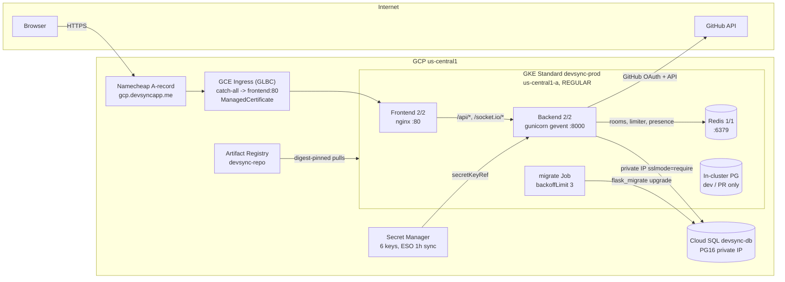
```mermaid
flowchart LR
    subgraph Internet["Internet"]
        User["Browser"]
        GH["GitHub API"]
    end

    subgraph GCP["GCP us-central1"]
        DNS["Namecheap A-record\ngcp.devsyncapp.me"]
        LB["GCE Ingress (GLBC)\ncatch-all -> frontend:80\nManagedCertificate"]
        subgraph Cluster["GKE Standard devsync-prod\nus-central1-a, REGULAR"]
            FE["Frontend 2/2\nnginx :80"]
            BE["Backend 2/2\ngunicorn gevent :8000"]
            Job["migrate Job\nbackoffLimit 3"]
            R[("Redis 1/1\n:6379")]
            PG[("In-cluster PG\ndev / PR only")]
        end
        SQL[("Cloud SQL devsync-db\nPG16 private IP")]
        SM["Secret Manager\n6 keys, ESO 1h sync"]
        AR["Artifact Registry\ndevsync-repo"]
    end

    User -->|"HTTPS"| DNS
    DNS --> LB
    LB --> FE
    FE -->|"/api/*, /socket.io/*"| BE
    BE -->|"private IP sslmode=require"| SQL
    BE -->|"rooms, limiter, presence"| R
    Job -->|"flask_migrate upgrade"| SQL
    SM -->|"secretKeyRef"| BE
    AR -->|"digest-pinned pulls"| Cluster
    BE -->|"GitHub OAuth + API"| GH
```

**Evidence - cluster:**

- `infra/terraform/modules/gke/main.tf:1` - `google_container_cluster.devsync` resource (`devsync-${var.environment}`).
- `infra/terraform/modules/gke/main.tf:8` - `location = var.zone`: zonal pin (regional creates died in `GCE_STOCKOUT`, documented in the comment at `infra/terraform/modules/gke/main.tf:3-7`).
- `infra/terraform/modules/gke/main.tf:9-11` - Standard by omission: `enable_autopilot` deliberately unset (setting it `false` still conflicts with `remove_default_node_pool`).
- `infra/terraform/modules/gke/main.tf:14-16` - `release_channel { channel = "REGULAR" }`.
- `infra/terraform/modules/gke/main.tf:18-22` - daily maintenance window `02:00`.
- `infra/terraform/modules/gke/main.tf:66-74` - node pool `devsync-pool`: `autoscaling { min 2 / max 6 }`, `auto_repair` + `auto_upgrade`.
- `infra/terraform/modules/gke/main.tf:81-83` - `machine_type = "e2-small"`, `disk_size_gb = 20`, `GKE_METADATA` workload metadata.
- `infra/terraform/variables.tf:6-10` - `region` default `us-central1`; `infra/terraform/variables.tf:12-16` - `zone` default `us-central1-a`.
- `infra/terraform/main.tf` - root module wiring (`module "gke"`, ordered before IAM so the workload-identity pool exists first).
- Node service account: `infra/terraform/modules/gke/main.tf:60-64` - `roles/container.defaultNodeServiceAccount` on the default compute SA (standing-window trade; dedicated least-privilege node SA recorded as the named upgrade); resolved to an email at `infra/terraform/modules/gke/outputs.tf:29-36`, exposed as `node_sa_email`. Image pulls authenticate as it via `infra/terraform/main.tf` (`nodes_ar_reader`, `roles/artifactregistry.reader`).
- Outputs: `infra/terraform/outputs.tf` (`cluster_name`, `endpoint`, `runner_email`, `wif_provider`); cluster CA at `infra/terraform/modules/gke/outputs.tf:11-12`.
- Supporting platform: `infra/terraform/main.tf` - Artifact Registry repo `devsync-repo` (created ahead of any CI push); `infra/terraform/main.tf` - External Secrets operator via `helm_release` chart `1.0.0`; `infra/terraform/services.tf` - 9 required GCP APIs enabled in code.

**Evidence - ingress, DNS, TLS:**

- `k8s/base/ingress.yaml:13` - load-bearing annotation `kubernetes.io/ingress.class: "gce"` (the `gce` IngressClass object does not exist in the cluster, so spec-only is ignored by GLBC - proven 2026-09-12 by an LB teardown + rebuild).
- `k8s/base/ingress.yaml:14` - `networking.gke.io/managed-certificates: devsync-prod-cert`.
- `k8s/base/ingress.yaml:18` - `ingressClassName: gce`.
- `k8s/base/ingress.yaml:22-31` - catch-all `path: /` to `devsync-frontend:80` (comment at `k8s/base/ingress.yaml:19-21`: devsyncapp.me, www, and gcp subdomains all route here; the `pr` overlay drops this Ingress entirely).
- `k8s/base/managedcertificate.yaml:4` - cert name `devsync-prod-cert`; `k8s/base/managedcertificate.yaml:11-12` - placeholder domain (prod overlay patches it).
- `k8s/overlays/prod/patch-ingress-host.yaml:4-9` - JSON-6902 replace of `/spec/domains` with `devsyncapp.me`, `www.devsyncapp.me`, `gcp.devsyncapp.me`.
- `k8s/overlays/prod/patch-config-host.yaml:9-10` - the **only** place the live host is set: `FRONTEND_URL: "https://gcp.devsyncapp.me"`, `GITHUB_REDIRECT_URI: "https://gcp.devsyncapp.me/api/v1/github/callback"` (base keeps placeholder `https://devsync.local` at `k8s/base/configmap.yaml:13-14` so PR/port-forward envs never inherit prod OAuth URLs).
- DNS is a manual Namecheap A-record for `gcp.devsyncapp.me` (`infra/terraform/main.tf`: no `dns.tf` by design).

**Evidence - data plane (Cloud SQL via managed-db, Redis, in-cluster PG, migrate Job):**

- Provisioning record: `infra/scripts/provision-cloudsql.sh:24` (`sqladmin` + `servicenetworking` APIs), `infra/scripts/provision-cloudsql.sh:28-33` (PSA range, `10.60.0.0/24`, no CIDR collision with pods/services/subnet), `infra/scripts/provision-cloudsql.sh:39-46` (instance `devsync-db`: `POSTGRES_16`, `enterprise` edition, `db-f1-micro` shared-core tier, `10GB` SSD, private-IP-only `--no-assign-ip`, backups `03:00`, deletion protection off for the teardown window), `infra/scripts/provision-cloudsql.sh:55-57` (private-IP DSN with `sslmode=require` pushed to Secret Manager).
- Overlay: `k8s/overlays/managed-db/kustomization.yaml:8-12` (stacks on `../prod`), `k8s/overlays/managed-db/patch-database-url.yaml:9-20` (deletes the in-cluster `devsync-postgres` StatefulSet + Service), `k8s/overlays/managed-db/patch-database-url.yaml:45-60` (Cloud SQL instance annotation on the backend Deployment; scrubs prod's literal DSN before re-adding - a single re-patch would merge `value` + `valueFrom` into an illegal env the kubelet rejects), `k8s/overlays/managed-db/patch-database-url.yaml:62-83` (database URL returns as the Secret Manager `secretKeyRef`; comment at `k8s/overlays/managed-db/patch-database-url.yaml:64-67`: private-IP-direct by design, proxy sidecar only if public-IP or IAM-DB-auth is ever needed), `k8s/overlays/managed-db/patch-database-url.yaml:87-136` (same two-phase rewiring for the migrate Job).
- Under `managed-db` the `wait-for-db` initContainer is dropped on both Deployment and Job (`k8s/overlays/managed-db/patch-database-url.yaml:31-42`, `k8s/overlays/managed-db/patch-database-url.yaml:95-98`): it polls `devsync-postgres:5432`, a Service the overlay deletes - kept, every restart would CrashLoop 120s on dead DNS.
- Cutover: `pg_dump` from `devsync-postgres-0` to restore into `devsync-db` from a one-off `postgres:16` pod inside the cluster (peering makes the private IP reachable); row counts verified both sides before the flip (`docs/planning/k8s-prod-platform.md:390`).
- Redis: `k8s/base/redis.yaml:13` (`replicas: 1`, `Recreate` so two publishers never coexist mid-rollout), `k8s/base/redis.yaml:29` (`redis:7-alpine`), `k8s/base/redis.yaml:31` (`--save "" --appendonly no`: pub/sub transit + TTLs are reconstructible - persistence would be theatre), `k8s/base/redis.yaml:66-83` (ClusterIP `devsync-redis:6379`); URL is non-sensitive cluster DNS in the ConfigMap at `k8s/base/configmap.yaml:18` (`REDIS_URL: "redis://devsync-redis:6379/0"`).
- In-cluster Postgres (dev/PR only): `k8s/base/postgres.yaml` (StatefulSet `devsync-postgres`, `postgres:16` at line 35, `10Gi` claim at line 102, headless Service + `publishNotReadyAddresses` at line 117 so the deploy-time `wait-for-db` poll sees DNS during PG boot). The `pr` overlay never drops it - PR namespaces get their own throwaway PG.
- Migrate Job: `k8s/base/migrate-job.yaml:9-11` (`backoffLimit: 3`, `activeDeadlineSeconds: 600`, `ttlSecondsAfterFinished: 86400`), `k8s/base/migrate-job.yaml:68-88` (mirrors `entrypoint.sh`: `flask_migrate upgrade` + `DB_BOOTSTRAP_FALLBACK` seed path), `k8s/base/migrate-job.yaml:120-121` (`DB_BOOTSTRAP_FALLBACK: "true"`).

**Deployed components:**

| Component | Where | Details |
|---|---|---|
| Backend runtime | GKE Deployment 2/2 | Port 8000, gunicorn gevent, `devsync-ksa` identity |
| Frontend runtime | GKE Deployment 2/2 | nginx port 80, GCE Ingress fronted |
| Database (prod) | Cloud SQL `devsync-db` | PG16, private IP, `managed-db` overlay |
| Database (dev/PR) | In-cluster StatefulSet | `postgres:16`, 10Gi, per-namespace throwaway |
| Realtime bus | In-cluster Deployment 1/1 | `redis:7-alpine`, ClusterIP `:6379` |
| Images | Artifact Registry | `devsync-repo`, digest-pinned pulls |
| CI/CD auth | WIF OIDC pool | Repo-scoped, no static keys |
| TLS | ManagedCertificate | `devsync-prod-cert`, 3 domains |

**Why this way:** Standard gives a real drain/upgrade path and honest PDB semantics - the PDB drain proof below is only possible on Standard. Zonal (not regional) because both regional create attempts hit a hard stockout in `us-central1-f`; the control plane living in one zone is the accepted trade for a time-boxed standing env. `e2-small` because `e2-medium` also hit a stockout; small slices had headroom. Managed Postgres for the standing env (a real production database is the point), in-cluster PG where data is throwaway (PR/dev). Redis contents are transit - one replica is a documented SPOF, not a hidden one; Memorystore stays unapplied (standing managed Redis on expiring credits for zero users is indefensible spend - the flip is a ConfigMap value + PSA egress rule, not a redesign). Migrations run once as a Job instead of racing on every pod boot. No Cloud DNS zone or cert-manager - an A-record plus a Google-managed cert proves the full DNS to TLS to Secure-cookie path at $0 and dies with the env. Catch-all (not per-host rules) so the owner's apex + www expansion needed zero routing changes.

**Proof receipt:** cluster `devsync-prod` live in `us-central1-a` since the 2026-09-12 standup; pool autoscaler 2-6 per TF (3 nodes at capture 2026-09-12, ~4 after the Phase 2 scale-up 2026-09-13; scheduling check: 940m/1.36 GiB allocatable per `e2-small` node - `docs/planning/k8s-prod-platform.md:420`). 2026-09-12: `ManagedCertificate` `Active`; `curl https://gcp.devsyncapp.me/health` 200 with valid cert. 2026-09-13: prod flipped to `managed-db`; CD rollout path switched prod to managed-db with the migrate Job gating Deployments. PDB drain-denied proven 2026-09-12 with zero live impact (`docs/planning/k8s-prod-platform.md:270`); Phase 2 flipped backend `maxUnavailable: 0` to `minAvailable: 1` alongside `replicas: 2` (`k8s/base/poddisruptionbudget.yaml:24`; frontend `minAvailable: 1` at `k8s/base/poddisruptionbudget.yaml:9`).


<p align="center">
  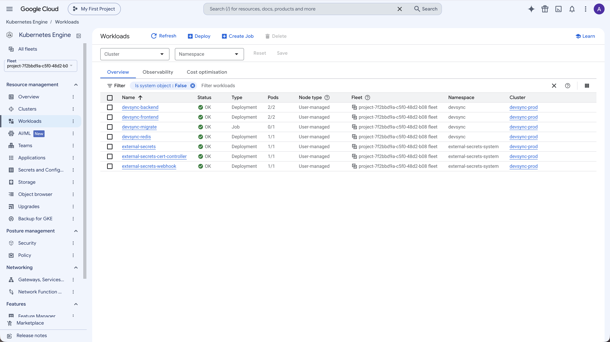
  <br/><em>Workloads: backend 2/2 and frontend 2/2 Running on devsync-pool.</em>
</p>

<p align="center">
  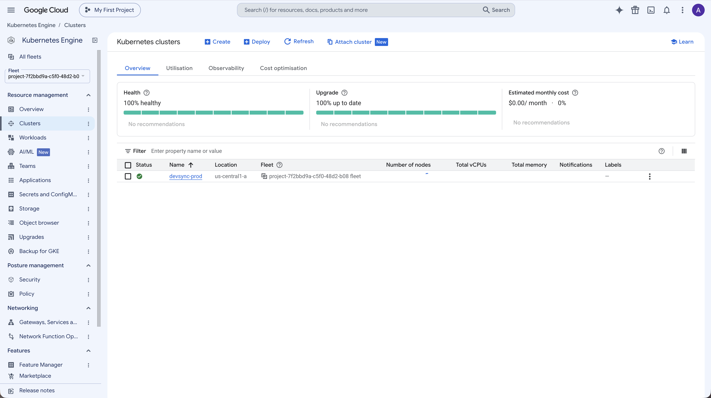
  <br/><em>Cluster list: devsync-prod Standard in us-central1-a (3 nodes at capture, autoscale 2-6).</em>
</p>

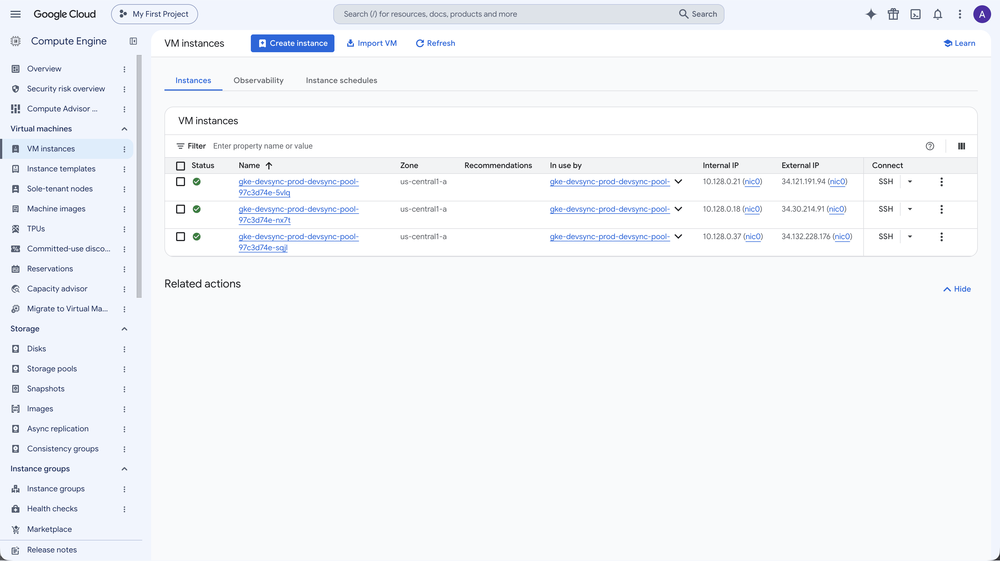

<p align="center">
  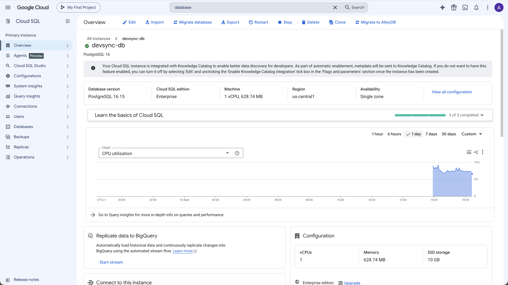
  <br/><em>Cloud SQL devsync-db: POSTGRES_16, private IP only, backups 03:00.</em>
</p>

<p align="center">
  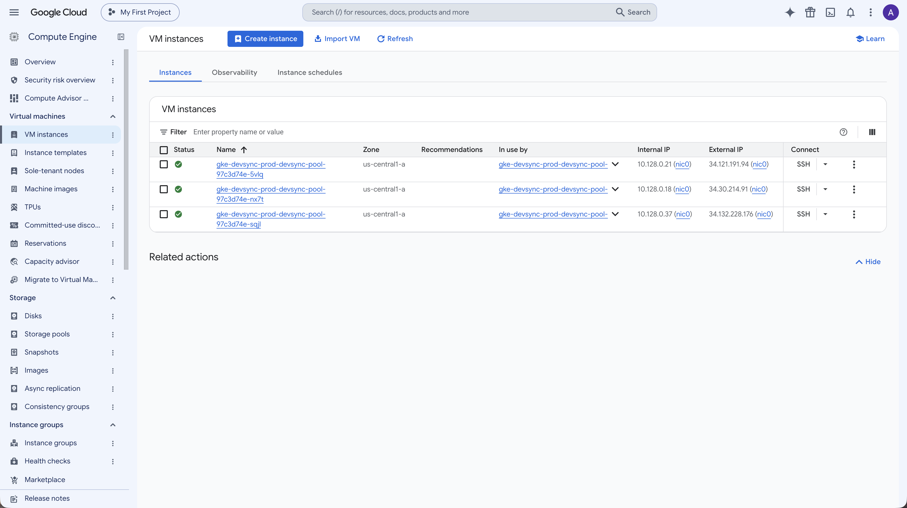
  <br/><em>VPC peering: PSA range 10.60.0.0/24, no CIDR collision with pods/services/subnet.</em>
</p>

---

### Backend Architecture

**Stack:** Flask (app factory pattern) - SQLAlchemy 2 ORM - Flask-Migrate (Alembic) - Flask-SocketIO - Gunicorn with gevent worker - Redis-backed rooms/limiter/presence (Phase 2).

**Application factory and blueprint layout:**

The Flask app is created via `create_app()` at `backend/src/app.py:32` - a factory that wires JSON logging, config, JWT, CORS, the API blueprint, middlewares, and SocketIO. Routes live per domain under `backend/src/api/routes/` (auth, users, projects, tasks, comments, dashboard, admin, notifications, github, audit, report), each exposing `register_routes(bp)`; they are all mounted on one versioned blueprint `api_bp = Blueprint("api", __name__, url_prefix="/api/v1")` at `backend/src/api/__init__.py`, registered onto the app by `init_app`, with `register_all_routes` at `backend/src/api/routes/__init__.py:24` as the parallel registration path. Controllers (`backend/src/api/controllers/`) hold business logic; middlewares (`backend/src/api/middlewares/`) hold auth, rate limiting, validation, and error handling. JWT is dual-location (`backend/src/app.py:69`: cookies + headers), 60-minute access TTL (`backend/src/app.py:67`), 30-day refresh.

**Request lifecycle:**

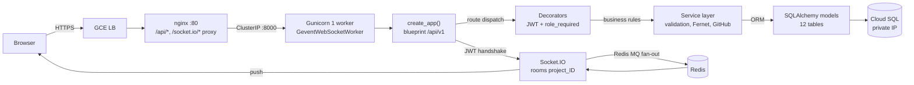
```mermaid
flowchart LR
    Browser["Browser"] -->|"HTTPS"| LB["GCE LB"]
    LB --> FE["nginx :80\n/api/*, /socket.io/* proxy"]
    FE -->|"ClusterIP :8000"| Gun["Gunicorn 1 worker\nGeventWebSocketWorker"]
    Gun --> Flask["create_app()\nblueprint /api/v1"]
    Flask -->|"route dispatch"| MW["Decorators\nJWT + role_required"]
    MW -->|"business rules"| Svc["Service layer\nvalidation, Fernet, GitHub"]
    Svc -->|"ORM"| Model["SQLAlchemy models\n12 tables"]
    Model --> SQL[("Cloud SQL\nprivate IP")]

    Flask -->|"JWT handshake"| Sock["Socket.IO\nrooms project_ID"]
    Sock -->|"Redis MQ fan-out"| R[("Redis")]
    R --> Sock
    Sock -->|"push"| Browser
```

**How it works end to end:** browser to GCE LB to frontend nginx (path proxy) to the backend ClusterIP to gunicorn (single gevent worker per pod - `backend/gunicorn.conf.py`: `workers = 1`, `GeventWebSocketWorker`; scale pods, not workers) to `create_app()` blueprints to JWT + role decorators (`backend/src/api/middlewares/__init__.py:19-53`: `admin_required`, `role_required`) to services to SQLAlchemy models to Cloud SQL over the private IP. Socket.IO rides the same port: JWT handshake, then project rooms.

**Container lifecycle (`entrypoint.sh` vs the migrate Job):**

`backend/entrypoint.sh` runs migrations (`flask_migrate upgrade`) unless `MIGRATE_ON_BOOT=false`, then the optional `DB_BOOTSTRAP_FALLBACK` seed (creates the schema seed only if the `users` table is missing), then `exec gunicorn --config gunicorn.conf.py src.wsgi:app`. In K8s the ConfigMap sets `MIGRATE_ON_BOOT: "false"` (`k8s/base/configmap.yaml:15`) and the migrate Job owns schema changes instead: `entrypoint.sh` migrations race past 1 replica (every pod booting at once runs `upgrade` concurrently), so the Job runs once, ordered before the rollout, with the CD pipeline waiting on `Complete` for 600s.

**Real-time collaboration (Socket.IO, Phase 2 shape):**

- JWT handshake auth, then `register` tracks `user_id -> sid` (`backend/src/socketio_server.py:208-216`).
- Message queue: `backend/src/socketio_server.py:24-30` (`_message_queue()`: `REDIS_URL` or the in-cluster default in production, `None` in dev/CI = single-process mode), wired only when a URL exists at `backend/src/socketio_server.py:34-35` and `backend/src/socketio_server.py:401-406` (the kwarg's mere presence changes ack behavior; `async_mode` explicit: `threading` for tests, `gevent` for prod). Two replicas share rooms through it (`k8s/base/backend-deployment.yaml:10-14`).
- Socket CORS locked in prod: `backend/src/socketio_server.py:15-21` (production pins origins to `[FRONTEND_URL]`, dev/compose/CI keep `*`); HTTP CORS allowlist + `FRONTEND_URL` parsing at `backend/src/app.py:115-126`, LAN regexes at `backend/src/app.py:132-136`.
- Presence: `backend/src/socketio_server.py:45-47` (`PRESENCE_PREFIX`, `PRESENCE_TTL_SECONDS = 30`, `POD_ID` from `HOSTNAME`), `backend/src/socketio_server.py:50-58` (`SETEX 30s`, value `pod:sid`, fail-open warning), `backend/src/socketio_server.py:61-74` (graceful leave/disconnect deletes only its own `pod:sid` - cross-pod reconnect race guard; ghosts expire via TTL, ~30s ceiling), heartbeat handler at `backend/src/socketio_server.py:219-224` (10s beat, 3:1 margin), refreshed on register/join/leave (`backend/src/socketio_server.py:214`, `backend/src/socketio_server.py:267`, `backend/src/socketio_server.py:288`).
- Membership: `backend/src/socketio_server.py:227-239` (`_membership_denied`: project members pass, admins bypass, unparseable IDs denied); enforced on join (`backend/src/socketio_server.py:252-254`) **and re-checked on every emit** - task_update (`backend/src/socketio_server.py:305-308`), comment_added (`backend/src/socketio_server.py:332-334`), project_updated (`backend/src/socketio_server.py:370-372`). Join-time membership is not sticky proof - memberships change mid-session. Broadcasts go to `project_<id>` rooms only, so nothing leaks across projects.
- Emits never 500: `backend/src/socketio_server.py:77-85` (`_safe_emit`: MQ outage logs and drops, never 500; DB stays authoritative, clients backfill via REST).
- Rate limiter: `backend/src/api/middlewares/rate_limiter.py:53-56` (epoch-aligned bucket `rl:<client>:<endpoint>:<window>`), `backend/src/api/middlewares/rate_limiter.py:59-79` (shared `INCR` + `EXPIRE`-on-first-hit; unset/failing Redis returns `None` to fallback, never raises), `backend/src/api/middlewares/rate_limiter.py:82-100` (in-memory per-pod sliding window fallback with identical limits), `backend/src/api/middlewares/rate_limiter.py:130-149` (global shape `300` req / `60`s, per-endpoint buckets so one chatty page cannot 429 the rest); bypass preserved at `backend/src/api/middlewares/__init__.py:67-74` (`RATE_LIMIT_REQUESTS_PER_WINDOW=0` disables) and exercised by CI at `.github/workflows/ci.yml:454`; shared client at `backend/src/services/redis_client.py:21-45` (lazy, cached, 0.5s timeouts at `backend/src/services/redis_client.py:37`, 30s fail-open retry cache).

**Docker multi-stage build (`backend/Dockerfile`):**

Build stage `python:3.11-slim-bookworm` installs `build-essential/gcc/libpq-dev` and resolves deps with `uv` into `/opt/venv`; runtime stage copies only the venv plus `libpq5`, upgrades `setuptools/wheel` past the Trivy HIGH, copies app code, creates the non-root `devsync` user, and execs `entrypoint.sh`. Final image ~330MB: compilers and headers stay in the build stage.

**Healthcheck** (compose, not Dockerfile - avoids a curl dependency in the slim image; `docker-compose.yml`): `python -c "import urllib.request; urllib.request.urlopen('http://localhost:8000/'"`, interval 10s, start period 15s. In K8s the same liveness signal is `/health` via startup/liveness/readiness probes (`k8s/base/backend-deployment.yaml:115-133`).

**Why this way:** factory + per-domain blueprints keeps route registration uniform (`register_routes(bp)` everywhere) and testable via `create_app(test_config)`. One gevent worker per pod plus a Redis MQ is what unlocks the second replica - affinity was tested and rejected (ADR 0002): websockets are persistent TCP and the frontend negotiates the upgrade, so pub/sub fan-out fixes rooms regardless of which pod holds which socket. Backfill stays client REST refetch (ADR 0003) - no sequence IDs or replay buffers until volume demands. The limiter fails open because a Redis outage must degrade limits, never cause a self-outage. The migrate Job exists because entrypoint migrations race past 1 replica.

**Proof receipt:** 2026-09-12 two-client broadcast, three green runs, all `BROADCAST PROOF OK`: (1) live URL over polling, (2) live URL over **websocket** (`websocket-client`, `transports=["websocket"]` - proves the `both`-transport upgrade end-to-end), (3) port-forwarded backend. Cross-pod receipt runs as its own sequential CI step (two managers share one kombu subscription thread; xdist pooling would tangle it - `.github/workflows/ci.yml:201-207`). Full-suite receipt `558 passed, 1 skip` (`docs/planning/k8s-prod-platform.md:384`). Server `timestamp` arrives `null` (minor wart, out of scope).

---

### Frontend Architecture

**Stack:** React 18 - Create React App - Tailwind CSS - Socket.IO client - React Testing Library + MSW.

**Containerization (`frontend/Dockerfile`):**

Build stage `node:20-alpine` (`npm ci` with layer-cached manifests, `REACT_APP_SOCKET_TRANSPORT` build arg defaulting to `polling` at lines 15-16, `npm run build`); serve stage `nginx:1.27-alpine` copies `/app/build` to the html root and the template to `/etc/nginx/templates/` for `envsubst` at container start. `API_UPSTREAM` defaults to the compose backend (`http://backend:8000`); `NGINX_RESOLVER` defaults to Docker DNS (`127.0.0.11`), overridden to GKE node-local DNS in K8s.

**Nginx SPA proxy (`frontend/nginx.conf.template`, FQDN upstream `http://devsync-backend.devsync.svc.cluster.local:8000` + resolver `169.254.20.10` set at `k8s/base/frontend-deployment.yaml:43-51`):**

- `/api/` to backend with `X-Forwarded-*` headers, 120s read timeout (`frontend/nginx.conf.template:25-33`).
- `/socket.io/` to backend with `Upgrade`/`Connection` WS headers, 86400s timeout - sockets stay open (`frontend/nginx.conf.template:36-46`).
- `= /health` proxied to the API (must not fall through to the SPA fallback, so `curl https://gcp.devsyncapp.me/health` hits the liveness gate - `frontend/nginx.conf.template:50-58`).
- `/static/` served directly with `Cache-Control: public, immutable`, 1-year expiry (`frontend/nginx.conf.template:61-64`).
- Everything else `try_files $uri /index.html` - React Router owns 404s (`frontend/nginx.conf.template:67-69`).
- `resolver ${NGINX_RESOLVER} valid=30s` (`frontend/nginx.conf.template:4`): FQDN, not short name, because the `resolver` directive does no search-domain expansion; Gzip + `X-Frame-Options`/`X-Content-Type-Options`/`X-XSS-Protection` headers on every response.

**Nginx routing flow:**

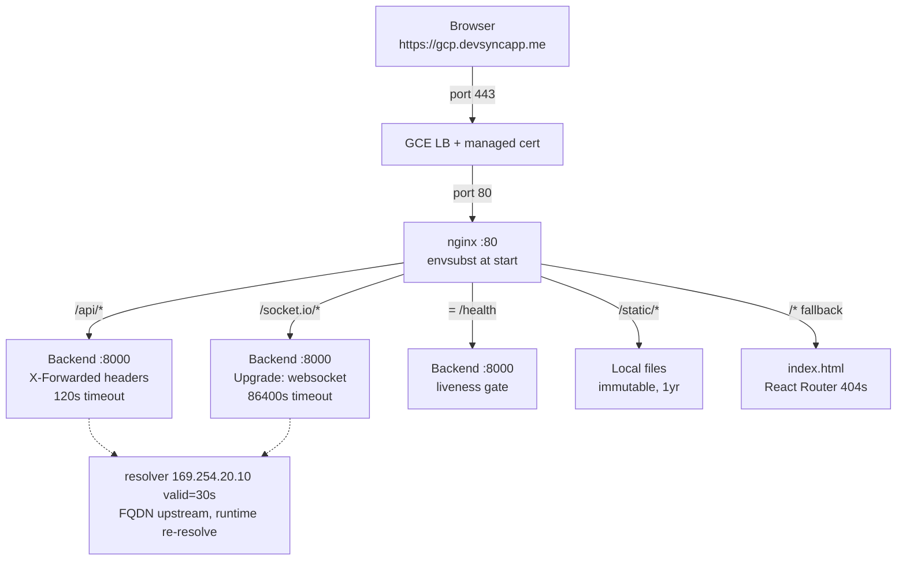
```mermaid
flowchart TD
    Browser["Browser\nhttps://gcp.devsyncapp.me"] -->|"port 443"| LB["GCE LB + managed cert"]
    LB -->|"port 80"| Nginx["nginx :80\nenvsubst at start"]

    Nginx -->|"/api/*"| API["Backend :8000\nX-Forwarded headers\n120s timeout"]
    Nginx -->|"/socket.io/*"| WS["Backend :8000\nUpgrade: websocket\n86400s timeout"]
    Nginx -->|"= /health"| Health["Backend :8000\nliveness gate"]
    Nginx -->|"/static/*"| Static["Local files\nimmutable, 1yr"]
    Nginx -->|"/* fallback"| Index["index.html\nReact Router 404s"]

    Resolver["resolver 169.254.20.10 valid=30s\nFQDN upstream, runtime re-resolve"]
    API -.-> Resolver
    WS -.-> Resolver
```

**Transport:** CD builds the frontend with `REACT_APP_SOCKET_TRANSPORT=both` (`.github/workflows/k8s-cd.yml:128-145`), baked at build time - the 2026-09-12 websocket broadcast run proves the upgrade path end-to-end against the live URL.

**Probes and resources:** liveness + readiness on `/:80` (`k8s/base/frontend-deployment.yaml:52-63`); requests `100m/128Mi`, limits `500m/512Mi` (`k8s/base/frontend-deployment.yaml:64-70`); non-root uid 101 with only `NET_BIND_SERVICE` added (`k8s/base/frontend-deployment.yaml:71-80`).

**Role dashboards (what each role sees):**

- Developer (`frontend/src/pages/DeveloperProgress.jsx`, `TaskList.jsx`, `TaskDetailsUser.jsx`): Assigned vs In Progress columns (`TaskColumns.jsx`, `TaskCard.jsx`), GitHub link cards (`GitHubIssueCard.jsx`, `GitHubRepoCard.jsx`), realtime comments (`CommentSection.jsx`) pushed over the project room socket.
- Team lead (`frontend/src/pages/ProjectDetails.jsx`, `TaskDetails.jsx`, `Reports.jsx`): task detail + `ReportTable.jsx` analytics + project workspace (`ProjectForm.jsx`, `DeveloperProgressCard.jsx`, `ProgressBar.jsx`).
- Admin (`frontend/src/pages/AdminDashboard.jsx`, `AdminUsers.jsx`, `AdminSystemSettings.jsx`, `AdminAuditLogs.jsx`, `AdminProjects.jsx`): user management + system settings + audit log viewer.
- Shared shell: `Navbar.jsx`, `Notifications.jsx` (socket-fed), `LoadingSpinner.jsx`; auth state in `frontend/src/context/AuthContext.jsx`; API surface in `frontend/src/services/`.


<p align="center"><em>Developer view: assigned tasks, progress, and realtime comments.</em></p>


<p align="center"><em>Team-lead view: task detail, reports analytics, workspace.</em></p>


<p align="center"><em>Admin view: user management and system settings.</em></p>

**Why this way:** the build stage carries the Node toolchain; the serve stage is ~12MB nginx with zero runtime toolchain and a tiny attack surface. `envsubst` at start (not build) means one image works in compose, PR namespaces, and prod - only env vars change. The FQDN + explicit resolver pair exists because nginx's `resolver` does no search-domain expansion and `127.0.0.11` does not exist inside a pod. `/health` proxying exists because without it the SPA fallback would answer 200 for the LB health path and mask a dead API.

---

### CI/CD Pipeline

**What it is:** `ci.yml` - path-aware verify on every PR and push (lint, security, pytest, cross-pod receipt, Jest, Cypress, k6 gate, kubeconform, Codecov, weekly CodeQL); `k8s-cd.yml` - gated push-deploy to the standing env (build to Trivy to sign to SBOM/SLSA to tf-plan to tf-apply to rollout to live verify to collect); `k8s-pr.yml` - ephemeral per-PR namespaces with smoke + sticky comment + GC.

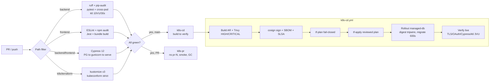
```mermaid
flowchart LR
    PR["PR / push"] --> Changes{"Path filter"}
    Changes -->|"backend"| BE["ruff + pip-audit\npytest + cross-pod\nk6 10VU/30s"]
    Changes -->|"frontend"| FE["ESLint + npm audit\nJest + bundle build"]
    Changes -->|"backend/frontend"| E2E["Cypress 12\nPG to gunicorn to serve"]
    Changes -->|"k8s/terraform"| KC["kustomize x3\nkubeconform strict"]
    BE & FE & E2E & KC --> Gate{"All green?"}
    Gate -->|"yes, main"| CD["k8s-cd\nbuild to verify"]
    Gate -->|"yes, PR"| PREV["k8s-pr\nns pr-N, smoke, GC"]

    subgraph CDP["k8s-cd.yml"]
        direction TB
        B["Build AR + Trivy HIGH/CRITICAL"]
        S["cosign sign + SBOM + SLSA"]
        P["tf-plan fail-closed"]
        A["tf-apply reviewed plan"]
        R["Rollout managed-db\ndigest tripwire, migrate 600s"]
        V["Verify live\nTLS/OAuth/Cypress/k6 3VU"]
    end
    CD --> B --> S --> P --> A --> R --> V
```

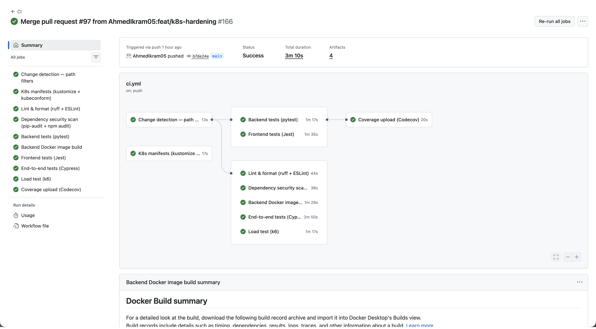

<p align="center">
  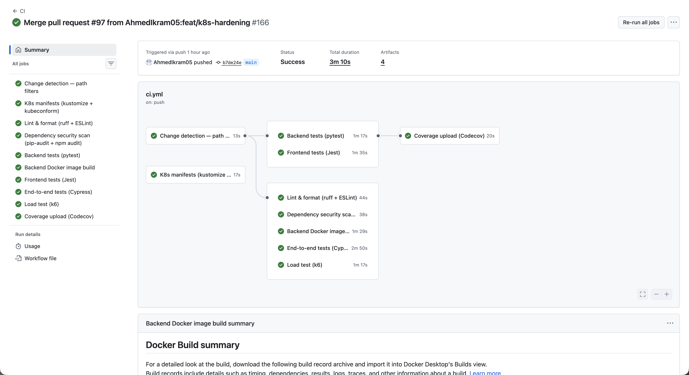
  <br/><em>CI: pytest, cross-pod receipt, Jest, Cypress, k6, kubeconform.</em>
</p>

<p align="center">
  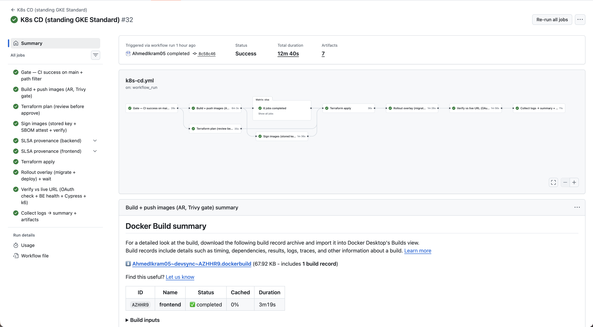
  <br/><em>CD: build, Trivy, sign, tf-plan/apply, rollout, live verify.</em>
</p>

<p align="center">
  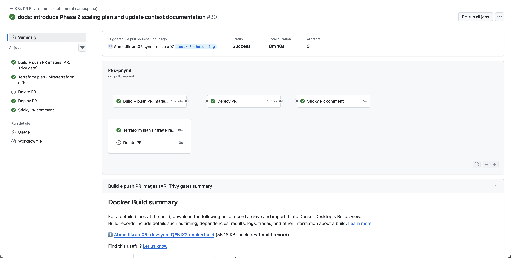
  <br/><em>PR envs: ephemeral pr-N namespace, smoke, sticky comment, GC on close.</em>
</p>

**Evidence - `ci.yml` (`.github/workflows/ci.yml`, 563 lines):**

- Lint + security: ruff check/format + ESLint (`:62-98`), pip-audit + npm audit (`:100-135`).
- Backend: unit with coverage gate on main (`--cov-fail-under=80` at `:182-188`), integration on a real PG service container (`DATABASE_URL` at `:190-199`), cross-pod receipt as its own sequential step (`:201-207`).
- Frontend: `CI=true npm test -- --watchAll=false --coverage`, thresholds on main `branches 75 / functions+lines+statements 85` (`:242-281`), production-bundle build on main.
- E2E: PG service to gunicorn to served production build (`npx serve`, `CYPRESS_BASE_URL http://localhost:3000`, `:293-393`); screenshots + backend logs on failure.
- k6: `10VU/30s` vs localhost (`BASE_URL` + `--vus 10 --duration 30s` at `:470-478`), committed-baseline gate (`:480-484`), limiter bypassed via `RATE_LIMIT_REQUESTS_PER_WINDOW=0` (`:454`).
- Coverage upload to Codecov (`:502-534`); **kustomize build x 3 overlays + `kubeconform -strict`**: prod, managed-db, pr (`:537-563`); weekly CodeQL (`codeql-analysis.yml`).

**Evidence - `k8s-cd.yml` (`.github/workflows/k8s-cd.yml`, 674 lines):**

- Gate (`:42-73`): `workflow_run` on CI completion, `main` only (kills PR-echo twins), CI-green + `head_sha` dedupe, path filter (backend/frontend/k8s/terraform/cd-workflow - docs-only pushes never ship).
- Build (`:75-145`): buildx to AR + Trivy `HIGH,CRITICAL` gates on both images; frontend baked with `REACT_APP_SOCKET_TRANSPORT=both`.
- Sign (`:148-257`): cosign `v3.1.3` pinned, stored keypair; digests re-resolved from the registry by tag (no cross-job outputs hop); both images signed; Syft SBOM attested `--type custom` (the `--type spdx` bundle path fails deterministically against AR); public-key verify (`cosign verify`, `:232-236`) + `slsa-verifier verify-image`; SLSA L3 provenance matrix (backend + frontend). Supply chain verifiable via the `cosign verify --key env://COSIGN_PUBLIC_KEY` lines.
- Plan/apply (`:291-382`): tf-plan outside the `production` environment so the diff is reviewable pre-approval; fail-closed `-detailed-exitcode`; no deletes/replaces allowed (CD must never destroy); plan uploaded as artifact; tf-apply applies **only** the reviewed plan file (drift errors stale instead of applying unreviewed).
- Rollout (`:392-491`): single rollout job; digest pins via `kustomize edit set image` against `k8s/overlays/managed-db`; **tripwire** asserts the rendered images (a silent no-op pin once shipped bare names); server-side dry-run + `kubectl diff` preview; completed migrate Job deleted before re-apply (immutable spec); waits: migrate `Complete` 600s (`:482-485`), both Deployments `Available` 10m (`:487-490`).
- Verify vs live URL (`:493-630`): TLS gate on `ManagedCertificate Active` - HTTPS checks skip explicitly while Google validates (`:523-541`); GitHub OAuth config-check (`:543-556`); backend `/health` via port-forward, always runs, avoids FE SPA fallback (`:558-567`); Cypress with `baseUrl=https://gcp.devsyncapp.me` (`:576-583`); settle + warmup - exactly 2/2 backend pods, LB warm (`:585-607`); **k6 3VU/30s** against the live URL (`:612-621`); collect pod logs to summary + artifacts (`:631-674`).

**Evidence - `k8s-pr.yml` (`.github/workflows/k8s-pr.yml`, 338 lines):** PR path triggers + per-PR concurrency; own build-push + Trivy; namespace `pr-<n>` + app secrets created directly (the `pr` overlay drops ESO by design, `:152-162`); overlay applied with **digest pins** + tripwire (`:164-183`); migrate + Available waits (`:185-192`); smoke `/health` + register via port-forward (`:194-207`); namespace deleted after the run, pass or fail (`:217-219`); sticky comment with digests + smoke pointer (`:221-237`); terraform plan preview comment for infra diffs; close-event GC sweep for cancelled-run leftovers (`:315-338`). Same-repo PRs only - fork PRs get no secrets, creds, or namespace. Replicas pinned to 1 per tier (`k8s/overlays/pr/patch-replicas-one.yaml:12-20`) so concurrent PRs fit the pool.

**Why this way:** the pipeline is permanent repo code; the env is the temporary part. Plan-before-apply with an approval boundary; digest pins with render tripwires (silent no-ops shipped bare names twice before the tripwires); verify-against-live with explicit TLS-skip instead of burning runs on DNS races; PR envs share the standing cluster at ~$0 marginal instead of a standing staging bill.

**Proof receipt:** PR-77 green end-to-end with GC; every qualifying `main` push redeploys and verifies (run links + digests in `docs/planning/k8s.md` Runs).

---

### Database Design

**Schema:** 12 tables - 11 SQLAlchemy models (`users`, `tasks`, `github_tokens`, `github_repositories`, `task_github_links`, `comments`, `notifications`, `projects`, `reports`, `audit_logs`, `system_settings` - `__tablename__` entries at `backend/src/db/models/models.py:18-292`) plus the `project_members` association table (`backend/src/db/models/models.py:10-16`) covering users, projects, tasks, comments, notifications, GitHub tokens/repos/links, reports, audit logs, and system settings.

**Indexing strategy:**
- Foreign keys indexed (FK columns in `tasks`, `comments`, `notifications`, `task_github_links`, etc.).
- Frequently filtered columns indexed: `status`, `role`, `isRead`, `reportType`.
- Time-based queries indexed: `createdAt`, `updatedAt`, `deadline`, `generatedAt`.
- Join columns indexed: `projectId` in `project_members`, `assignedTo` in `tasks`.

**Migrations:** Flask-Migrate (Alembic) handles schema evolution. Locally and in compose, `entrypoint.sh` runs `flask db upgrade` on boot; in K8s the migrate Job runs `upgrade()` once per deploy (`k8s/base/migrate-job.yaml:68-88`) with the `DB_BOOTSTRAP_FALLBACK` seed path for fresh databases.

**Where it runs:** prod is Cloud SQL `devsync-db` (PG16, Enterprise, `db-f1-micro`, 10GB SSD, private-IP-only, backups 03:00, `sslmode=require` - `infra/scripts/provision-cloudsql.sh:39-57`) reached over the peered VPC (`10.60.0.0/24`); dev and PR namespaces use in-cluster `postgres:16` StatefulSet with a 10Gi claim (`k8s/base/postgres.yaml:35-117`). The app only ever sees `DATABASE_URL` from the synced secret - the overlay decides which database that points at.

**ER diagram:**

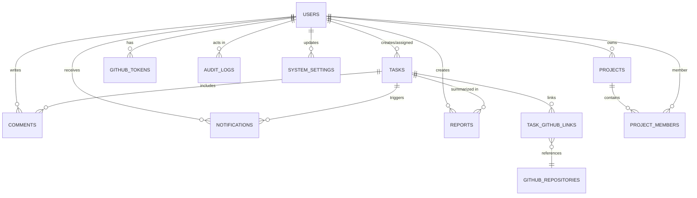
```mermaid
erDiagram
    USERS ||--o{ TASKS : "creates/assigned"
    USERS ||--o{ PROJECTS : "owns"
    USERS ||--o{ COMMENTS : "writes"
    USERS ||--o{ NOTIFICATIONS : "receives"
    USERS ||--o{ GITHUB_TOKENS : "has"
    USERS ||--o{ REPORTS : "creates"
    USERS ||--o{ AUDIT_LOGS : "acts in"
    USERS ||--o{ SYSTEM_SETTINGS : "updates"
    TASKS ||--o{ COMMENTS : "includes"
    TASKS ||--o{ NOTIFICATIONS : "triggers"
    TASKS ||--o{ TASK_GITHUB_LINKS : "links"
    PROJECTS ||--o{ PROJECT_MEMBERS : "contains"
    PROJECT_MEMBERS }o--|| USERS : "member"
    TASK_GITHUB_LINKS }o--|| GITHUB_REPOSITORIES : "references"
    TASKS ||--o{ REPORTS : "summarized in"
```

**Why this way:** managed Postgres for the standing env (a real production database is the point), in-cluster PG where data is throwaway (PR/dev). The `DATABASE_URL`-only contract means the app never knows which one it talks to - the overlay swap is zero code. Migrations run once as a Job because entrypoint migrations race past 1 replica. `sslmode=require` on the private endpoint because unencrypted private traffic is still unencrypted traffic.

**Proof receipt:** 2026-09-13 cutover `pg_dump` from `devsync-postgres-0` to restore into `devsync-db` from a one-off `postgres:16` pod inside the cluster; row counts verified both sides before the overlay flip (`docs/planning/k8s-prod-platform.md:390`).

---

### Testing Strategy

| Layer | Framework | Count | Coverage / Quality Gate |
|---|---|---|---|
| Backend unit | Pytest + xdist | 449 | 80% line (main) - real PG service in CI |
| Backend integration | Pytest | 113 | Real PG service container, cross-pod file excluded from xdist run |
| Cross-pod receipt | Pytest (sequential) | 2 | Own CI step, shared kombu subscription thread |
| Frontend unit + component | Jest + RTL + MSW | 929 across 71 suites | Branches 75%, functions/lines/statements 85% (main) |
| End-to-end | Cypress | 12 across 5 specs | Full stack: PG to gunicorn to served build |
| Load | k6 | - | Thresholds + baseline gate, reported separately from the 1505 count |
| **Total tests** | | **1505** | All must pass |
| Lint | ruff + ESLint | - | Zero warnings |
| Security | pip-audit + npm audit + CodeQL | - | Zero high/critical |

Every PR is validated end-to-end - tests run in parallel, and any failure or coverage regression aborts the pipeline before deployment.

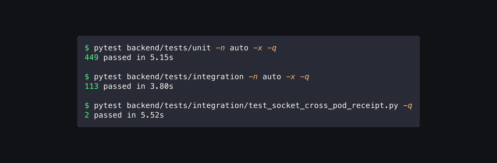

<p align="center">
  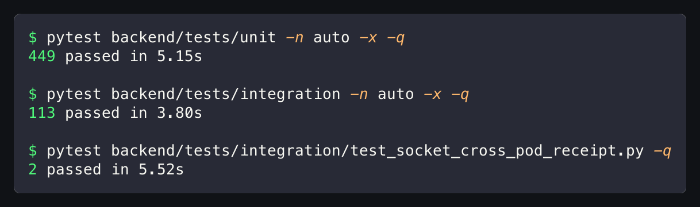
  <br/><em>Backend: 449 unit + 113 integration + cross-pod receipt green.</em>
</p>

<p align="center">
  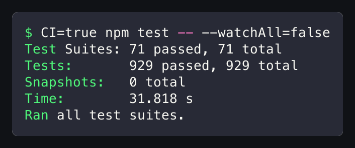
  <br/><em>Frontend: 929 Jest tests across 71 suites green.</em>
</p>

<p align="center">
  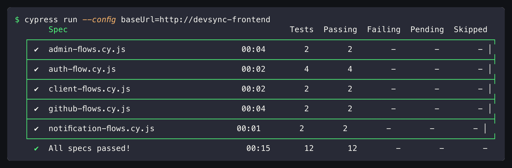
  <br/><em>E2E: 12 Cypress specs green against the served production build.</em>
</p>

**Test architecture:**

- **Backend unit (449):** `pytest backend/tests/unit -n auto -x` with coverage on main (`--cov-fail-under=80` at `.github/workflows/ci.yml:182-188`). Mocks external deps (database, GitHub API, OAuth providers).
- **Backend integration (113):** real PG service container (`DATABASE_URL` at `.github/workflows/ci.yml:190-199`).
- **Cross-pod receipt (2):** `backend/tests/integration/test_socket_cross_pod_receipt.py` as its own sequential step (`.github/workflows/ci.yml:201-207`); broadcast smoke matrix at `backend/tests/integration/test_socket_broadcast_smoke.py` (join to task/comment/mention/project emits to leave to disconnect, non-member guards, presence shape, MQ-down degrade, CORS/MQ env matrix); limiter Redis contract at `backend/tests/unit/middlewares/test_rate_limiter_redis.py`. Full-suite receipt `558 passed, 1 skip` (`docs/planning/k8s-prod-platform.md:384`).
- **Frontend (929 across 71 suites):** `CI=true npm test -- --watchAll=false --coverage`, thresholds on main `branches 75 / functions+lines+statements 85` (`.github/workflows/ci.yml:242-281`). No snapshot tests - assertions target behavior (element existence, click handlers, accessibility roles, state transitions), not markup. MSW intercepts API calls for realistic responses. Production bundle built on main.
- **E2E (12 across 5 specs):** PG service to gunicorn to served production build (`.github/workflows/ci.yml:293-393`); screenshots + backend logs on failure. Covers login, project creation, task assignment, GitHub link flow.

**Runbook:**

```bash
pytest backend/tests/unit -n auto -x -q          # unit, no PG needed
pytest backend/tests/integration -n auto -x -q   # integration, PG service
pytest backend/tests/integration/test_socket_cross_pod_receipt.py -q  # sequential receipt
cd frontend && CI=true npm test -- --watchAll=false --coverage
npx cypress run --config baseUrl=http://localhost:3000   # against the served build
```

**Why this way:** fast unit tests on cheap fixtures, honest gates where it matters (real PG in CI, signed digests, live-URL k6 on every deploy); thresholds live next to the code they gate so local and CI agree. Path-aware gating (`dorny/paths-filter`) skips backend jobs on frontend-only changes and vice versa. The socket smoke (broadcast 7-shape + cross-pod receipt) is the standing scale proof - rooms, membership re-checks, and MQ fan-out are exercised on every run, not just at demo time.

---

### Load Testing (k6)

**What it is:** every backend change is load-tested before merge. The `perf` CI job stands up Postgres and the real gunicorn server, then drives authenticated traffic with k6 (`backend/tests/perf/api-load.js`): register a throwaway user, log in, hammer the JWT-protected developer read surface (`GET /api/v1/dashboard`, `GET /api/v1/dashboard/client`) under constant VUs. `/reports` is excluded deliberately - it requires Team Lead/Admin, so hitting it as a developer would load-test a permission denial.

<p align="center">
  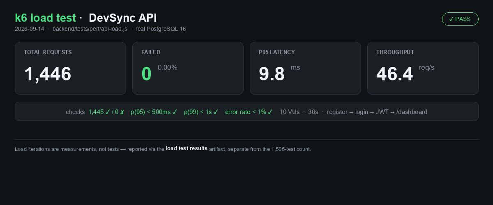
  <br/><em>k6: authenticated dashboard reads, thresholds green, baseline gate enforced.</em>
</p>

**Evidence:**

- Script + thresholds in-script (`backend/tests/perf/api-load.js:20-31`): error rate < 1% (`http_req_failed rate<0.01`), `p(95)<500`, `p(99)<1000`. Thresholds live in the script (not CI YAML) so `k6 run` behaves identically locally and in the pipeline. These are CI execution ceilings (single gevent worker on a shared 2-vCPU runner), not production SLOs.
- Real user path (`backend/tests/perf/api-load.js:38-88`): register to login to JWT to dashboard reads; seed-user-first trick absorbs the first-registration admin promotion so the load user stays a developer.
- Committed baseline (`backend/tests/perf/baseline.json:1-7`: p95 9.65ms, 46.58 rps, captured 2026-08-31): `check_baseline.py` trips the build on ~3x p95 / 4x p99 / +5pp error rate / -30% throughput (`.github/workflows/ci.yml:480-484`). First-run (no baseline) passes with a warning.
- CI shape 10VU/30s with the limiter bypassed (`RATE_LIMIT_REQUESTS_PER_WINDOW=0` at `.github/workflows/ci.yml:454`); load iterations are measurements, never counted - results ship as the `load-test-results` artifact, separate from the 1505.
- Live shape 3VU/30s (`--vus 3 --duration 30s` at `.github/workflows/k8s-cd.yml:612-621`).

**Why this way:** unit + integration tests run on fast fixtures, and the `perf` job spins up a real Postgres + gunicorn so the k6 gate exercises genuine SQL semantics under real concurrent load. The committed baseline catches order-of-magnitude regressions that unit tests cannot see.

**Proof receipt (2026-09-12, `docs/planning/k8s-prod-platform.md:346-351`):** same script + thresholds vs live - **3VU/30s: 250/250 checks passed, 0 failed, p95 232ms, p99 447ms**, no 429s. **10VU is NOT transferable to live and was never claimed green there:** 1VU/5s smoke crossed p95 on WAN/TLS alone; full 10VU/30s held latency (p95 229ms) but failed 29.7% on HTTP 429 from the live Global limiter (300 req/60s - production behavior, not a defect; CI disables it). DoD asks for thresholds, not VU count - green is claimed at the documented 3VU shape, thresholds unweakened.

---

### Security Model

| Layer | Mechanism |
|---|---|
| **Authentication** | JWT issued on login, HTTP-only cookie + bearer header dual support. 60-min access TTL, 30-day refresh. |
| **Authorization** | Role-based decorators on every protected route (developer, team_lead, admin). A route missing a decorator is intentionally public. |
| **OAuth tokens** | GitHub access tokens stored server-side, encrypted at rest with Fernet (key from env, else derived from app secret). Rotating either key invalidates stored tokens - users re-link. Never exposed to the browser. |
| **OAuth flow** | Server-side callback validates a signed state parameter (10-minute expiry) - forged or expired states rejected, preventing CSRF on the handshake. |
| **Real-time isolation** | Socket.IO rooms per project; server checks membership (admins bypass) before join **and** re-checks on every emit, so non-members cannot enter and broadcasts stay within their project. |
| **Input validation** | Route validators + controller-level checks on all mutation endpoints. |
| **Mutation safety** | SQLAlchemy sessions commit atomically; controller failures trigger rollback. Partial writes do not happen. |
| **Network** | K8s NetworkPolicy default-deny + explicit allows (LB ranges, Cloud SQL egress). No public database. |
| **CI/CD credentials** | WIF OIDC federation - roles scoped to this repo. No static keys stored anywhere. |
| **Secrets at rest** | 6 keys in Secret Manager, ESO-synced hourly. Values never in git or TF state. |
| **Transport** | Google-managed TLS cert, HTTPS-only live host. |

**Evidence - app layer:**

- JWT: `backend/src/app.py:66-69` (signing key from env, 60-min access, 30-day refresh, cookie + header locations); Secure + SameSite cookie policy at `backend/src/app.py:71-104` (`None` requires Secure, enforced by ValueError).
- RBAC: `backend/src/api/middlewares/__init__.py:19-53` (`admin_required`, `role_required` hierarchy developer/team_lead/admin); Socket.IO side at `backend/src/socketio_server.py:227-239` + emit re-checks (`:305-308`, `:332-334`, `:370-372`).
- Token encryption: `backend/src/auth/encryption.py` (Fernet encrypt/decrypt, env key preferred at `:27-32`, deterministic derivation from app secret otherwise).
- OAuth state: `backend/src/api/controllers/github_controller.py:56` (state stored with user id, 10-minute expiry) - forged/expired states rejected.
- Atomicity: SQLAlchemy commit/rollback in controllers; Socket.IO emits are best-effort post-commit (`_safe_emit`, never 500).

**Evidence - platform layer (CI identity, runtime identity, secrets, net policy):**

- WIF OIDC: `infra/terraform/modules/iam/github_oidc.tf:26` (`attribute_condition` scoped to owner `AhmedIkram05` + repo `AhmedIkram05/devsync`); `:38-42` (impersonation binding, this repo only); `:47-62` (9 runner CI roles: `container.admin`, `artifactregistry.admin`, `secretmanager.admin`, `monitoring.editor`, `serviceusage.serviceUsageAdmin`, `resourcemanager.projectIamAdmin`, `compute.viewer`, `iam.serviceAccountAdmin`, `iam.workloadIdentityPoolAdmin` - the last two landed after the first tf-apply 403, a runner cannot self-grant); `:64-67` + `infra/terraform/outputs.tf` (`wif_provider` output).
- Runtime identity: `infra/terraform/modules/iam/backend_runner.tf:28-31` (GSA `devsync-runner`); `:33-37` (Workload Identity binding `serviceAccount:PROJECT.svc.id.goog[devsync/devsync-ksa]`); `k8s/base/serviceaccount.yaml:6-11` (KSA `devsync-ksa` annotated to the GSA; project ID is a deploy-time sed token, never committed); `:47-63` (log/metric writers + AR reader); `:66-72` (`secretmanager.secretAccessor` scoped to the 6 demo keys only, not project-wide).
- Secrets (ESO): the 6 keys (database URL, JWT signing key, GitHub OAuth client id + client secret, Fernet key, Postgres password) declared identically in `infra/terraform/modules/iam/backend_runner.tf:22-26` and `k8s/base/externalsecret.yaml:17-35`; `k8s/base/externalsecret.yaml:9` (`refreshInterval: 1h`) into `devsync-app-secrets`; store at `k8s/base/clustersecretstore.yaml` (GCP provider, deploy-time project token). Values entered via `scripts/bootstrap-secrets.sh`, never printed, never in git or TF state.
- NetworkPolicy: `k8s/base/networkpolicy.yaml:1-12` (default-deny all ingress/egress), `:25-38` (node-local DNS `169.254.20.10/32` - without it default-deny kills all resolution), `:41-59` (egress `0.0.0.0/0:443` for GitHub API + registry pulls), `:61-108` (backend/migrate to backend `:8000`, PG `:5432`, redis `:6379`; frontend has no PG path), `:110-133` (only backend reaches redis `:6379`), `:158-180` (frontend ingress from GCE LB ranges `130.211.0.0/22` + `35.191.0.0/16`), `:182-204` (PG ingress from backend/migrate only), `k8s/overlays/managed-db/allow-egress-cloudsql.yaml:23-28` (backend/migrate to `10.60.0.0/24:5432`).
- Honesty note: policies are applied and kubeconform-validated, but the cluster predates Dataplane V2, so no policy is enforced yet - declared, not enforced (`docs/planning/k8s-prod-platform.md:391-397`). Enabling DPv2 mid-window would recreate the node pool (rejected); the Cloud SQL egress rule already ships so enforcement turns on without cutting the DB.

<p align="center">
  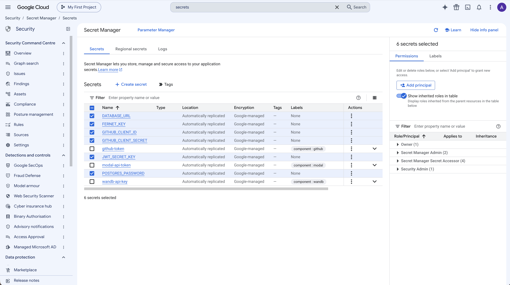
  <br/><em>Secret Manager: the 6 demo keys ESO syncs hourly.</em>
</p>

**Why this way:** federation over keys (nothing to leak/rotate/audit); ESO over TF-managed values (values in TF state is the classic leak); per-key accessor grants over project-wide; emit-path re-checks because join-time membership is not sticky proof; fail-open limiter/presence/MQ because an outage must degrade features, never cause a self-outage.

**Proof receipt:** `kubectl get externalsecret -n devsync` shows `SecretSynced`; no secret value appears in `git log -p -- k8s/`.

**API routes follow a consistent prefix pattern:**

- `/api/v1/auth/*` - authentication (public for login/register)
- `/api/v1/projects/*` - project CRUD (role-gated)
- `/api/v1/tasks/*` - task CRUD (role-gated with ownership checks)
- `/api/v1/admin/*` - admin operations (Admin role only)
- `/api/v1/github/*` - GitHub integration (authenticated, role-gated)
- `/api/v1/dashboard/*` - aggregated views (role-aware)
- `/api/v1/reports/*` - report generation (Team Lead+)
- `/api/v1/notifications/*` - user notifications (authenticated)

---

### Observability

**What it is:** a TF-managed 4-tile dashboard, 3 alert policies with explicit filters, JSON logs to stdout, and a documented PodMonitoring placeholder. Infra alerts are decoupled from the k6 app gate - a wedged pod cannot emit its own health metric.

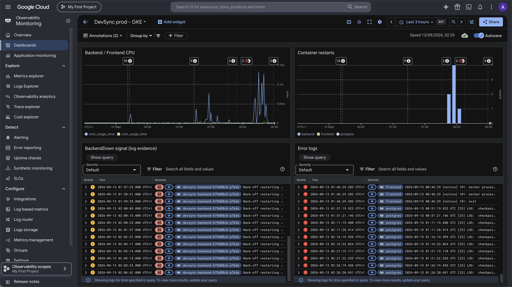

<p align="center">
  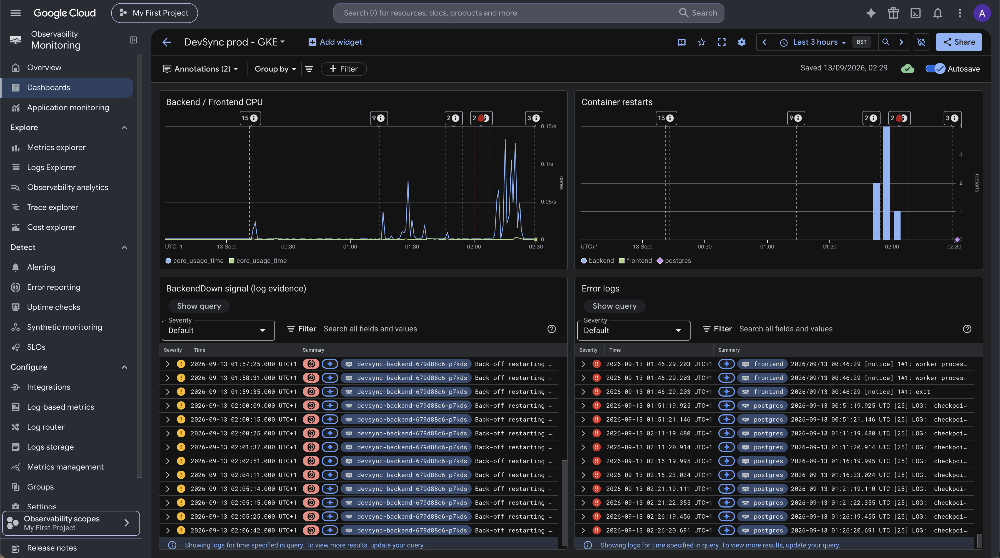
  <br/><em>TF-managed 4-tile dashboard: CPU, restarts, BackendDown log panel, error logs.</em>
</p>

<p align="center">
  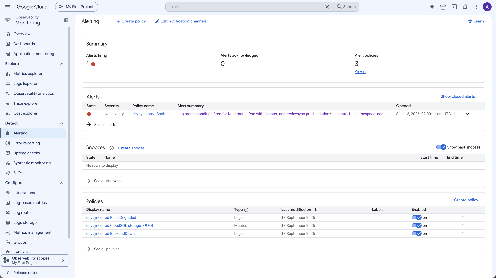
  <br/><em>Alert policies: BackendDown, RedisDegraded, Cloud SQL storage.</em>
</p>

**Evidence:**

- Dashboard (`infra/terraform/dashboard.tf:39-153`): tile 1 CPU backend/frontend (`:44-89`), tile 2 container restarts (`:90-120`), tile 3 BackendDown log-evidence panel (`:121-136` - `alertChart` cannot render log-based policies, so the tile shows the same signal as logs), tile 4 error logs (`:137-149`). TF-managed: destroyed with the platform; screenshot is the receipt.
- Alert 1 - BackendDown (`infra/terraform/dashboard.tf:12-36`): `condition_matched_log` on `resource.type="k8s_pod"` + namespace devsync + (`BackOff` OR (`Unhealthy` + message `~"eadiness probe failed"`)); email channel at `infra/terraform/dashboard.tf:1-9` (empty `alert_email` = no channels, alert still evaluates); 7-day auto-close + 300s rate limit. The old `k8s_container`/`textPayload` filter matched nothing - crash signals arrive as K8s EVENTS, never container stdout (proven by the canary).
- Alert 2 - RedisDegraded (`infra/terraform/dashboard.tf:163-188`): same proven shape; fires on `Redis unreachable` / `Presence refresh failed` / `Socket emit .* failed` (both `textPayload` and `jsonPayload.message`) - without it the only degradation signal was an unwatched log line.
- Alert 3 - Cloud SQL storage (`infra/terraform/dashboard.tf:193-219`): metric threshold `cloudsql.../disk/bytes_used > 9 GB` on `database_id "...:devsync-db"`, 5m duration - catches the fix-now point on the 10 GB provision long before pressure becomes an outage.
- Logging: `backend/src/logging_config.py:9-23` (`JsonFormatter`: `ts/level/severity/msg/logger/request_id`, stdlib only, no new dep), `backend/src/logging_config.py:40-61` (**stdout**, not stderr - GKE tags every stderr line `ERROR` regardless of severity; `severity` key promotes true severity in Cloud Logging); wired in `create_app`. Gunicorn access + error logs also to stdout (`backend/gunicorn.conf.py`).
- Probes feeding the signals: `k8s/base/backend-deployment.yaml:115-133` (startupProbe owns the ~37s boot window with a 120s ceiling; liveness/readiness stay tight - tighter initial delays rebooted healthy pods mid-boot during the 1am BackendDown) + `preStop sleep 15` (`k8s/base/backend-deployment.yaml:134-140`: NEG deregistration lags SIGTERM; without it k6 measured p99 30.07s at the grace boundary).
- PodMonitoring: `k8s/base/podmonitoring.yaml:1-10` - intentionally **not** a rendered resource (excluded from `k8s/base/kustomization.yaml:3-23`): the backend serves `/health` but no `/metrics` on `:8000`, so any scrape would fail continuously. Re-add only when `/metrics` ships (intended shape documented in the file).

**Why this way:** infra alerts decoupled from the k6 app gate; dashboard in TF so destroy cleans up; JSON logs so panels filter `severity>=ERROR`; stdout because GKE labels all stderr `ERROR`.

**Proof receipt - BackendDown canary (2026-09-12, `docs/planning/k8s-prod-platform.md:337-344`):** patched Deployment `command=[sh,-c,exit 1]` to CrashLoopBackOff (3-4 restarts), old pod stayed Running (no outage window by design). Discovery: the as-written filter could never fire. Fix applied live (`infra/terraform/dashboard.tf:12-36`), applied to `No changes` drift. Firing proof: **alert email received and user-confirmed** (incidents API lagged ~4 min - email closes the box). Restored via `rollout undo`; pod 1/1 Running, `/health` 200.

<p align="center">
  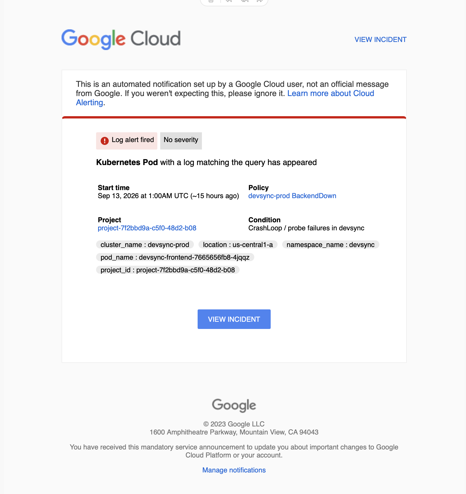
  <br/><em>Firing proof: BackendDown alert email received on the 2026-09-12 canary.</em>
</p>

---

## Project Structure

```
DevSync/
├── backend/
│   ├── Dockerfile              # Multi-stage: python:3.11-slim-bookworm + uv build -> libpq5 runtime, non-root devsync
│   ├── entrypoint.sh           # Migrations (unless MIGRATE_ON_BOOT=false) -> optional bootstrap -> gunicorn
│   ├── gunicorn.conf.py        # GeventWebSocketWorker, workers=1, stdout logs, 120s timeout
│   ├── src/
│   │   ├── app.py              # create_app() factory: JWT, CORS, blueprints, middlewares, SocketIO
│   │   ├── wsgi.py             # Gunicorn entry point
│   │   ├── socketio_server.py  # Rooms, presence, MQ fan-out, membership re-checks, _safe_emit
│   │   ├── logging_config.py   # JSON stdout formatter + request-id filter
│   │   ├── api/routes/         # Per-domain register_routes(bp): auth/users/projects/tasks/comments/dashboard/admin/notifications/github/audit/report
│   │   ├── api/controllers/    # Business logic per domain
│   │   ├── api/middlewares/    # RBAC, rate_limiter (Redis + in-memory fail-open), validation, error handler
│   │   ├── auth/               # JWT helpers, RBAC roles, Fernet encryption
│   │   ├── config/             # Env-selected config classes
│   │   ├── db/models/          # 11 models + project_members = 12 tables
│   │   └── services/           # redis_client (lazy, fail-open), GitHub, notifications
│   └── tests/
│       ├── unit/               # 449 tests incl. limiter Redis contract
│       ├── integration/        # 113 tests + broadcast smoke + cross-pod receipt (2)
│       └── perf/               # api-load.js (k6) + baseline.json + check_baseline.py
├── frontend/
│   ├── Dockerfile              # Multi-stage: node:20-alpine build -> nginx:1.27-alpine serve
│   ├── nginx.conf.template     # /api + /socket.io + /health proxy, /static immutable, SPA fallback, envsubst
│   └── src/
│       ├── pages/              # Landing/Login/Register, BasicDashboard, DeveloperProgress, ProjectDetails, TaskList/Details, Reports, GitHub*, Admin*
│       ├── components/         # TaskCard/Columns/Form, CommentSection, GitHub cards, Navbar, Notifications, ReportTable
│       ├── context/            # AuthContext (JWT lifecycle)
│       ├── services/           # API clients per domain
│       └── tests/              # 929 Jest tests across 71 suites
├── k8s/
│   ├── base/                   # Deployments, services, ingress, cert, migrate Job, PG, Redis, HPA, PDBs, NetPol, ESO, quota/limits, SA
│   └── overlays/
│       ├── prod/               # Live host + cert domains + prod DB shape
│       ├── managed-db/         # APPLIED: Cloud SQL wiring, drops in-cluster PG
│       └── pr/                 # Ephemeral: replicas 1, ns pr-<n>, drops ingress/cert/ESO
├── infra/
│   ├── terraform/              # Root (AR, ESO helm, IAM wiring) + modules/gke + modules/iam + dashboard.tf + services.tf
│   └── scripts/                # provision-cloudsql.sh (APIs, PSA, instance, DSN to Secret Manager)
├── .github/workflows/
│   ├── ci.yml                  # Lint, security, pytest, cross-pod, Jest, Cypress, k6, Codecov, kubeconform
│   ├── k8s-cd.yml              # Gate, build+Trivy, sign+SBOM+SLSA, tf-plan/apply, rollout, live verify, collect
│   ├── k8s-pr.yml              # Ephemeral pr-<n>: build, deploy, smoke, sticky comment, GC
│   ├── codeql-analysis.yml     # Weekly + per-PR security analysis
│   └── security-weekly.yml     # Scheduled dependency/security sweep
├── docker-compose.yml          # backend + frontend + postgres:16 (service-scoped up for DB-only), urllib healthcheck
├── Makefile                    # up/down/logs/rebuild/shell
├── .env.example                # All required env vars documented
├── pyproject.toml              # Ruff lint config + pytest settings
└── docs/
    ├── deep-dives.md           # This file
    ├── Design.pdf              # Architecture design proposal
    ├── backend/                # swagger.yaml (OpenAPI), rbac.md, models.md, load-testing.md
    ├── planning/               # k8s.md, k8s-prod-platform.md, k8s-phase2-scaling.md, CONTEXT.md, adr/
    └── assets/                 # Carousels (gke, infra, workflows, tests, monitoring, dev/tl/admin) + images/
```

---

## Costs

**What it is:** Standard-cluster standing cost with a calendar teardown and a console budget as the backstop; per-run workflow costs. (The pipeline is permanent repo code; the env is the temporary part.)

**Evidence:**

- Standing **~$4-5/day** - zonal control-plane `$0.10/hr` (`docs/planning/k8s-prod-platform.md:315-316`; plan table at `docs/planning/k8s-prod-platform.md:207-222`). The Phase 1 estimate was $1-3/day (Autopilot assumption); Standard bills the control plane, Autopilot's is free - honest math after the change.
- Backstop: one-time console budget **$50/mo at 50/80/100%** (Billing to Budgets and alerts - the budget API rejects scripted creation; `docs/planning/k8s.md:46`, `docs/planning/k8s-prod-platform.md:406-410`). No automation enforces the teardown date; the calendared entry + billing alerts are the entire cost control (accepted, recorded).
- Push-deploy run **~$0.40-1.00/run**; per-PR namespace run **~$0.05-0.20/run** (no Ingress/certs, port-forward smoke, shares the standing cluster, GC on close); AR storage + egress <$1/mo; cosign/SBOM/SLSA $0 (CI-only inside existing runners); managed cert + A-record $0; Secret Manager 6 keys $0 (free tier); Phase-2 Cloud SQL window actuals recorded at apply time (`docs/planning/k8s-prod-platform.md:207-222`, `docs/planning/k8s-phase2-scaling.md:85-87`).
- Teardown (hand-run): `gcloud sql instances delete devsync-db` (deletion protection off by design) to `terraform destroy -target=module.gke` to Namecheap A-record re-point/removal to secrets cleanup (`docs/planning/k8s.md:46`).

**Why this way:** temporarily standing (not permanently, not windowed) - the URL stays live for the whole standing period so evidence accumulates; the pipeline outlives every env it creates.

---

## Trade-offs / ADRs

| Decision | Alternative | Why |
|---|---|---|
| Standard, not Autopilot | Autopilot (no node mgmt) | Real drain/upgrade path + honest PDB semantics; drain-denied proof needs Standard (`infra/terraform/modules/gke/main.tf:9-11`, `docs/planning/k8s-prod-platform.md:315`) |
| Zonal `us-central1-a`, not regional | Regional (HA control plane) | Both regional creates died in `us-central1-f` stockout; `-a` had proven capacity; single-zone control plane accepted for a standing window (`infra/terraform/modules/gke/main.tf:3-8`) |
| Managed-db private IP direct, no proxy sidecar | Auth Proxy sidecar / public IP | Private IP through VPC peering + `sslmode=require` needs no sidecar; proxy only if public-IP or IAM-DB-auth is ever needed (`k8s/overlays/managed-db/patch-database-url.yaml:64-67`) |
| Redis MQ, no session affinity | Sticky sessions / ingress affinity from day one | WS is persistent TCP; MQ fans out regardless of pod; affinity must earn its way via a forced-polling test (`docs/planning/adr/0002-phase2-mq-only-no-affinity.md:10-14`) |
| ESO from Secret Manager | TF-managed values / in-git secrets | Values in TF state is the classic leak; ESO keeps them in Secret Manager with one-hour sync (`k8s/base/externalsecret.yaml:9`) |
| GCE Ingress, not NGINX | nginx-ingress + cookie affinity / cert-manager | Zero-controller path with managed certs; named fallback only if polling breaks (ADR 0002) |
| HPA frontend-only (2-6, CPU 60%) | Backend HPA on CPU | FE is stateless and safe to autoscale (`k8s/base/horizontalpodautoscaler.yaml:9-21`); backend HPA stays rejected until a better-than-CPU metric (socket connections) is proven |
| PDB `minAvailable: 1` (both tiers) | `maxUnavailable: 0` carried over | Zero-setting was singleton language; at `replicas: 2` it over-blocks evictions (`k8s/base/poddisruptionbudget.yaml:22-24`) |
| Fail-open limiter (+ presence/MQ) | Fail-closed on Redis outage | An outage must degrade limits, never cause a self-outage (`backend/src/api/middlewares/rate_limiter.py:82-100`, `backend/src/services/redis_client.py:21-45`) |
| Stored-key cosign `v3.1.3`, SBOM `--type custom` | Keyless OIDC + `--type spdx` | Keyless hung with no local token; `--type spdx` bundle path fails deterministically vs AR - same SPDX payload, verifiable attestations (`.github/workflows/k8s-cd.yml:148-230`, `docs/planning/k8s-prod-platform.md:317`) |
| 3VU live k6, 10VU CI k6 | One shape everywhere | 10VU cannot run green on live by construction (WAN + active 300/window throttle vs localhost + disabled throttle); thresholds identical, shapes honest (`docs/planning/k8s-prod-platform.md:346-351`) |
| Single-replica Redis, emptyDir | Memorystore / persistent Redis | Contents are reconstructible transit; standing managed Redis on expiring credits for zero users is indefensible - upgrade is a ConfigMap value, not a redesign (`k8s/base/redis.yaml:10-13`) |
| Migrate Job, `MIGRATE_ON_BOOT=false` | Entrypoint migrates every boot | Entry race at >1 replica; Job runs once, ordered before rollout (`k8s/base/migrate-job.yaml:9-11`) |
| In-cluster PG for dev/PR, managed for prod | Managed everywhere | Throwaway data does not need a standing bill; PR namespaces get their own PG at $0 marginal (`k8s/overlays/pr/kustomization.yaml`) |
| Single compose service-scoped DB for local dev | Managed DB for local dev | Local data is throwaway; compose PG + urllib healthcheck is $0 and instant (`docker-compose.yml`) |
| Flask (factory + blueprints) kept | Rewrite on FastAPI | The factory/blueprint/decorator shape already carries the domain; a rewrite buys typing at the cost of re-proving every gate above |
| CRA kept | Migrate to Vite/Next | 929 green tests + served-build E2E already prove the bundle; migration risk with zero user-facing gain |
| envsubst runtime upstream | Baked-per-env images | One image for compose, PR, and prod - only env vars change (`frontend/Dockerfile:28-40`) |
| Rolling updates (`maxUnavailable: 0`) | Recreate | Service never fully goes down; old pods drain while new ones warm (`k8s/base/backend-deployment.yaml:16-20`) |
