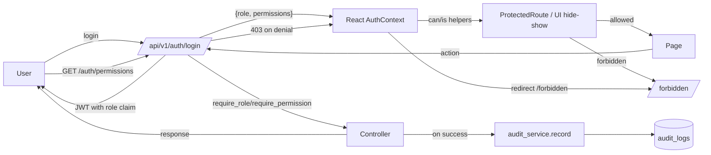

# Audit Summary (what exists vs. what's missing)

## Backend — already in place

- `Role` enum + `ROLE_PERMISSIONS` map + `require_role` / `require_permission` decorators in [backend/src/auth/rbac.py](backend/src/auth/rbac.py).
- `admin_required()` and `role_required([...])` middlewares in [backend/src/api/middlewares/__init__.py](backend/src/api/middlewares/__init__.py).
- JWT tokens carry `role` claim via `generate_tokens` in [backend/src/auth/helpers.py](backend/src/auth/helpers.py); `refresh_token()` in [backend/src/auth/auth.py](backend/src/auth/auth.py) preserves role.
- Route-level RBAC for tasks/comments/projects/admin/dashboard/reports/users (e.g. `@role_required([Role.ADMIN])` for delete in [backend/src/api/routes/tasks_routes.py](backend/src/api/routes/tasks_routes.py)).
- Integration coverage in [backend/tests/integration/test_role_access_integration.py](backend/tests/integration/test_role_access_integration.py).

### Backend — gaps and bugs

- __Privilege escalation via self-registration.__ `/api/v1/auth/register` accepts any `role` from the body in `register_user()` ([backend/src/auth/auth.py](backend/src/auth/auth.py)) — anyone can register as `admin`.
- __Stale role on refresh (dead but dangerous).__ The unused `auth_bp` defined in [backend/src/auth/auth.py](backend/src/auth/auth.py) lines 129–147 calls `create_access_token(identity=current_user)` without re-adding the `role` claim. Real route uses `refresh_token()` which is correct; the dead blueprint must be removed to avoid future regressions.
- __Team Lead cannot update tasks they're not assigned to.__ `update_task_by_id` in [backend/src/api/controllers/tasks_controller.py](backend/src/api/controllers/tasks_controller.py) only allows admin or assignee for non-assignment fields — doc grants `can_update_any_task` to Team Lead.
- __`GET /users/:id` is wide-open.__ [backend/src/api/routes/users_routes.py](backend/src/api/routes/users_routes.py) only has `@jwt_required()` — any developer can read any profile. Doc restricts profile viewing to self for developers, all for team_lead/admin.
- __System Settings are stub-only.__ `get_system_settings` / `update_system_settings` in [backend/src/api/controllers/admin_controller.py](backend/src/api/controllers/admin_controller.py) return hard-coded values and never persist.
- __No audit log model/endpoint__ despite `can_view_audit_logs` (the in-memory `api_usage_logger` is not an audit log).
- __GitHub repo add isn't admin-gated__ (doc: `can_link_github_repos` is admin-only).
- __`role_required` & `admin_required` exist but `require_permission` / role-hierarchy helpers are unused__ — the granular permissions list is dead code.

### Frontend — gaps and bugs

- __Team Lead is treated like Developer.__ [frontend/src/components/Navbar.jsx](frontend/src/components/Navbar.jsx) only branches `isAdmin` vs everything else; routes like `/admin/reports`, `/admin/developer-progress` are gated `allowedRoles={['admin']}` in [frontend/src/App.jsx](frontend/src/App.jsx) even though the doc grants Team Lead `can_generate_reports`, `can_view_team_metrics`.
- __No Admin User Management page.__ Dashboard links `/admin/users` ([frontend/src/pages/AdminDashboard.jsx](frontend/src/pages/AdminDashboard.jsx) line 360) but no route or page exists.
- __No System Settings UI, no Audit Logs UI.__
- __Registration form lets users self-select `admin`.__ [frontend/src/pages/Register.jsx](frontend/src/pages/Register.jsx) lines 202–209.
- __No 403-handling.__ API wrapper in [frontend/src/services/utils/api.js](frontend/src/services/utils/api.js) doesn't redirect or surface a friendly forbidden screen.
- __Role strings hardcoded__ across pages instead of a shared constants/permissions helper.

### Database — gaps

- No `audit_logs` table.
- No `system_settings` table.
- `users.role` has no DB-level CHECK constraint (drift to legacy values like `client` happened before; migration `d8b7f3a2c1e4` cleaned that up — we should harden).

---

## Implementation Plan

### Phase 1 — Backend: security fixes & RBAC hardening

- __Lock down registration__ in [backend/src/auth/auth.py](backend/src/auth/auth.py): ignore the request body's `role`, always create users as `Role.DEVELOPER.value`. Update [backend/src/api/validators/auth_validator.py](backend/src/api/validators/auth_validator.py) to drop the role requirement.
- __Delete the unused `auth_bp` block__ (the duplicate `register/login/refresh/me/logout` Flask Blueprint at the top of [backend/src/auth/auth.py](backend/src/auth/auth.py)); keep only the function-level handlers used by [backend/src/api/routes/auth_routes.py](backend/src/api/routes/auth_routes.py).
- __Add a role-hierarchy helper__ to [backend/src/auth/rbac.py](backend/src/auth/rbac.py):

```python
ROLE_HIERARCHY = {Role.DEVELOPER: 0, Role.TEAM_LEAD: 1, Role.ADMIN: 2}
def role_at_least(min_role): ...   # decorator
def has_permission(role_value, permission): ...
```

- __Use `require_permission`__ on a small set of endpoints to keep the granular permission list alive (e.g. notifications `can_manage_personal_notifications`, comments `can_comment`, github `can_link_github_repos` for the admin-only POST `/github/repositories`).
- __Tighten existing route guards:__
  - `GET /users/:id`: allow self OR `role_at_least(TEAM_LEAD)` in [backend/src/api/routes/users_routes.py](backend/src/api/routes/users_routes.py).
  - Tasks `PUT`: rework `update_task_by_id` so Team Lead can update any field (matches `can_update_any_task`).
  - `POST /github/repositories`: add `@role_required([Role.ADMIN])`.
- __Audit-log instrumentation hooks__ (added in Phase 3) wired into login, register, role change, settings change, user delete, project create/delete, task delete.

### Phase 2 — Database: new tables & migration

Add a single Alembic migration `add_audit_logs_and_system_settings.py` under [backend/migrations/versions/](backend/migrations/versions/) that creates:

- `audit_logs(id, actor_user_id NULL FK users, actor_role, action, resource_type, resource_id NULL, ip, user_agent, metadata JSON, created_at)` with indexes on `(actor_user_id, created_at)`, `action`, `resource_type`.
- `system_settings(key VARCHAR PK, value JSON, updated_by FK users, updated_at)` seeded with the defaults currently returned by `get_system_settings`.
- Optional CHECK constraint on `users.role IN ('developer','team_lead','admin')` (Postgres only — gate on dialect).

Models go in [backend/src/db/models/models.py](backend/src/db/models/models.py).

### Phase 3 — Backend: audit log + settings services

- __`backend/src/services/audit_service.py`__: `record(action, *, actor=None, resource_type=None, resource_id=None, metadata=None)`; reads actor from JWT when available; resilient (never breaks the request on logging failure).
- __`backend/src/services/settings_service.py`__: `get_settings()`, `update_settings(data, actor_id)` reading/writing the `system_settings` table; `get_default_role()` used by registration.
- Update [backend/src/api/controllers/admin_controller.py](backend/src/api/controllers/admin_controller.py) `get_system_settings` / `update_system_settings` to delegate to the service.
- New controller `audit_controller.py` + routes `audit_routes.py` for:
  - `GET /api/v1/admin/audit-logs?action=&actor=&from=&to=&page=&per_page=` (admin only, paginated).
  - `GET /api/v1/admin/audit-logs/<id>`.
- Wire the audit service into:
  - `auth.login`, `auth.register`, `logout_user` (auth events).
  - `update_user_role`, `delete_user`, `update_user` (admin user management).
  - `update_system_settings` (settings change).
  - `delete_task_by_id`, `create_project`, `delete_project` (mutations).
  - Failed RBAC checks inside `role_required` / `admin_required` (optional but recommended).

### Phase 4 — Backend: API additions for the new admin UI

Add these under `/api/v1/admin/...` (matches existing prefix; doc will be updated to align):

- `GET /api/v1/admin/users` — alias of existing `GET /users` (admin), for clearer admin path.
- `PUT /api/v1/admin/users/<id>` — edit user (delegates to `update_user`).
- `DELETE /api/v1/admin/users/<id>` — delete user (delegates to `delete_user`).
- `PUT /api/v1/admin/users/<id>/role` — already exists; keep.
- `GET/PUT /api/v1/admin/settings` — already exists; now persistent.
- `GET /api/v1/admin/audit-logs` (+ detail) — new.
- `GET /api/v1/auth/permissions` — returns `{role, permissions: [...]}` for the current user so the frontend can drive UI without hardcoding.

### Phase 5 — Frontend: shared RBAC primitives + 403 handling

- New [frontend/src/utils/rbac.js](frontend/src/utils/rbac.js): mirror backend `ROLE_PERMISSIONS`, expose `ROLES`, `PERMISSIONS`, `hasRole`, `hasAnyRole`, `hasPermission`, `roleAtLeast`. Replace ad-hoc `currentUser.role === 'admin'` checks across pages.
- Extend [frontend/src/context/AuthContext.jsx](frontend/src/context/AuthContext.jsx) to expose `permissions` (loaded once from `GET /auth/permissions`) and helpers `can(perm)`, `is(role)`.
- Add `frontend/src/pages/Forbidden.jsx` (clean 403 screen with role-aware CTA).
- In [frontend/src/services/utils/api.js](frontend/src/services/utils/api.js), on `403` dispatch a navigation to `/forbidden` (or surface via a callback the AuthContext registers) and never retry. On `401` keep existing token-refresh flow.
- Refactor `ProtectedRoute` in [frontend/src/App.jsx](frontend/src/App.jsx) to accept either `allowedRoles` or `requiredPermission`, redirect unauthorized users to `/forbidden`.

### Phase 6 — Frontend: Team Lead uplift

- Update route guards in [frontend/src/App.jsx](frontend/src/App.jsx):
  - `/admin/reports` → `[TEAM_LEAD, ADMIN]`.
  - `/admin/developer-progress` → `[TEAM_LEAD, ADMIN]`.
  - `/admin/create-task` already correct.
  - Project management (`/admin/projects/*`) stays admin.
- Update [frontend/src/components/Navbar.jsx](frontend/src/components/Navbar.jsx) to a three-branch render (developer / team_lead / admin), with Team Lead seeing: Dashboard, Tasks, Create Task, Reports, Developer Progress, GitHub. Drive visibility from `can(...)` instead of role string equality.
- Optional new `frontend/src/pages/TeamLeadDashboard.jsx` reusing existing widgets — or extend `BasicDashboard` with team-lead sections. (Default: extend existing `BasicDashboard` to add a "Team" section visible only when `roleAtLeast('team_lead')`.)

### Phase 7 — Frontend: missing admin pages

- __`frontend/src/pages/AdminUsers.jsx`__ — table with search/filter, inline role dropdown (calls `PUT /admin/users/:id/role`), edit modal (`PUT /admin/users/:id`), delete confirmation. Wired into Navbar and Admin Quick Actions.
- __`frontend/src/pages/AdminSystemSettings.jsx`__ — form bound to `GET/PUT /admin/settings` (toggle registration, default role, github integration enabled, notification flags). Persists via service.
- __`frontend/src/pages/AdminAuditLogs.jsx`__ — paginated, filterable list of audit events (action, actor, date range), detail drawer per row.
- Add corresponding services to [frontend/src/services/utils/api.js](frontend/src/services/utils/api.js): `adminUserService`, `settingsService`, `auditLogService`.
- Wire new routes in [frontend/src/App.jsx](frontend/src/App.jsx) under `[ADMIN]`.

### Phase 8 — Frontend: register form lockdown

- Remove the role `<select>` in [frontend/src/pages/Register.jsx](frontend/src/pages/Register.jsx); inform users that admin/team-lead roles can only be assigned by an administrator. Backend already enforces this after Phase 1.

### Phase 9 — Tests

- Extend [backend/tests/integration/test_role_access_integration.py](backend/tests/integration/test_role_access_integration.py) and add new files:
  - `test_audit_logs_routes.py`: admin-only access, filters, pagination, and that key actions emit audit events.
  - `test_admin_settings_persistence.py`: settings round-trip via DB.
  - `test_register_role_lockdown.py`: registration ignores role in body.
  - `test_users_routes.py`: `GET /users/:id` self vs other for each role.
  - `test_tasks_routes.py`: Team Lead can update any task field.
- Frontend: Cypress flow (or unit test) that admin user can land on `/admin/users`, `/admin/settings`, `/admin/audit-logs`; Team Lead can land on `/admin/reports` and `/admin/developer-progress`; Developer is redirected to `/forbidden` for those.

### Phase 10 — Docs

- Rewrite [docs/backend/rbac.md](docs/backend/rbac.md) to:
  - Use the actual `/api/v1/...` paths.
  - Document the new admin endpoints (`/api/v1/admin/users`, `/api/v1/admin/audit-logs`, etc.) and `/api/v1/auth/permissions`.
  - Document the `role_at_least` decorator and the `record(...)` audit-service contract.
  - Add a "Frontend integration" subsection covering `useAuth().can(...)`, `ProtectedRoute`, and `/forbidden`.
- Add a brief example to the file (it currently ends mid-section at "Example RBAC Usage in Code").

---

## End-to-end Flow After Implementation



---

## Out of Scope

- Replacing JWT cookie/header storage strategy.
- New roles beyond Developer / Team Lead / Admin.
- Real-time audit log streaming via Socket.IO.
